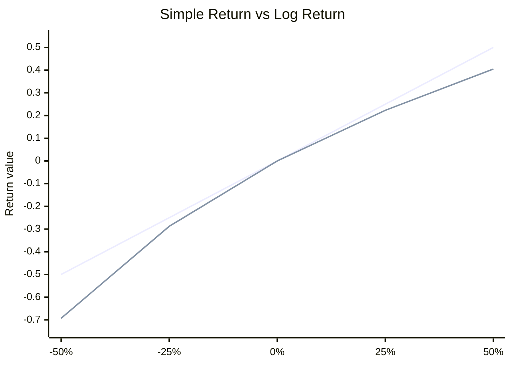

# Week 1: Financial Asset Prices and Returns

## What this week is for

This week gives the basic language used everywhere else in the unit: prices, returns, excess returns, equity curves, market risk, factor investing, and Value at Risk. Later workshop and exam questions assume you can move between prices, returns, risk-free rates, and portfolio values without hesitation.

## Plain-English Roadmap

The most important shift this week is from thinking in prices to thinking in returns. A price by itself is hard to compare: a \$200 stock is not automatically "better" or "more profitable" than a \$20 stock. What matters is how much your money grows relative to what you put in. That relative change is the return.

A simple return answers: "By what percentage did my money change over this period?" If a price goes from \$100 to \$110, the simple return is 10%. If you invested \$1, it became \$1.10. Simple returns are natural when you are tracking wealth because wealth compounds by multiplying gross returns: after a 10% gain followed by a 10% loss, \$1 becomes \$0.99, not exactly back to \$1.

A log return answers a slightly different question: "What continuously compounded growth rate would take the old price to the new price?" This sounds abstract, but it is useful because log returns add through time. If you have daily log returns, the weekly log return is just their sum. This is why econometrics courses love log returns: adding is easier than multiplying, and many time-series models are written for additive changes.

Use simple returns when you care about actual wealth growth or equity curves. Use log returns when you are modelling returns statistically, adding returns across time, or working with log prices. For small daily or monthly returns, simple and log returns are almost the same, so the choice usually matters more for convenience than for the numerical answer.

Excess return means "return above the risk-free alternative." If a stock earns 1.2% in a month and the risk-free rate is 0.2%, the excess return is 1.0%. CAPM and factor models use excess returns because they ask: "How much extra did you earn for taking risk?"

VaR is a downside-risk number. It does not tell you the worst possible loss. It tells you a loss threshold for a chosen probability. A 5% VaR of \$50,000 means that, under the model, losses worse than \$50,000 should occur about 5% of the time over the stated horizon.

## Visual Guide

This chart shows why log returns are convenient. For small returns, the simple and log return lines are close. For larger moves, they separate, which is why you should not blindly treat them as identical.



## Formula Symbol Guide

Use this when a formula in this week feels like alphabet soup.

- $P_t$: asset price at time $t$.
- $P_{t-1}$: asset price one period earlier.
- $R_t$: simple return from $t-1$ to $t$; this is the ordinary percentage change.
- $1+R_t$: gross return; this is the multiplier applied to wealth.
- $r_t$: log return from $t-1$ to $t$; in this unit, $log$ means natural log, $ln$.
- $V_0$: starting wealth or starting portfolio value.
- $V_T$: wealth after $T$ periods.
- $\prod$: product/multiply symbol; multiply all the gross returns together.
- $R_f$: risk-free return.
- $R_t-R_f$: excess return, meaning return above the risk-free return.
- $q_\alpha$: the $\alpha$ lower-tail return quantile, such as the worst 5% cutoff.
- $\alpha$: tail probability, usually $0.05$ for a 5% VaR question.
- $z_\alpha$: standard normal cutoff for probability $\alpha$; for example, $z_{0.05}=-1.645$.
- $\mu$: mean return.
- $\sigma$: standard deviation of returns.
- $W_0$: dollar value invested.
- $\operatorname{VaR}_\alpha$: Value at Risk at tail probability $\alpha$; the dollar loss at the bad-return cutoff.


## Prices versus returns (Exam)

Concept: price is a level; return is the change relative to where you started. Exams usually care about returns because they let you compare a cheap stock and an expensive stock on the same percentage scale.

Example: if a stock rises from \$50 to \$55, the return is 10%, no matter whether another stock has a higher dollar price.

A price tells you the dollar value of an asset at one point in time. A return tells you the profit or loss from holding the asset over a period.

If `P_t` is the price at time `t`, the simple return is

$$
\begin{aligned}
R_t = (P_t - P_{t-1}) / P_{t-1} \\
= P_t / P_{t-1} - 1
\end{aligned}
$$

If `R_t = 0.05`, the asset gained 5 percent. If `R_t = -0.05`, it lost 5 percent.

The gross simple return is

$$
1 + R_t = P_t / P_{t-1}
$$

This is useful because wealth compounds by multiplying gross returns.

## Log returns (Exam)

Concept: log returns convert price changes into additive growth rates. You use them because adding log returns across days/months is much easier than multiplying simple returns, especially in time-series models.

Example: if daily log returns are 0.01 and 0.02, the two-day log return is 0.03; with simple returns you would need to multiply gross returns.

The log return is

$$
\begin{aligned}
r_t = \log(1 + R_t) \\
= \log(P_t) - \log(P_{t-1})
\end{aligned}
$$

Log returns are also called continuously compounded returns.

For small returns, simple and log returns are very close:

$$
\log(1 + R_t) \approx R_t
$$

The bigger the return in absolute value, the more they differ.

## Multi-period returns and equity curves (Exam)

Concept: an equity curve follows actual wealth through time. Simple returns must be compounded by multiplying gross returns, because each period starts from the wealth left by the previous period.

Example: a 20% gain followed by a 10% loss gives wealth $1\times1.20\times0.90=1.08$, so the total gain is 8%.

For simple returns, multi-period returns compound by multiplication:

$$
1 + R_t(k) = (1 + R_t)(1 + R_{t-1})\cdots(1 + R_{t-k+1})
$$

So the k-period simple return is

$$
R_t(k) = \prod_{j=0}^{k-1} (1 + R_{t-j}) - 1
$$

An equity curve shows how \$1 invested grows through time:

$$
V_t(k) = \prod_{j=0}^{k-1} (1 + R_{t-j})
$$

This is exactly the idea used in the Week 2 workshop comparison of the S&P 500 and hedge fund. You multiply each year's gross return. The larger final value is the better performer over that period.

For log returns, multi-period returns add:

$$
r_t(k) = r_t + r_{t-1} + \cdots + r_{t-k+1}
$$

This is one reason log returns are convenient in econometrics.

## Stock indices

Concept: an index is treated like a portfolio price. You calculate index returns exactly like stock returns, but the index is usually smoother because it diversifies across many firms.

Example: if the S&P 500 moves from 5000 to 5050, its simple return is 1%, just like a single stock moving from 100 to 101.

A stock market index, such as the S&P 500, is a portfolio-like summary of a market. You compute returns on an index in the same way as for a single stock:

$$
r_t = \log(Index_t) - \log(Index_{t-1})
$$

An index is usually less volatile than a single stock because it is diversified across many companies.

## Excess returns (Exam)

Concept: excess return removes the reward for taking no risk. What remains is the extra return earned for bearing risky-asset exposure.

Example: if a stock earns 1.4% and the risk-free rate is 0.3%, the excess return is 1.1%.

An excess return is the return above the risk-free rate.

Simple excess return:

```text
R_t - r_{f,t}
```

Log excess return:

```text
r_t - r_{f,t}
```

The risk-free rate is usually proxied by a short-term government rate such as a 1-month Treasury bill rate.

Excess returns are central in CAPM and Fama-French regressions:

$$
\begin{aligned}
asset excess return = asset return - risk-free rate \\
market excess return = market return - risk-free rate
\end{aligned}
$$

## Market risk and beta intuition

Concept: beta is a sensitivity measure. It tells you how strongly an asset tends to move when the whole market moves.

Example: if beta is 1.5 and the market excess return rises by 2%, the asset is expected to rise by about 3% from the market component.

Market risk is risk that comes from economy-wide or market-wide movements. It cannot be diversified away.

If an asset has market beta `beta = 1.5`, then when the market excess return increases by 1 percentage point, the asset's excess return is expected to increase by about 1.5 percentage points on average.

Interpretation:

$$
\begin{aligned}
\beta > 1       aggressive, more sensitive than the market \\
\beta = 1       tracks the market \\
0 < \beta < 1   defensive, less sensitive than the market \\
\beta = 0       unrelated to market movements
\end{aligned}
$$

## Size and value language

Concept: size and value are firm characteristics used to group stocks. Factor models ask whether a portfolio behaves like small stocks, big stocks, value stocks, or growth stocks.

Example: a positive SMB loading means the portfolio tends to do well when small stocks outperform big stocks.

Market capitalisation:

$$
market cap = share price \times number of shares outstanding
$$

Small stocks have low market capitalisation. Big stocks have high market capitalisation.

Book-to-market ratio:

$$
\operatorname{BtM} = \frac{\text{book value of equity}}{\text{market value of equity}}
$$

High `BtM` means value stock. Low `BtM` means growth stock.

In Fama-French language:

```text
small stocks often have a size premium
value stocks often have a value premium
```

This is why Week 3 and Week 6 style-box tables sort portfolios by size and book-to-market or growth/value.

## Quantiles and VaR basics (Exam)

Concept: VaR uses a bad-tail quantile of returns and converts it into dollars. It is a threshold loss for a chosen probability, not a maximum possible loss.

Example: if the 5% return quantile is -4% on a \$100,000 position, the 5% VaR is about \$4,000.

If a return `R` is normally distributed:

$$
R \sim \mathcal{N}(\mu, \sigma^2)
$$

then the alpha quantile is

$$
q_\alpha = \mu + \sigma z_\alpha
$$

where `z_\alpha` is the standard normal critical value. Common values:

$$
\begin{aligned}
z_{0.05} = -1.645 \\
z_{0.025} = -1.96
\end{aligned}
$$

Value at Risk (VaR) is the dollar loss corresponding to a bad quantile of the return distribution. For an investment of size `W_0`:

$$
\operatorname{VaR}_\alpha = | W_0 \times q_\alpha |
$$

If the mean is zero:

$$
\begin{aligned}
q_{0.05} = -1.645 \sigma \\
\operatorname{VaR}_{0.05} = | W_0 \times (-1.645 \sigma) |
\end{aligned}
$$

This becomes very important in Weeks 11 and 12.

## Exam-Style Practice Questions

### Question 1: Returns and equity curves

#### Relevant Formulas

Equity curve formula: use this when you need the final value after several returns compound over time.

$$
V_T=V_0\prod_{t=1}^T(1+R_t)
$$

Gross return: use this because wealth is multiplied by $1+R_t$, not by $R_t$ itself.

$$
1+R_t=\frac{P_t}{P_{t-1}}
$$


An investor compares Fund A and Fund B over four years. Their annual simple returns are:

| Year | Fund A | Fund B |
| ---- | -----: | -----: |
| 1    |   -12% |    -4% |
| 2    |    18% |     9% |
| 3    |     7% |     6% |
| 4    |     4% |     5% |

1. Write the formula for the four-period equity curve for \$1 invested in each fund.
2. Compute the final value of \$1 invested in Fund A and Fund B.
3. Which fund outperformed over the full period?
4. Briefly explain why comparing the average annual return alone can be misleading.

#### Worked Answer

Fund A:

$$
V_A=(1-0.12)(1+0.18)(1+0.07)(1+0.04)=1.1555.
$$

Fund B:

$$
V_B=(1-0.04)(1+0.09)(1+0.06)(1+0.05)=1.1646.
$$

So one dollar invested becomes about 1.156 dollars in Fund A and 1.165 dollars in Fund B. Fund B performs slightly better. Average returns can mislead because wealth compounds multiplicatively; the order and size of gains/losses matter.

### Question 2: Simple and log returns

#### Relevant Formulas

Simple return: use this for the percentage change from one price to the next.

$$
R_t=\frac{P_t}{P_{t-1}}-1
$$

Log return: use natural log returns when the question asks for log returns.

$$
r_t=\log\left(\frac{P_t}{P_{t-1}}\right)
$$

Multi-period log return: log returns add across time.

$$
r(1,T)=\sum_{t=1}^T r_t=\log\left(\frac{P_T}{P_0}\right)
$$

Multi-period simple return: simple returns compound through gross returns.

$$
R(1,T)=\prod_{t=1}^T(1+R_t)-1
$$


Suppose a stock price moves from \$80 to \$86 and then to \$82.

1. Compute the two one-period simple returns.
2. Compute the two one-period log returns.
3. Compute the two-period simple return directly from prices.
4. Verify that the two-period log return equals the sum of the one-period log returns.

#### Worked Answer

Simple returns:

$$
R_1=\frac{86}{80}-1=0.075,\qquad
R_2=\frac{82}{86}-1=-0.0465.
$$

Log returns:

$$
r_1=\log(86/80)=0.0723,\qquad
r_2=\log(82/86)=-0.0476.
$$

Two-period simple return:

$$
R(2)=\frac{82}{80}-1=0.025.
$$

Two-period log return:

$$
r(2)=\log(82/80)=0.0247=r_1+r_2.
$$

### Question 3: VaR from a normal return

#### Relevant Formulas

Normal return quantile: use this to find the bad return cutoff.

$$
q_\alpha=\mu+\sigma z_\alpha
$$

Value at Risk: use this to convert the bad return cutoff into a dollar loss.

$$
\operatorname{VaR}_\alpha=|W_0q_\alpha|
$$


Suppose the next monthly simple return on a stock is modelled as:

$$
R_{t+1} \sim \mathcal{N}(0.012, 0.08^2).
$$

An investor holds \$250,000 in the stock.

1. Compute the 5% return quantile using $z_{0.05}=-1.645$.
2. Compute the 5% monthly VaR.
3. Explain in words what this VaR means.

#### Worked Answer

The 5% quantile is:

$$
q_{0.05}=0.012+0.08(-1.645)=-0.1196.
$$

VaR is:

$$
\operatorname{VaR}_{0.05}=|250000(-0.1196)|=29900.
$$

So the 5% monthly VaR is about 29,900 dollars. Under the model, losses worse than about 29,900 dollars occur with probability 5% over one month.

## What to be able to do

1. Compute simple returns from prices.
2. Compute log returns from prices.
3. Explain why log returns add over time.
4. Build an equity curve by multiplying gross simple returns.
5. Explain excess return as compensation above the risk-free rate.
6. Interpret beta as market sensitivity.
7. Know size, value, growth, `BtM`, and market cap language.
8. Compute a normal quantile and turn it into VaR.
