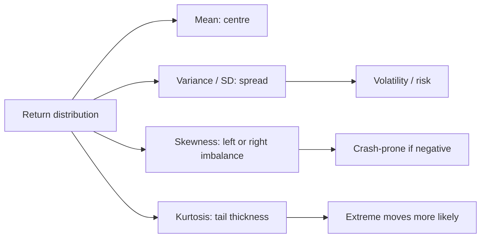

# Week 2: Statistical Properties of Financial Data

## What this week is for

This week formalises returns as random variables. The main things you need later are means, variances, standard deviations, normal probabilities, skewness, kurtosis, and the difference between simple and log compounding.

## Plain-English Roadmap

This week treats returns as uncertain outcomes. Before the return happens, it is a random variable: it could be high, low, positive, or negative. A distribution is just a way of describing the possible outcomes and how likely they are.

The mean is the centre of the distribution. For returns, it is the average return you would expect over many repeated periods. It is not a promise about the next period; it is the long-run centre.

The variance and standard deviation measure spread. In finance, spread is risk because a return that jumps around a lot is harder to predict and can create large losses. Standard deviation is usually easier to interpret than variance because it is in the same units as returns.

Skewness tells you whether the distribution leans more heavily toward one side. Negative skewness is common in finance and means large negative outcomes are more prominent than large positive outcomes. Kurtosis tells you whether extreme outcomes are more common than they would be under a normal distribution. High kurtosis is why financial returns often have more big crashes and jumps than a simple normal model expects.

Standardising is a translation step. If a return has its own mean and standard deviation, standardising converts it into a standard normal variable so you can use normal tables or normal quantiles. You are not changing the event; you are changing the scale so probabilities are easier to compute.

Adjusted closing prices matter because raw prices can jump due to dividends or stock splits even when the investor's true wealth did not jump in the same way. Adjusted prices try to make the return series reflect the investor's actual economic gain or loss.

## Visual Guide

This diagram shows how the main distribution summaries fit together. The mean tells you where returns are centred, variance/standard deviation tell you how wide the distribution is, skewness tells you whether one tail dominates, and kurtosis tells you how extreme the tails are.



## Formula Symbol Guide

Use this when checking what each symbol means in the Week 2 formulas.

- $P_t$: price at time $t$.
- $D_t$: dividend paid during period $t$, if dividends are included.
- $R_t$: simple return in period $t$.
- $r_t$: log return in period $t$; $log$ means natural log.
- $\bar r$: sample average return.
- $T$: number of observations in the sample.
- $s^2$: sample variance; the average squared distance from the sample mean, using $T-1$ in the denominator.
- $s$: sample standard deviation, equal to $\sqrt{s^2}$.
- $\mu$: population or model mean.
- $\sigma$: population or model standard deviation.
- $X$: a generic random variable, often a return.
- $x$: a particular cutoff or observed value.
- $Z$: a standard normal random variable with mean 0 and variance 1.
- $z$: a standardised value, calculated by subtracting the mean and dividing by the standard deviation.
- $\mathbb E[\cdot]$: expected value, meaning probability-weighted average.
- $\operatorname{Var}(\cdot)$: variance, meaning squared spread around the mean.
- $\operatorname{sd}(\cdot)$: standard deviation, the square root of variance.


## Returns with dividends (Exam)

Concept: dividends are part of the investor's payoff. If you ignore dividends, you understate the true return from holding the asset.

Example: if price rises from \$100 to \$103 and a \$2 dividend is paid, the return is 5%, not 3%.

If dividends are included, the simple return is

$$
R_t = (P_t + D_t - P_{t-1}) / P_{t-1}
$$

where `D_t` is the dividend paid during the holding period.

In most workshop data you use adjusted closing prices. Adjusted prices already account for splits and dividends, so the return formula can usually be applied directly to adjusted prices:

$$
\begin{aligned}
R_t = P_t / P_{t-1} - 1 \\
r_t = \log(P_t) - \log(P_{t-1})
\end{aligned}
$$

## Simple versus log returns (Exam)

Concept: simple returns track actual wealth multiplication; log returns track additive growth. They are close for small returns but behave differently over multiple periods.

Example: a simple return of 1% has log return about 0.995%, so they are nearly identical for small daily moves.

Simple returns compound by multiplication:

$$
1+R_t(k)=\prod_{j=0}^{k-1}(1+R_{t-j})
$$

Log returns compound by addition:

$$
r_t(k)=\sum_{j=0}^{k-1}r_{t-j}
$$

Use log returns when the question asks for them or when working with time-series models. Use simple gross returns when constructing an equity curve.

## Random variables and distributions

Concept: before a return is observed, it is uncertain. A distribution is a map of possible return outcomes and their likelihoods.

Example: tomorrow's return is unknown today, so we describe it with possible values and probabilities.

A random variable is something uncertain, such as next month's return.

A probability distribution describes which values the random variable can take and how likely they are.

For a continuous random variable `X`, probabilities are areas under the density:

$$
\Pr(a \le X \le b) = area \text{ under } f(x) from a to b
$$

The normal distribution is written

$$
X \sim \mathcal{N}(\mu, \sigma^2)
$$

where:

$$
\begin{aligned}
\mu       \operatorname{mean}, centre of the distribution \\
\sigma^2  variance \\
\sigma    standard deviation
\end{aligned}
$$

## Expected value (Exam)

Concept: expected value is the centre or long-run average. It is not what must happen next period; it is the average outcome the model points toward.

Example: if returns are 1%, 2%, and 3% with equal chance, the expected return is 2%.

The expected value is the long-run average or centre of a random variable:

$$
\mathbb{E}[X] = \mu
$$

For returns, the expected return is your best single-number summary of average performance.

Useful rules:

$$
\begin{aligned}
\mathbb{E}(a) = a \\
\mathbb{E}(aX) = aE(X) \\
\mathbb{E}(a + X) = a + \mathbb{E}(X) \\
\mathbb{E}(X + Y) = \mathbb{E}(X) + \mathbb{E}(Y)
\end{aligned}
$$

## Variance and standard deviation (Exam)

Concept: variance and standard deviation measure how spread out returns are. In finance, more spread usually means more risk because outcomes are less predictable.

Example: two assets can both average 1%, but the one swinging between -5% and 7% is riskier than one staying near 1%.

Variance measures average squared distance from the mean:

$$
\operatorname{Var}(X) = \mathbb{E}[(X - \mu)^2]
$$

Standard deviation is the square root of variance:

$$
\operatorname{sd}(X) = \sqrt{\operatorname{Var}(X)}
$$

For returns, standard deviation is interpreted as volatility or risk.

Useful rules:

$$
\begin{aligned}
\operatorname{Var}(a) = 0 \\
\operatorname{Var}(aX) = a^2 \operatorname{Var}(X) \\
\operatorname{Var}(a + X) = \operatorname{Var}(X)
\end{aligned}
$$

For two random variables:

$$
\operatorname{Var}(X + Y) = \operatorname{Var}(X) + \operatorname{Var}(Y) + 2cov(X,Y)
$$

That covariance term becomes essential in portfolio risk.

## Standardising a normal variable (Exam)

Concept: standardising puts any normal variable onto the standard normal scale. This lets you use the same normal critical values for many different return distributions.

Example: if $X$ is two standard deviations below its mean, its standardised value is $Z=-2$.

If

$$
X \sim \mathcal{N}(\mu, \sigma^2)
$$

then

$$
Z = (X - \mu) / \sigma \sim \mathcal{N}(0,1)
$$

Use this to compute probabilities or quantiles.

Example structure:

$$
\begin{aligned}
\Pr(X > a) = \Pr((X - \mu)/\sigma > (a - \mu)/\sigma) \\
= \Pr(Z > z)
\end{aligned}
$$

## Moments: mean, variance, skewness, kurtosis (Exam)

Concept: moments summarise the shape of a return distribution. Mean is centre, variance is spread, skewness is imbalance, and kurtosis is tail thickness.

Example: crash-prone returns often show negative skewness and high kurtosis.

The main moments used for asset returns are:

```text
mean       average return
variance   risk or dispersion
skewness   asymmetry
kurtosis   tail thickness / extreme-return tendency
```

Financial returns often have:

```text
negative skewness      large negative returns can be more common/severe
excess kurtosis        tails are fatter than normal
volatility clustering  large moves tend to follow large moves
```

These stylised facts motivate ARCH and GARCH models later.

## Percent returns (Exam)

Concept: always check scale before calculating. A return written as 2 might mean 2 percent in R output, while 0.02 means 2 percent in decimal form.

Example: in some R outputs, 0.8 means 0.8%, but in decimal return data 0.008 means 0.8%.

Be careful about scale.

If returns are written as decimals:

$$
0.01 = 1 percent
$$

If returns are written as percentages:

$$
1 = 1 percent
$$

Use the scale consistently in formulas.

## Exam-Style Practice Questions

### Question 1: Returns and scale

#### Relevant Formulas

Simple return: use this to measure the ordinary percentage price change.

$$
R_t=\frac{P_t}{P_{t-1}}-1
$$

Log return: use this for continuously compounded returns.

$$
r_t=\log\left(\frac{P_t}{P_{t-1}}\right)
$$


A stock has adjusted closing prices:

| Month | Price |
|---|---:|
| Jan | 52.00 |
| Feb | 54.60 |
| Mar | 53.20 |

1. Compute the February and March simple returns.
2. Compute the February and March log returns.
3. Express both log returns in percentage terms.
4. Explain why the January return cannot be computed from this table alone.

#### Worked Answer

February simple return:

$$
R_{Feb}=54.60/52.00-1=0.0500=5.00\%.
$$

March simple return:

$$
R_{Mar}=53.20/54.60-1=-0.0256=-2.56\%.
$$

Log returns:

$$
r_{Feb}=\log(54.60/52.00)=0.0488=4.88\%,
$$

$$
r_{Mar}=\log(53.20/54.60)=-0.0260=-2.60\%.
$$

The January return cannot be computed because the previous price is missing.

### Question 2: Normal probabilities

#### Relevant Formulas

Standardisation: use this to turn a return into a standard normal $z$ value.

$$
z=\frac{x-\mu}{\sigma}
$$

Normal probability: after standardising, read the probability from the standard normal distribution.

$$
\Pr(r_t<x)=\Pr\left(Z<\frac{x-\mu}{\sigma}\right)
$$


Suppose a monthly log return is:

$$
r_t \sim \mathcal{N}(0.006, 0.045^2).
$$

1. Standardise the event $r_t < -0.06$.
2. Write the probability in terms of a standard normal random variable $Z$.
3. Explain what a very small probability would mean in this context.

#### Worked Answer

Standardise:

$$
Z=\frac{-0.06-0.006}{0.045}=-1.467.
$$

So:

$$
\Pr(r_t<-0.06)=\Pr(Z<-1.467).
$$

This is about 7%. A very small probability would mean that a return below -6% is unusual under the assumed normal model.

### Question 3: Moments and interpretation

#### Relevant Formulas

Mean: use this to describe the centre of the return distribution.

$$
\bar r=\frac{1}{T}\sum_{t=1}^T r_t
$$

Variance and standard deviation: use these to describe spread or volatility.

$$
s^2=\frac{1}{T-1}\sum_{t=1}^T(r_t-\bar r)^2, \qquad s=\sqrt{s^2}
$$

Skewness and kurtosis: use these to describe asymmetry and tail thickness.

$$
\text{skewness}=\frac{\mathbb E[(r_t-\mu)^3]}{\sigma^3}, \qquad
\text{kurtosis}=\frac{\mathbb E[(r_t-\mu)^4]}{\sigma^4}
$$


Two portfolios have the following sample moments for monthly log returns:

| Portfolio | Mean | Standard deviation | Skewness | Kurtosis |
|---|---:|---:|---:|---:|
| A | 0.8% | 3.2% | -0.9 | 6.5 |
| B | 0.6% | 1.8% | 0.1 | 3.1 |

1. Which portfolio has higher average return?
2. Which portfolio has higher volatility?
3. Which portfolio has stronger evidence of large negative returns?
4. Which portfolio has fatter tails than a normal distribution? Explain.

#### Worked Answer

Portfolio A has the higher mean return: 0.8% versus 0.6%.

Portfolio A also has higher volatility: 3.2% versus 1.8%.

Portfolio A has stronger evidence of large negative returns because its skewness is -0.9.

Portfolio A has much fatter tails because its kurtosis is 6.5, well above the normal benchmark of 3. Portfolio B is closer to normal-tail behaviour with kurtosis 3.1.

## What to be able to do

1. Compute simple and log returns from prices.
2. Explain why adjusted closing prices are usually used.
3. Compound simple returns using products.
4. Add log returns across periods.
5. Interpret mean and standard deviation of returns.
6. Standardise a normal variable.
7. Recognise why financial returns often require models beyond constant-variance normal models.
