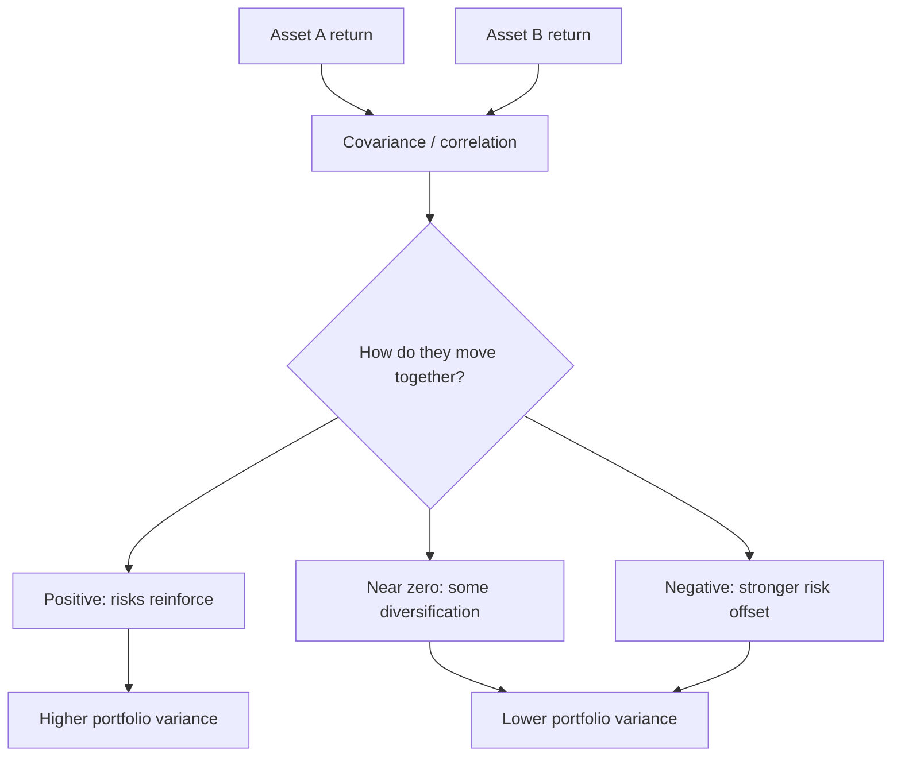

# Week 3: Co-movements of Financial Data

## What this week is for

This week explains how variables move together. In finance this matters because portfolio risk depends not only on each asset's volatility, but also on how asset returns co-move.

## Plain-English Roadmap

This week is about relationships. In finance, you rarely care about one asset in isolation. If two stocks both crash at the same time, holding both may not reduce your risk much. If one tends to rise when the other falls, combining them can smooth the ride.

Joint probability is about two things happening together. Marginal probability is about one thing by itself. Conditional probability is about updating your view once you know something else. This conditional way of thinking is everywhere in time-series finance: "Given what I knew yesterday, what did I expect today?"

Conditional expectation is a forecast based on information. If you know the state of the economy, your expected sales or expected return may change. Before the state is known, the conditional expectation itself is uncertain because it depends on which state occurs.

Covariance tells you the direction of co-movement. Positive covariance means two returns tend to move together. Negative covariance means they tend to move in opposite directions. Correlation is the same idea scaled to be between -1 and 1, which makes it easier to interpret.

The Fama-French size/value tables are not random tables of numbers. They are trying to show patterns in average returns across types of firms. Moving down the rows changes firm size. Moving across the columns changes value/growth characteristics. If returns rise toward small or value portfolios, that is evidence of size or value effects.

## Visual Guide

This is the basic co-movement story. Individual asset risk matters, but portfolio risk also depends on the correlation/covariance between assets.



## Formula Symbol Guide

Use this when reading Week 3 formulas about probabilities, conditioning, and co-movement.

- $X$, $Y$: generic random variables.
- $x$, $y$: particular values that $X$ and $Y$ can take.
- $\Pr(\cdot)$: probability of an event.
- $\Pr(X=x,Y=y)$: joint probability that both events happen together.
- $\Pr(X=x)$: marginal probability of $X=x$, ignoring $Y$.
- $\Pr(X=x|Y=y)$: conditional probability of $X=x$ after knowing $Y=y$.
- $\sum_y$: add over all possible values of $Y$.
- $\mathbb E[X|Y]$: conditional expectation of $X$ after knowing $Y$.
- $\operatorname{Var}(Y|X)$: conditional variance of $Y$ after knowing $X$.
- $\operatorname{Cov}(X,Y)$: covariance; direction of linear co-movement between $X$ and $Y$.
- $\operatorname{Corr}(X,Y)$: correlation; covariance scaled between -1 and 1.
- $\operatorname{sd}(X)$: standard deviation of $X$.
- $R_A$, $R_B$: returns on assets A and B.
- $\rho_{AB}$: correlation between returns on assets A and B.
- $\sigma_A$, $\sigma_B$: standard deviations of returns on assets A and B.
- $SMB_t$: Small Minus Big factor return at time $t$.
- $HML_t$: High Minus Low factor return at time $t$.
- $R_{\text{small},t}$: return on small-stock portfolios at time $t$.
- $R_{\text{big},t}$: return on big-stock portfolios at time $t$.
- $R_{\text{high BtM},t}$: return on value-stock portfolios at time $t$.
- $R_{\text{low BtM},t}$: return on growth-stock portfolios at time $t$.


## Joint, marginal, and conditional probabilities

Concept: joint means together, marginal means by itself, and conditional means after knowing something else. Conditional thinking is the basis for forecasts and risk models later.

Example: joint probability asks for rain and low sales together; marginal probability asks for low sales regardless of weather.

The joint probability describes two events happening together:

$$
\Pr(X = x, Y = y)
$$

where `X` and `Y` are two random variables, `x` is one possible value of `X`, and `y` is one possible value of `Y`.

The marginal probability ignores the other variable:

$$
\Pr(X=x)=\sum_y \Pr(X=x,Y=y)
$$

where `\sum_y` means "add across all possible values of `Y`". You are removing `Y` from the question and just asking how likely `X=x` is overall.

The conditional probability asks for the probability of one event given that another event is known:

$$
\Pr(X = x | Y = y) = \frac{\Pr(X = x, Y = y)}{\Pr(Y = y)}
$$

where `\Pr(X=x|Y=y)` means "the probability that `X=x` after we know `Y=y`". The denominator `\Pr(Y=y)` rescales the probability because we are only looking inside the cases where `Y=y` happened.

This matters because finance often uses conditional thinking: what is the expected return or variance given the information available now?

## Independence

Concept: independence means knowing one variable gives no information about the other. In finance, returns are rarely perfectly independent, which is why diversification needs covariance/correlation.

Example: if knowing the market rose today changes your expectation for a stock, the stock is not independent of the market.

`X` and `Y` are independent if knowing `Y` tells you nothing about `X`:

$$
\Pr(X = x | Y = y) = \Pr(X = x)
$$

where the left side is the probability after learning `Y=y`, and the right side is the original probability before learning `Y=y`. If they are equal, `Y` did not change your view of `X`.

For returns, independence would mean one asset's outcome gives no information about another asset's outcome. That is rarely exactly true in markets.

## Conditional expectation (Exam)

Concept: conditional expectation is a forecast after using available information. If the condition changes, the forecast can change too.

Example: expected airline returns may be different conditional on oil prices being high.

The conditional expectation is the mean of a variable after conditioning on information:

$$
\mathbb{E}[X | Y]
$$

Read this as "the expected value of X given Y".

Here, `X` is the variable you are forecasting or averaging, and `Y` is the information you condition on. In finance, `X` might be tomorrow's return, and `Y` might be today's market state.

The Law of Iterated Expectations (LIE) says:

$$
\mathbb{E}[X] = \mathbb{E}[ \mathbb{E}[X | Y] ]
$$

where `\mathbb{E}[X]` is the unconditional mean of `X`, `\mathbb{E}[X|Y]` is the conditional mean after knowing `Y`, and the outer `\mathbb{E}` averages those conditional means across all possible values of `Y`.

In words: the unconditional mean is the average of the conditional mean.

This is used repeatedly in AR, ARCH, and GARCH derivations.

## Conditional variance (Exam)

Concept: conditional variance is remaining uncertainty after using information. It is usually smaller than unconditional variance because you know more.

Example: if you know markets are in crisis, your conditional variance forecast for tomorrow may be higher than usual.

The conditional variance is uncertainty after conditioning on information:

$$
\operatorname{Var}(Y | X) = \mathbb{E}[(Y - \mathbb{E}[Y | X])^2 | X]
$$

where `Y` is the variable whose uncertainty you care about, `X` is the information you know, `\mathbb{E}[Y|X]` is the conditional mean of `Y`, and the squared term measures how far `Y` is from that conditional mean.

The Law of Total Variance says:

$$
\operatorname{Var}(Y) = \mathbb{E}[\operatorname{Var}(Y | X)] + \operatorname{Var}(\mathbb{E}[Y | X])
$$

where `\operatorname{Var}(Y)` is total uncertainty, `\mathbb{E}[\operatorname{Var}(Y|X)]` is the average uncertainty left after knowing `X`, and `\operatorname{Var}(\mathbb{E}[Y|X])` is the uncertainty caused by the conditional mean changing across different values of `X`.

This becomes very important in the practice exam when comparing conditional and unconditional variance for an AR(1) process.

Interpretation:

```text
conditional variance     uncertainty after using available information
unconditional variance   total uncertainty before using that information
```

Usually:

$$
\operatorname{Var}(Y | information) < \operatorname{Var}(Y)
$$

where "information" means whatever you condition on, such as yesterday's return, the market state, or a volatility forecast. This inequality is an intuition, not a mathematical guarantee in every possible case, but the basic idea is that useful information should reduce uncertainty.

## Covariance (Exam)

Concept: covariance tells you whether two returns tend to move in the same or opposite directions, but its units make it hard to compare across assets.

Example: bank stocks often have positive covariance because they respond to similar economic news.

Covariance measures whether two variables move together:

$$
\operatorname{Cov}(X,Y) = \mathbb{E}[(X - \mathbb{E}[X])(Y - \mathbb{E}[Y])]
$$

where `X` and `Y` are the two variables, `\mathbb{E}[X]` and `\mathbb{E}[Y]` are their means, and each bracket measures whether the variable is above or below its own mean. Multiplying the brackets tells you whether they tend to be above/below their means together.

Interpretation:

$$
\begin{aligned}
\operatorname{Cov}(X,Y) > 0 &\Rightarrow X \text{ and } Y tend to move in the same direction, \\
\operatorname{Cov}(X,Y) < 0 &\Rightarrow X \text{ and } Y tend to move in opposite directions, \\
\operatorname{Cov}(X,Y) = 0 &\Rightarrow \text{no linear co-movement.}
\end{aligned}
$$

For returns, covariance is central to diversification.

## Correlation (Exam)

Concept: correlation is standardised covariance. It keeps the direction of co-movement but rescales it between -1 and 1.

Example: a correlation of -0.4 means the assets often move in opposite directions, though not perfectly.

Correlation is standardised covariance:

$$
\operatorname{Corr}(X,Y) = \operatorname{Cov}(X,Y) / (\operatorname{sd}(X) \operatorname{sd}(Y))
$$

where `\operatorname{Cov}(X,Y)` is covariance, `\operatorname{sd}(X)` is the standard deviation of `X`, and `\operatorname{sd}(Y)` is the standard deviation of `Y`. Dividing by the two standard deviations removes the units, so the result is easier to interpret.

It is always between -1 and 1.

Interpretation:

```text
near 1       strong positive co-movement
near -1      strong negative co-movement
near 0       weak linear co-movement
```

Correlation is easier to interpret than covariance because it has no units.

## Fama-French size and value portfolio tables (Exam)

Concept: these tables reveal patterns in average returns across firm types. Read rows as size groups and columns as growth-to-value groups. The point is not to memorise one table; the point is to learn how to spot whether certain types of stocks historically earned higher average returns.

Example: if high-BtM columns have higher returns than low-BtM columns, that is a value effect.

The Week 3 workshop uses 25 Fama-French portfolios sorted by:

```text
size:             small to big
book-to-market:   low to high
```

### What Fama-French is doing

Fama-French is a way of grouping stocks by characteristics and then asking:

```text
Do some types of stocks earn different average returns from other types of stocks?
```

Instead of looking at one company at a time, the method forms portfolios. For example, it groups many small companies together and many big companies together, then compares their average returns.

The two characteristics in this section are:

```text
size              how large the company is
book-to-market    how cheap or expensive the company looks relative to accounting value
```

Size usually means market capitalisation:

$$
\text{market capitalisation}=\text{share price}\times\text{number of shares outstanding}
$$

where share price is the current price of one share, and shares outstanding is the number of company shares held by investors. A small firm has low market capitalisation. A big firm has high market capitalisation.

Book-to-market is:

$$
\text{book-to-market}=\frac{\text{book value of equity}}{\text{market value of equity}}
$$

where book value of equity is the accounting value of the firm's equity from its balance sheet, and market value of equity is what the stock market says the firm's equity is worth. Low book-to-market usually means the market price is high relative to accounting value. High book-to-market means the market price is low relative to accounting value.

### Growth versus value

Low book-to-market means growth. These firms are often priced highly because investors expect strong future growth.

High book-to-market means value. These firms are often priced cheaply relative to accounting value, so they may be mature, distressed, overlooked, or simply less exciting to investors.

In short:

```text
low book-to-market     growth stocks
high book-to-market    value stocks
small size             small stocks
big size               big stocks
```

### How the 5 by 5 table is built

The workshop table has 25 portfolios because it uses:

```text
5 size groups x 5 book-to-market groups = 25 portfolios
```

First, stocks are sorted into five size buckets, from smallest firms to biggest firms. Then, within those, stocks are sorted into five book-to-market buckets, from growth to value.

In a 5 by 5 table:

```text
rows      size groups, small at top and big at bottom
columns   book-to-market groups, growth on left and value on right
cell      average monthly excess return for that portfolio
```

Each cell is not one company. Each cell is a portfolio of companies with similar size and book-to-market characteristics.

For example:

```text
Small / Low BtM      small-growth portfolio
Small / High BtM     small-value portfolio
Big / Low BtM        big-growth portfolio
Big / High BtM       big-value portfolio
```

### What the table is trying to show

You read the table by comparing patterns across rows and columns.

How to read the patterns:

```text
returns rise left to right    value effect
returns rise bottom to top    size effect
highest small-value cell      small value earns highest average return
lowest small-growth cell      small growth earns weak average return
```

The value effect means value stocks have higher average returns than growth stocks. In the table, this shows up if the right-hand columns have larger numbers than the left-hand columns.

The size effect means small stocks have higher average returns than big stocks. In the table, this shows up if the top rows have larger numbers than the bottom rows.

### A small example

Suppose a simplified table reports average monthly excess returns:

|       | Low BtM | High BtM |
| ----- | ------: | -------: |
| Small |    0.30 |     0.95 |
| Big   |    0.20 |     0.55 |

Read it like this:

```text
Small / Low BtM  = small-growth
Small / High BtM = small-value
Big / Low BtM    = big-growth
Big / High BtM   = big-value
```

The value effect is visible because high-BtM returns are higher than low-BtM returns:

```text
small row: 0.95 > 0.30
big row:   0.55 > 0.20
```

The size effect is visible because small-stock returns are higher than big-stock returns:

```text
growth column: 0.30 > 0.20
value column:  0.95 > 0.55
```

The strongest portfolio is small-value because it combines both characteristics associated with higher average returns in this table.

### How SMB and HML connect to the table

Fama-French factors are long-short portfolios built from these sorts.

SMB means "Small Minus Big". It is designed to capture the size effect:

$$
SMB_t=R_{\text{small},t}-R_{\text{big},t}
$$

where `SMB_t` is the size-factor return at time `t`, `R_{\text{small},t}` is the return on small-stock portfolios, and `R_{\text{big},t}` is the return on big-stock portfolios.

If `SMB_t` is positive, small stocks outperformed big stocks during that period.

HML means "High Minus Low". It is designed to capture the value effect:

$$
HML_t=R_{\text{high BtM},t}-R_{\text{low BtM},t}
$$

where `HML_t` is the value-factor return at time `t`, `R_{\text{high BtM},t}` is the return on value-stock portfolios, and `R_{\text{low BtM},t}` is the return on growth-stock portfolios.

If `HML_t` is positive, value stocks outperformed growth stocks during that period.

### What an exam or workshop question usually wants

If you are given a Fama-French table, do this:

1. Check whether numbers rise from left to right. If yes, say there is a value effect.
2. Check whether numbers are higher for small firms than big firms. If yes, say there is a size effect.
3. Identify the largest cell and describe it using both labels, such as small-value or big-growth.
4. Use words, not just numbers. Say what the pattern means economically.

The workshop result is consistent with:

```text
value stocks outperform growth stocks
small stocks often outperform big stocks
small-value portfolios often have high average returns
```

## Exam-Style Practice Questions

### Question 1: Conditional expectation and LIE

#### Relevant Formulas

Expected return across states: use this when different states have different probabilities.

$$
\mathbb E(R)=\sum_s R_s\Pr(S=s)
$$

where `R_s` is the return in state `s`, `\Pr(S=s)` is the probability of state `s`, and `\sum_s` means add across all states.

Law of iterated expectations: use this to connect conditional and unconditional averages.

$$
\mathbb E(R)=\mathbb E[\mathbb E(R\mid S)]
$$

where `R` is the return, `S` is the state variable, `\mathbb E(R|S)` is the expected return after knowing the state, and the outer expectation averages across the possible states.


Suppose market state $S$ is either good $(S=1)$ or bad $(S=0)$. A portfolio return $R$ has:

$$
\mathbb{E}(R\mid S=1)=1.8,\qquad \mathbb{E}(R\mid S=0)=-0.6,
$$

where `S=1` means the good state, `S=0` means the bad state, and `R` is the portfolio return.

and:

$$
\Pr(S=1)=0.65,\qquad \Pr(S=0)=0.35.
$$

1. Use the Law of Iterated Expectations to compute $\mathbb{E}(R)$.
2. Explain what the conditional means represent.
3. Explain why $\mathbb{E}(R\mid S)$ is a random variable before $S$ is known.

#### Worked Answer

Using LIE:

$$
\mathbb{E}(R)=1.8(0.65)+(-0.6)(0.35)=1.17-0.21=0.96.
$$

The conditional means are the expected returns after knowing the market state. Before the state is known, $\mathbb{E}(R\mid S)$ is random because it depends on whether $S=1$ or $S=0$ occurs.

### Question 2: Covariance and correlation

#### Relevant Formulas

Covariance from correlation: use this when the question gives correlation and standard deviations.

$$
\operatorname{Cov}(R_A,R_B)=\rho_{AB}\sigma_A\sigma_B
$$

where `R_A` and `R_B` are the two asset returns, `\rho_{AB}` is their correlation, and `\sigma_A`, `\sigma_B` are their standard deviations.

Correlation from covariance: use this to standardise covariance into a number between -1 and 1.

$$
\rho_{AB}=\frac{\operatorname{Cov}(R_A,R_B)}{\sigma_A\sigma_B}
$$

where `\operatorname{Cov}(R_A,R_B)` is the covariance between the two returns.


Two assets have:

$$
\sigma_A=0.09,\qquad \sigma_B=0.14,\qquad \rho_{AB}=-0.25.
$$

where `0.09` and `0.14` are the assets' standard deviations, and `-0.25` says the two assets have negative correlation.

1. Compute $\operatorname{Cov}(R_A,R_B)$.
2. Explain whether the assets tend to move together or in opposite directions.
3. Explain why this correlation may help reduce portfolio risk.

#### Worked Answer

Covariance is:

$$
\operatorname{Cov}(R_A,R_B)=\rho_{AB}\sigma_A\sigma_B=(-0.25)(0.09)(0.14)=-0.00315.
$$

The negative sign means the two returns tend to move in opposite directions. This helps diversification because losses in one asset may be partly offset by gains in the other.

### Question 3: Fama-French style table

#### Relevant Formulas

Group mean return: use this to compare portfolios such as small versus big or value versus growth.

$$
\bar r_g=\frac{1}{T}\sum_{t=1}^T r_{g,t}
$$

where `\bar r_g` is the average return for group `g`, `T` is the number of time periods, and `r_{g,t}` is group `g`'s return in period `t`.

Long-short factor return: use this when a factor is built by going long one group and short another.

$$
r_{factor,t}=r_{long,t}-r_{short,t}
$$

where `r_{factor,t}` is the factor return in period `t`, `r_{long,t}` is the return on the group you buy, and `r_{short,t}` is the return on the group you short.


The table reports mean monthly excess returns:

|       | Low BtM | Medium BtM | High BtM |
| ----- | ------: | ---------: | -------: |
| Small |    0.35 |       0.82 |     1.05 |
| Mid   |    0.44 |       0.70 |     0.91 |
| Big   |    0.39 |       0.55 |     0.63 |

1. Identify the value effect in the table.
2. Identify the size effect in the table.
3. Which portfolio has the highest average excess return?
4. Interpret the result using the terms growth, value, small, and big.

#### Worked Answer

The value effect appears because returns rise as BtM moves from low to high within each size row.

The size effect appears because small portfolios generally have higher returns than big portfolios, especially in the high-BtM column.

The highest return is Small/High BtM at 1.05. That is the small-value portfolio.

## What to be able to do

1. Explain joint, marginal, and conditional probability.
2. Use LIE: `E[X] = E(E[X | Y])`.
3. Use Law of Total Variance.
4. Interpret covariance and correlation.
5. Read a size-by-value portfolio table.
6. Explain value effect and size effect in plain language.
