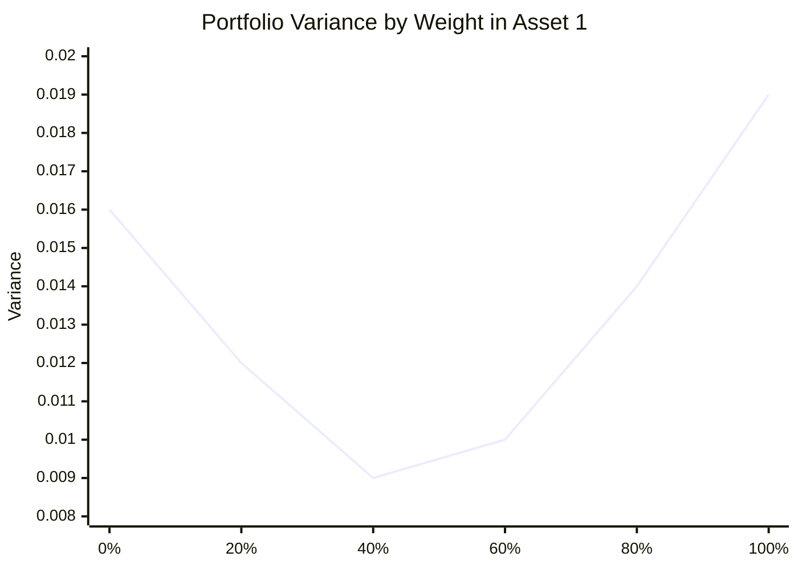

# Week 4: Mitigating Risk

## What this week is for

This week is portfolio risk. You need to understand how expected return, variance, covariance, correlation, Sharpe ratio, and Global Minimum Variance (GMV) weights fit together.

## Plain-English Roadmap

A portfolio is a weighted mix of assets. The return is simple: if half your money is in asset 1 and half in asset 2, your portfolio return is half of asset 1's return plus half of asset 2's return.

Risk is less simple because the assets may move together. Portfolio variance has three parts: the risk from asset 1, the risk from asset 2, and the co-movement between them. The co-movement term is why diversification works. If two assets do not move perfectly together, some ups and downs offset each other.

The GMV portfolio asks a very narrow question: "What weights give the lowest possible variance?" It does not ask for the highest return. It only cares about reducing risk. That is why a low-volatility asset can receive a large GMV weight even if its expected return is not exciting.

The regression trick for two-asset GMV weights works because the regression is indirectly finding how much of one asset's movement can be offset by the difference between the two assets. You do not need to love the trick; for exams, remember that the slope maps to the risk-minimising weight in the setup given.

The Sharpe ratio puts return and risk into one number: extra return per unit of volatility. A high-return asset can have a worse Sharpe ratio than a lower-return asset if it takes much more risk to get that return.

## Visual Guide

The GMV idea is easiest to see as a curve: as the weight in asset 1 changes, portfolio variance changes. The GMV weight is the lowest point on the curve.



## Formula Symbol Guide

Use this for the portfolio formulas in Week 4.

- $R_p$: portfolio return.
- $R_1$, $R_2$: returns on asset 1 and asset 2.
- $w_1$, $w_2$: portfolio weights in asset 1 and asset 2. Usually $w_1+w_2=1$.
- $\mathbb E(R_p)$: expected portfolio return.
- $\mathbb E(R_i)$: expected return on asset $i$.
- $\sigma_p^2$: portfolio variance. This is the risk measure before taking the square root.
- $\sigma_p$: portfolio standard deviation, also called portfolio volatility.
- $\sigma_1^2$, $\sigma_2^2$: variances of asset 1 and asset 2.
- $\sigma_{12}$: covariance between asset 1 and asset 2.
- $\rho_{12}$: correlation between asset 1 and asset 2.
- $w_1^{GMV}$: weight in asset 1 for the global minimum variance portfolio.
- $w_2^{GMV}$: weight in asset 2 for the global minimum variance portfolio.
- $R_f$: risk-free return.
- $SR$: Sharpe ratio; excess return per unit of volatility.
- $b$: regression slope, used in the workshop/practice-exam shortcut for GMV weights.
- $\operatorname{Cov}(R_1,R_2)$: covariance between the two asset returns.
- $\operatorname{Var}(R_2)$: variance of asset 2's return.


## Portfolio basics

Concept: a portfolio return is a weighted average because each asset contributes according to how much wealth you put into it.

Example: with 30% in A and 70% in B, the portfolio return is $0.3R_A+0.7R_B$.

A portfolio is a collection of assets. If a portfolio has two risky assets with returns `R1` and `R2`, and weight `w` in asset 1, then:

$$
R_p = w R1 + (1 - w) R2
$$

The weights tell you how wealth is allocated.

## Expected return of a two-asset portfolio

Concept: expected returns combine linearly. If you put 70% in one asset, 70% of its expected return contributes to the portfolio expected return.

Example: if expected returns are 10% and 4%, a 50/50 portfolio has expected return 7%.

Expected portfolio return is the weighted average of expected asset returns:

$$
\mathbb{E}[R_p] = w \mathbb{E}[R1] + (1 - w) \mathbb{E}[R2]
$$

or

$$
\mu_p = w \mu_1 + (1 - w) \mu_2
$$

This part is simple: expected returns average linearly.

## Variance of a two-asset portfolio

Concept: portfolio risk is not just the weighted average of individual risks. The covariance term captures whether the assets rise and fall together.

Example: two risky assets can form a lower-risk portfolio if their correlation is low or negative.

Portfolio variance is:

$$
\begin{aligned}
\operatorname{Var}(R_p) = w^2 \sigma_1^2 \\
+ (1 - w)^2 \sigma_2^2 \\
+ 2w(1 - w) \sigma_{12}
\end{aligned}
$$

where:

- $R_p$ is the portfolio return.
- $w$ is the weight invested in asset 1.
- $1-w$ is the weight invested in asset 2.
- $\sigma_1^2$ is the variance of asset 1.
- $\sigma_2^2$ is the variance of asset 2.
- $\sigma_{12}$ is the covariance between asset 1 and asset 2.

The covariance term is the diversification term.

If covariance is positive, the assets move together and portfolio risk is higher. If covariance is negative, one asset tends to offset the other and portfolio risk is lower.

Correlation and covariance are related by:

$$
\sigma_{12} = \rho_{12} \sigma_1 \sigma_2
$$

## Sharpe ratio (Exam)

Concept: the Sharpe ratio asks how much extra return you get per unit of volatility. It helps compare assets with different risk levels.

Example: an asset earning 8% with 20% volatility has lower reward per risk than one earning 6% with 8% volatility.

The Sharpe ratio measures excess return per unit of risk:

$$
SR = (\operatorname{mean} return - risk-free rate) / standard deviation
$$

For an asset:

$$
SR_i = (\mu_i - r_f) / \sigma_i
$$

For a portfolio:

$$
SR_p = (\mu_p - r_f) / \sigma_p
$$

Higher Sharpe ratio means a better risk-return trade-off.

In the Week 4 workshop, compute monthly log returns, subtract the monthly risk-free rate, then divide the average excess return by the standard deviation.

If the annual risk-free rate is 3 percent and you need a monthly rate, a common approximation is:

```text
monthly r_f approx 0.03 / 12
```

Keep the units consistent. If returns are percentages, use the risk-free rate as a percentage too.

## Global Minimum Variance portfolio, two assets (Exam)

Concept: the GMV portfolio is the lowest-risk mix of the assets. It ignores expected return and only minimises variance.

Example: the GMV portfolio may put more weight in the lower-volatility asset even if its average return is lower.

The GMV portfolio is the portfolio with the smallest possible variance.

For two assets, the GMV weight in asset 1 is:

$$
\begin{aligned}
w_1^{GMV}
= \frac{\sigma_2^2-\sigma_{12}}
{\sigma_1^2+\sigma_2^2-2\sigma_{12}}
\end{aligned}
$$

and:

$$
w_2^{GMV}=1-w_1^{GMV}
$$

where $w_1^{GMV}$ is the risk-minimising weight in asset 1, $w_2^{GMV}$ is the risk-minimising weight in asset 2, $\sigma_1^2$ and $\sigma_2^2$ are the asset variances, and $\sigma_{12}$ is their covariance.

Interpretation:

```text
larger own variance       lowers that asset's GMV weight
lower covariance          can increase diversification benefit
negative covariance       especially useful for risk reduction
```

## Regression trick for GMV weights (Exam)

Concept: the regression slope is a shortcut for the same risk-minimisation problem. In the exam setup, the slope directly maps to one of the GMV weights.

Example: if the slope is 0.30 in the workshop-style regression, read it as a 30% GMV weight in the relevant asset.

The workshop asks how the slope in this regression is related to GMV weights:

$$
r_{2,t} = \beta_0 + \beta_1 (r_{2,t} - r_{1,t}) + e_t
$$

where $r_{1,t}$ and $r_{2,t}$ are the two asset returns at time $t$, $\beta_0$ is the intercept, $\beta_1$ is the slope, and $e_t$ is the regression error.

The slope coefficient $\beta_1$ gives the GMV weight allocated to asset 1 in the two-asset portfolio:

$$
\beta_1 = w_1
$$

Then:

$$
w_2 = 1 - \beta_1
$$

The practice exam uses the same idea but describes the slope as the weight allocated to one of the two stocks. Always check which asset is in the difference term.

## GMV portfolio with many assets (Exam)

Concept: the matrix formula is the many-asset version of the two-asset GMV formula. The covariance matrix contains all variances and co-movements.

Example: with 10 stocks, the covariance matrix tracks every stock's variance and every pairwise covariance.

For $N$ risky assets, collect weights into a vector:

$$
\mathbf w = (w_1, \cdots, w_N)'
$$

Let $\Sigma$ be the covariance matrix and $\mathbf 1$ be a vector of ones. The GMV weights are:

$$
\mathbf w^{GMV}
= \frac{\Sigma^{-1}\mathbf 1}{\mathbf 1'\Sigma^{-1}\mathbf 1}
$$

where $\mathbf w^{GMV}$ is the vector of risk-minimising weights, $\Sigma^{-1}$ is the inverse covariance matrix, and $\mathbf 1'\Sigma^{-1}\mathbf 1$ is the scaling term that makes the weights add to 1.

This is the many-asset version of the two-asset formula.

## Computing the GMV portfolio return (Exam)

Concept: once weights are known, the portfolio return series is built period by period as a weighted average of asset returns.

Example: if $w_1=0.25$, then each portfolio return is $0.25r_{1,t}+0.75r_{2,t}$.

For two assets:

$$
r_{p,t} = w_1 r_{1,t} + (1 - w_1) r_{2,t}
$$

Then compute the Sharpe ratio using the portfolio return series:

$$
SR_p = \frac{\operatorname{mean}(r_p) - r_f}{\operatorname{sd}(r_p)}
$$

## Exam-Style Practice Questions

### Question 1: GMV weights from a covariance matrix

#### Relevant Formulas

Two-asset GMV weight: use this to find the portfolio weight that minimises variance.

$$
w_1^{GMV}=\frac{\sigma_2^2-\sigma_{12}}{\sigma_1^2+\sigma_2^2-2\sigma_{12}}
$$

Second asset weight: portfolio weights must add to 1.

$$
w_2^{GMV}=1-w_1^{GMV}
$$

Portfolio variance: use this to calculate the risk of the combined portfolio.

$$
\sigma_p^2=w_1^2\sigma_1^2+w_2^2\sigma_2^2+2w_1w_2\sigma_{12}
$$


An investor considers two stocks with:

$$
\sigma_1^2=0.018,\qquad \sigma_2^2=0.010,\qquad \sigma_{12}=0.004.
$$

1. Compute the GMV weight in asset 1.
2. Compute the GMV weight in asset 2.
3. Explain why asset 2 receives a larger or smaller weight.
4. Compute the variance of the GMV portfolio.

#### Worked Answer

The GMV weight in asset 1 is:

$$
w_1=\frac{\sigma_2^2-\sigma_{12}}{\sigma_1^2+\sigma_2^2-2\sigma_{12}}
=\frac{0.010-0.004}{0.018+0.010-2(0.004)}=0.30.
$$

So:

$$
w_2=1-w_1=0.70.
$$

Asset 2 gets more weight because it has lower variance. The GMV variance is:

$$
0.3^2(0.018)+0.7^2(0.010)+2(0.3)(0.7)(0.004)=0.0082.
$$

### Question 2: Regression slope and GMV interpretation

#### Relevant Formulas

Regression slope: use this when the question links a hedge or GMV weight to a regression coefficient.

$$
b=\frac{\operatorname{Cov}(R_1,R_2)}{\operatorname{Var}(R_2)}
$$

Two-asset weight relationship: use this to convert the slope into portfolio weights when required by the setup.

$$
w_1=b, \qquad w_2=1-b
$$


An analyst estimates:

$$
r_{2,t}=0.003+0.62(r_{2,t}-r_{1,t})+\hat{\epsilon}_t.
$$

1. Interpret the slope coefficient as a GMV portfolio weight.
2. What percentage of wealth should be allocated to asset 1?
3. What percentage should be allocated to asset 2?
4. Briefly explain why a regression coefficient can recover the risk-minimising weight.

#### Worked Answer

In this regression setup, the slope is the GMV weight on asset 1. Thus:

$$
w_1=0.62,\qquad w_2=0.38.
$$

Allocate 62% to asset 1 and 38% to asset 2. The regression recovers the risk-minimising trade-off between the two return series.

### Question 3: Sharpe ratios

#### Relevant Formulas

Sharpe ratio: use this to compare return per unit of risk.

$$
SR=\frac{\mathbb E(R_p)-R_f}{\sigma_p}
$$

Higher Sharpe ratio: the portfolio gives more excess return for each unit of volatility.


The monthly mean log returns and standard deviations are:

| Asset | Mean | Standard deviation |
|---|---:|---:|
| A | 1.1% | 4.5% |
| B | 0.7% | 2.2% |
| GMV portfolio | 0.8% | 1.9% |

Assume the monthly risk-free rate is 0.25%.

1. Compute the Sharpe ratio for each asset and the GMV portfolio.
2. Which has the best risk-return trade-off?
3. Explain why the highest mean return need not have the highest Sharpe ratio.

#### Worked Answer

Sharpe ratios:

$$
SR_A=\frac{1.1-0.25}{4.5}=0.189.
$$

$$
SR_B=\frac{0.7-0.25}{2.2}=0.205.
$$

$$
SR_{GMV}=\frac{0.8-0.25}{1.9}=0.289.
$$

The GMV portfolio has the best Sharpe ratio. The highest mean return is not always best because it may require too much volatility.

## What to be able to do

1. Compute a portfolio return from weights and asset returns.
2. Compute a covariance and correlation matrix.
3. Explain why low or negative correlation reduces risk.
4. Compute two-asset GMV weights.
5. Use $\mathbf w^{GMV}=\frac{\Sigma^{-1}\mathbf 1}{\mathbf 1'\Sigma^{-1}\mathbf 1}$ for many assets.
6. Explain the regression slope/GMV weight connection.
7. Compute and interpret a Sharpe ratio.
