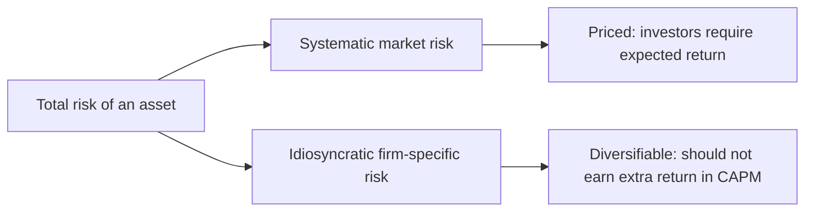
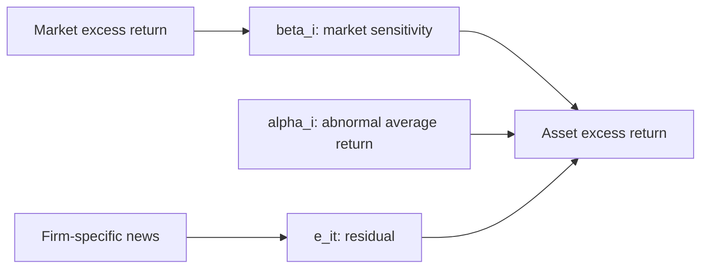

# Week 5: Asset Pricing Models

## What This Week Is Really About

Week 5 is about explaining returns using risk. The main question is simple:

> Why should one asset earn a higher expected return than another?

The answer in this week is not "because it is volatile" by itself. The answer is more specific: an asset should earn a higher expected return when it exposes investors to risk that cannot be easily diversified away.

This is the story behind CAPM and the factor models. CAPM begins with one priced risk factor: the market. Fama-French and Carhart extend the same idea by adding extra factors such as size, value, and momentum.

By the end of the week, you should be able to look at a regression output and explain what the alpha, beta, residual standard error, and `R^2` mean in economic language.

## Jargon Check

- **Asset:** Something investors can hold, such as a stock, bond, ETF, or portfolio.
- **Return:** The gain or loss on an asset over a period.
- **Risk-free rate:** The return on a very safe asset, often approximated using a short-term government bill.
- **Excess return:** The return above the risk-free rate. If an asset earns 8% and the risk-free rate is 3%, its excess return is 5%.
- **Market portfolio:** A broad portfolio meant to represent the overall market.
- **Market risk premium:** The extra expected return from holding the market instead of the risk-free asset.
- **Systematic risk:** Market-wide risk that affects many assets and cannot be diversified away.
- **Idiosyncratic risk:** Firm-specific or asset-specific risk that can be reduced through diversification.
- **Beta:** A measure of how sensitive an asset is to a factor, especially the market factor.
- **Alpha:** Abnormal average return left over after the model has accounted for risk exposure.
- **Factor:** A variable used to explain returns, such as the market, size, value, or momentum factor.

## Why Asset Pricing Starts With Risk

Suppose two assets both have an average return of 10%. One barely moves from month to month. The other swings violently, sometimes gaining a lot and sometimes losing a lot. Investors do not view these assets as equivalent, because the same average return can come with very different risk.

Asset pricing models try to connect expected return to the kind of risk an investor is taking. The important phrase is **kind of risk**. Not every risk should earn a reward.

If you hold only one company, that company might suffer a failed product launch, a CEO scandal, or an earnings disappointment. That is real risk for you, but it is mostly company-specific. If you hold a broad portfolio, one company's bad news can be offset by another company's good news. This kind of risk is idiosyncratic.

Market risk is different. A recession, interest rate shock, inflation surprise, or global crisis can affect many companies at once. Holding more stocks does not remove this exposure, because the whole market may move together.

CAPM says investors are compensated for bearing this unavoidable market-wide risk, not for holding avoidable firm-specific risk.



### Section Summary

- Asset pricing models explain expected returns through risk.
- CAPM separates risk into systematic risk and idiosyncratic risk.
- Systematic risk is market-wide and priced.
- Idiosyncratic risk is firm-specific and can be diversified away.

## The CAPM Pricing Idea

The Capital Asset Pricing Model, or CAPM, says an asset's expected excess return depends on its beta with the market.

The pricing equation is:

```text
E(R_i) - r_f = beta_i * [E(R_m) - r_f]
```

Read it from left to right:

- `E(R_i) - r_f` is the extra return investors expect from asset `i` above the safe rate.
- `E(R_m) - r_f` is the market risk premium.
- `beta_i` tells us how much market risk asset `i` carries.

If `beta_i = 1`, the asset has market-like exposure. If the market risk premium is 6%, the asset's expected excess return is also 6%.

If `beta_i = 2`, the asset is more aggressive. It carries twice the market exposure, so CAPM predicts twice the expected excess return.

If `beta_i = 0.5`, the asset is more defensive. It carries only half the market exposure, so CAPM predicts a lower expected excess return.

| Beta | Interpretation |
| --- | --- |
| `beta > 1` | More aggressive than the market |
| `beta = 1` | Moves like the market |
| `0 < beta < 1` | Less sensitive than the market |
| `beta = 0` | No systematic market exposure |

### Section Summary

- CAPM links expected excess return to market beta.
- Beta measures market sensitivity.
- Higher beta means more systematic risk.
- In CAPM, higher systematic risk should mean higher expected return.

## CAPM As A Regression

In real data, we estimate CAPM using a regression. The theoretical model talks about expected returns, but the regression uses observed returns through time.

The empirical CAPM regression is:

```text
r_it - r_ft = alpha_i + beta_i * (r_mt - r_ft) + e_it
```

Where:

- `r_it - r_ft` is the excess return on asset `i` at time `t`.
- `r_mt - r_ft` is the market excess return at time `t`.
- `alpha_i` is abnormal average return not explained by market exposure.
- `beta_i` is market exposure.
- `e_it` is the residual, or the part of the asset's return not explained by the market.

This regression turns the economic idea into something measurable. The market excess return is the explanatory variable. The asset excess return is the dependent variable. The slope is beta.

The residual matters because it represents idiosyncratic movement. For example, if Microsoft moves because of Microsoft-specific news rather than because the whole market moved, that movement appears in the residual.



### Section Summary

- CAPM can be estimated using OLS regression.
- The dependent variable is asset excess return.
- The main explanatory variable is market excess return.
- Beta is the slope on the market factor.
- The residual is the idiosyncratic component.

## Interpreting Alpha

In the theoretical CAPM, alpha should be zero:

```text
alpha_i = 0
```

If alpha is zero, the asset earns what CAPM predicts after accounting for market risk.

If alpha is positive, the asset earned more than CAPM predicts. This may suggest abnormal performance or underpricing, but only relative to CAPM.

If alpha is negative, the asset earned less than CAPM predicts. This may suggest inadequate reward for the risk taken.

| Alpha | Interpretation |
| --- | --- |
| `alpha > 0` | Excess reward after controlling for modelled risk |
| `alpha = 0` | CAPM-consistent return |
| `alpha < 0` | Inadequate reward relative to CAPM |

The caution is important: alpha is model-dependent. A positive CAPM alpha might disappear once SMB, HML, or MOM are included. In that case, the "abnormal" return was not truly abnormal; CAPM was just missing a relevant risk factor.

### Section Summary

- Alpha is abnormal return relative to the model.
- CAPM predicts alpha should be zero.
- Nonzero alpha may mean mispricing, abnormal performance, or a missing risk factor.

## Total Risk Decomposition

CAPM also gives a way to split total risk into market-related risk and idiosyncratic risk.

Ignoring alpha for the moment, the CAPM regression can be written as:

```text
r_it - r_f = beta_i * (r_mt - r_f) + e_it
```

The variance decomposition is:

```text
var(r_it - r_f) = beta_i^2 * var(r_mt - r_f) + var(e_it)
```

In words:

```text
total risk = systematic risk + idiosyncratic risk
```

The regression `R^2` tells us the proportion of the asset's return variation explained by the model. In a CAPM regression, that means the share explained by the market factor.

If:

```text
R^2 = 0.70
```

then about 70% of the variation is systematic market-related variation, and:

```text
1 - R^2 = 0.30
```

or 30%, is idiosyncratic variation.

The residual standard error is also important. It estimates the standard deviation of the residuals, so in this context it gives the typical size of idiosyncratic movements.

### Section Summary

- CAPM splits total return variation into systematic and idiosyncratic parts.
- `R^2` is the fraction explained by market risk.
- `1 - R^2` is the idiosyncratic fraction.
- Residual standard error estimates the magnitude of idiosyncratic volatility.

## Microsoft CAPM Example

The lecture estimates CAPM for Microsoft using monthly data from January 1990 to December 2000.

The setup is:

- asset return: Microsoft;
- market proxy: S&P 500;
- risk-free rate: 30-day Treasury bill;
- return frequency: monthly log returns.

The regression is:

```text
MSFT excess return = alpha + beta * S&P500 excess return + error
```

The estimated values are approximately:

| Quantity | Approximate value | Interpretation |
| --- | ---: | --- |
| Beta | `1.526` | Microsoft was more market-sensitive than the S&P 500 |
| SE(beta) | `0.2` | Uncertainty around the beta estimate |
| Alpha | `0.013` | About 1.3% monthly abnormal return before judging significance |
| SE(alpha) | `0.008` | Uncertainty around alpha |
| `R^2` | `0.31` | 31% of variation explained by market movements |
| Residual standard error | `0.090` | Idiosyncratic volatility around 9% per month |

The key interpretation is that Microsoft had a beta greater than 1, so it was aggressive relative to the market during this sample. But most of Microsoft's month-to-month variation was not explained by the market alone, because `1 - R^2 = 0.69`. That means about 69% of the variation was idiosyncratic.

### Section Summary

- A CAPM regression lets us estimate beta, alpha, `R^2`, and idiosyncratic risk.
- Microsoft's estimated beta was above 1 in the lecture example.
- The market explained only part of Microsoft's variation.
- A low or moderate `R^2` suggests substantial idiosyncratic movement.

## Why Move Beyond CAPM?

CAPM is elegant because it has one factor: the market. But one factor may be too simple.

If CAPM leaves patterns in residuals, or if many assets seem to have nonzero alpha, the model may be missing other systematic risks. This does not automatically mean investors found free money. It may mean the model is incomplete.

Multi-factor models keep the same logic as CAPM but add more sources of systematic risk.

Instead of:

```text
returns depend only on market risk
```

they say:

```text
returns may depend on market risk plus other systematic risk factors
```

### Section Summary

- CAPM is a one-factor model.
- Nonzero alpha may mean CAPM is missing risk factors.
- Multi-factor models add extra systematic factors.

## Fama-French Three-Factor Model

The Fama-French three-factor model adds two factors to the market factor:

1. `SMB`: Small Minus Big
2. `HML`: High Minus Low

The model is:

```text
r_it - r_ft = alpha_i
           + beta_i1 * (r_mt - r_ft)
           + beta_i2 * SMB_t
           + beta_i3 * HML_t
           + e_it
```

### SMB: Small Minus Big

SMB measures the return of small stocks minus the return of big stocks.

If SMB is positive in a period, small stocks outperformed big stocks in that period.

The SMB coefficient tells us how much the asset behaves like the SMB factor.

| SMB coefficient | Interpretation |
| --- | --- |
| Positive | Small-cap tilt |
| Negative | Large-cap tilt |
| Near zero | Little size exposure |

### HML: High Minus Low

HML measures the return of high book-to-market stocks minus low book-to-market stocks.

High book-to-market firms are often called value stocks. Low book-to-market firms are often called growth stocks.

| HML coefficient | Interpretation |
| --- | --- |
| Positive | Value tilt |
| Negative | Growth tilt |
| Near zero | Little value/growth exposure |

The wording matters: a positive SMB or HML coefficient does not literally prove the company is small or value. It means its returns co-move with those factor portfolios after controlling for the other factors.

### Section Summary

- Fama-French adds size and value factors.
- SMB captures small-minus-big exposure.
- HML captures value-minus-growth exposure.
- Factor coefficients describe co-movement, not simple company labels.

## Manufacturing And Technology Portfolio Examples

The lecture uses industry portfolios to show how factor loadings are interpreted.

For manufacturing, the fitted equation is approximately:

```text
r_Mt - r_f = -0.015
           + 1.03 * (r_mt - r_f)
           + 0.66 * SMB_t
           + 0.434 * HML_t
```

This says manufacturing tracks the market closely because its market beta is about 1.03. It also has positive SMB and HML exposure, so it behaves more like a small-value portfolio. The `R^2` is about 0.94, which means the three factors explain a large share of its variation.

For technology, the fitted equation is approximately:

```text
r_Tt - r_f = 0.201
           + 1.21 * (r_mt - r_f)
           + 0.95 * SMB_t
           - 0.188 * HML_t
```

Technology has a market beta above 1, so it is more aggressive than the market. Its SMB loading is positive, so it has a small-cap tilt. Its HML loading is negative, so it has a growth tilt. The `R^2` is about 0.87, meaning the model explains much of the variation, though less than for manufacturing.

### Section Summary

- Manufacturing: market-like, small-cap tilt, value tilt.
- Technology: aggressive market exposure, small-cap tilt, growth tilt.
- `R^2` helps judge how much variation the factors explain.

## Momentum And Four-Factor Models

Carhart adds a momentum factor, often written as `MOM`.

Momentum is based on the idea that recent winners may continue to perform well for some time, while recent losers may continue to perform poorly.

The four-factor model is:

```text
r_it - r_ft = alpha_i
           + beta_i1 * (r_mt - r_ft)
           + beta_i2 * SMB_t
           + beta_i3 * HML_t
           + beta_i4 * MOM_t
           + e_it
```

If:

```text
beta_i2 = beta_i3 = beta_i4 = 0
```

then the model reduces back to CAPM, because only the market factor remains.

This nesting is why the exam can ask whether the four-factor model improves on CAPM. The question becomes: are the extra factor coefficients jointly equal to zero?

### Section Summary

- Carhart adds momentum to the Fama-French model.
- CAPM is nested inside the four-factor model.
- Testing the extra factors jointly tells us whether CAPM is too restrictive.

## Testing Coefficients

A single coefficient can be tested with a t-test.

For example, to test whether an asset tracks the market:

```text
H0: beta = 1
H1: beta != 1
```

The test statistic is:

```text
t = (estimated beta - hypothesised beta) / standard error
```

If `|t|` is larger than the critical value, reject the null.

To test whether a factor matters, the null is usually that its coefficient is zero:

```text
H0: beta_SMB = 0
H1: beta_SMB != 0
```

Then:

```text
t = estimated beta / standard error
```

### Section Summary

- Use a t-test for one coefficient at a time.
- Testing `beta = 1` checks whether an asset tracks the market.
- Testing `beta = 0` checks whether a factor has explanatory power.

## Joint Test: CAPM Versus A Multi-Factor Model

Sometimes we do not want to test one factor at a time. We want to test whether several extra factors matter together.

For a four-factor model compared with CAPM, the null is:

```text
H0: beta_SMB = beta_HML = beta_MOM = 0
```

The alternative is:

```text
H1: at least one of these coefficients is not zero
```

The restricted model is CAPM. The unrestricted model is the larger four-factor model.

The unit's joint test statistic is:

```text
J = (RSS0 - RSS1) / [RSS1 / (T - K - 1)]
```

Where:

- `RSS0` is the residual sum of squares from the restricted model.
- `RSS1` is the residual sum of squares from the unrestricted model.
- `T` is sample size.
- `K` is the number of regressors in the unrestricted model.
- The number of restrictions is the number of extra coefficients set to zero.

If `J` is larger than the chi-square critical value, reject the CAPM restriction. That means the extra factors improve the explanation of returns.

### Section Summary

- A joint test checks whether multiple restrictions hold at once.
- CAPM is the restricted model.
- The multi-factor model is the unrestricted model.
- Rejecting the null means the extra factors matter as a group.

## Getting RSS From Residual Standard Error

R output often gives residual standard error instead of RSS. You can recover RSS using:

```text
RSS = (residual standard error)^2 * df
```

This works because:

```text
residual standard error = sqrt(RSS / df)
```

where:

```text
df = T - K - 1
```

This is useful in exam questions where you are given residual standard errors for CAPM and a multi-factor model and asked to compute the joint statistic.

### Section Summary

- Residual standard error can be converted back into RSS.
- Square the residual standard error and multiply by degrees of freedom.
- This is often needed for joint tests.

## Model Diagnostics And Fit

`R^2` and adjusted `R^2` tell us how well a model fits the sample.

In the lecture examples:

- manufacturing CAPM `R^2` is about 0.8166;
- manufacturing multi-factor adjusted `R^2` is about 0.9393;
- technology CAPM `R^2` is about 0.75;
- technology multi-factor adjusted `R^2` is about 0.87.

This suggests the multi-factor model fits these industry portfolios better than simple CAPM.

But do not overstate this. A high `R^2` means the model explains a large share of return variation in the sample. It does not automatically prove the model is economically true or that it will forecast well.

### Section Summary

- `R^2` measures explained variation.
- Adjusted `R^2` is useful when comparing models with different numbers of regressors.
- Better fit supports the model, but does not prove the model is true.

## Worked Exam Practice

### Question 1: CAPM Beta And Idiosyncratic Risk

An OLS regression of a stock's monthly excess return on the market excess return gives:

| Coefficient | Estimate | Standard error |
| --- | ---: | ---: |
| Intercept | 0.18 | 0.22 |
| MKT-RF | 1.28 | 0.14 |

The regression has `R^2 = 0.64` and residual standard error `3.10`.

Answer:

The fitted regression is:

```text
r_i - r_f = 0.18 + 1.28(r_m - r_f) + e_i
```

The beta of 1.28 means the stock is more sensitive than the market. A 1 percentage point increase in market excess return is associated with about a 1.28 percentage point increase in the stock's excess return.

To test whether the stock tracks the market:

```text
t = (1.28 - 1) / 0.14 = 2.00
```

Using 1.96 as the approximate 5% two-sided critical value, reject `H0: beta = 1` just barely. The stock does not exactly track the market.

The systematic fraction is `R^2 = 0.64`, or 64%. The idiosyncratic fraction is `1 - R^2 = 0.36`, or 36%. The residual standard error of 3.10 is the typical unexplained monthly movement.

### Question 2: Fama-French Coefficient Interpretation

A four-factor regression gives:

| Factor | Estimate | Standard error |
| --- | ---: | ---: |
| MKT-RF | 0.96 | 0.08 |
| SMB | 0.42 | 0.15 |
| HML | -0.31 | 0.12 |
| MOM | 0.18 | 0.09 |

Interpretation:

- SMB is positive, so the portfolio behaves more like small stocks.
- HML is negative, so the portfolio behaves more like growth stocks.
- MOM is positive, so the portfolio co-moves with recent winner stocks.

Testing SMB:

```text
t = 0.42 / 0.15 = 2.80
```

This is significant at the 5% level using a two-sided critical value of about 1.96.

Testing HML at the 1% level:

```text
t = -0.31 / 0.12 = -2.58
```

Since `|t| = 2.58` is just above 2.576, HML is just significant at the 1% level.

### Question 3: Joint Test Of CAPM Versus Four-Factor Model

The CAPM regression has residual standard error `5.80` with 216 degrees of freedom. The four-factor model has residual standard error `5.35` with 213 degrees of freedom. The sample size is `T = 218`.

The hypotheses are:

```text
H0: beta_SMB = beta_HML = beta_MOM = 0
H1: at least one extra factor coefficient is nonzero
```

Recover the RSS values:

```text
RSS0 = 5.80^2 * 216 = 7266.24
RSS1 = 5.35^2 * 213 = 6096.59
```

Then:

```text
J = (7266.24 - 6096.59) / (6096.59 / 213)
  = 40.87
```

Compare this with `chi-square_3 = 7.815`. Since `40.87 > 7.815`, reject the null. The four-factor model explains returns better than CAPM in this example.

## Week 5 Big Picture

The central idea is:

> Asset returns can be explained by exposure to systematic risk factors.

CAPM starts with the market factor. Beta measures exposure to that factor, alpha measures abnormal return relative to the model, and the residual captures idiosyncratic movement.

Fama-French and Carhart keep the same regression logic but add more systematic factors: size, value, and momentum. The practical skill is not just writing the formulas. It is being able to translate each regression output into a clear sentence about risk exposure, abnormal performance, and model fit.

## Final Quick Checks

You should be able to answer:

1. What is the difference between systematic risk and idiosyncratic risk?
2. Why does CAPM say idiosyncratic risk is not priced?
3. What does beta measure?
4. What does alpha measure?
5. How is CAPM estimated as a regression?
6. What does `R^2` mean in a CAPM regression?
7. What does residual standard error estimate?
8. What are SMB, HML, and MOM?
9. How do you interpret positive and negative SMB/HML loadings?
10. How do you test whether beta equals 1?
11. How do you test whether a factor coefficient equals 0?
12. How do you compare CAPM against a multi-factor model using a joint test?
