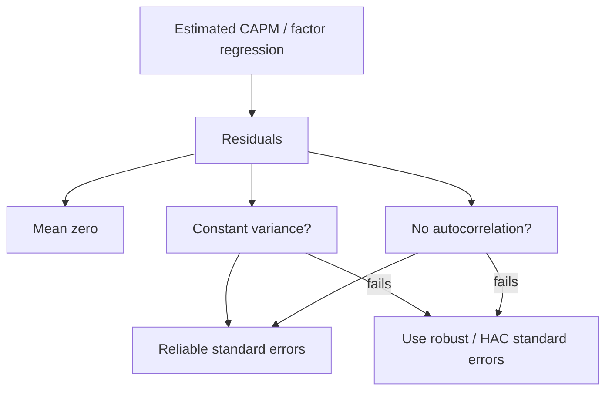
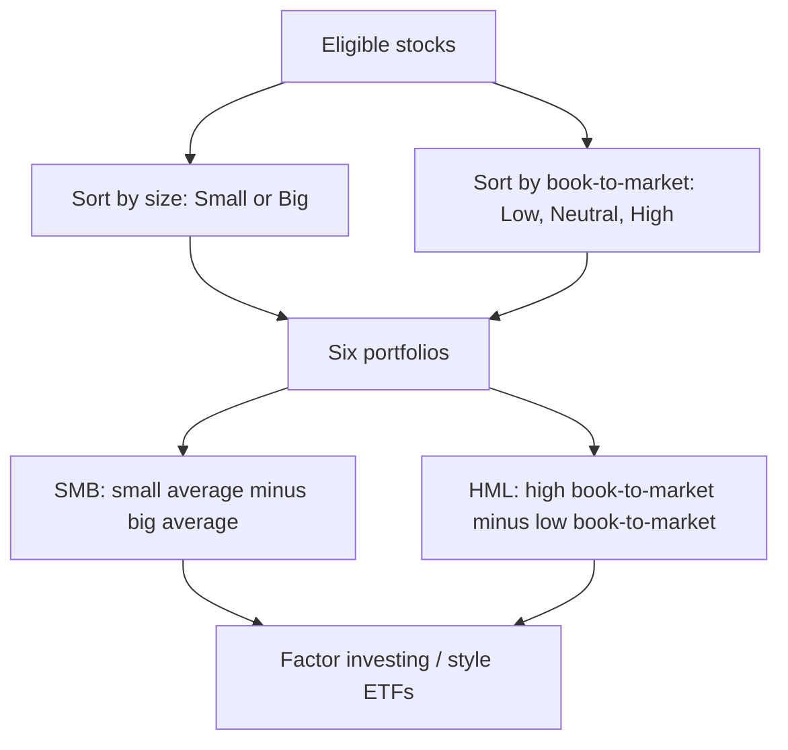

# Week 6: Efficient Market Hypothesis And Implications

## What This Week Is Really About

Week 6 has two connected threads.

The first thread finishes the CAPM and factor-model material from Week 5. Once we estimate a regression, we cannot blindly trust the usual OLS standard errors. We need to check whether the residuals behave properly. If residuals have changing variance or serial correlation, ordinary standard errors can mislead us.

The second thread introduces the Efficient Market Hypothesis, or EMH. EMH asks whether returns are predictable from available information. If markets are efficient, then past information should already be reflected in prices, so it should not give an easy trading advantage.

These threads connect through the same econometric idea: look at what is left unexplained. If residuals or returns still contain patterns, then either the model is incomplete or the market may not be behaving like the efficient-market story predicts.

## Jargon Check

- **Residual / disturbance term:** The part of a regression's dependent variable not explained by the regressors.
- **Homoskedasticity:** Constant residual variance over time.
- **Heteroskedasticity:** Non-constant residual variance over time.
- **Autocorrelation / serial correlation:** Correlation between a variable and its own past values.
- **LM test:** Lagrange Multiplier test; a regression-based diagnostic test often built from an auxiliary regression.
- **Auxiliary regression:** A secondary regression used to test whether residuals contain a pattern.
- **HAC standard errors:** Standard errors robust to heteroskedasticity and autocorrelation.
- **Newey-West standard errors:** A common HAC standard error estimator.
- **ETF:** Exchange traded fund; a traded fund designed to track an index, commodity, sector, or strategy.
- **EMH:** Efficient Market Hypothesis; the idea that prices reflect available information.
- **White noise:** A process with zero mean, constant variance, and no autocorrelation.
- **Correlogram:** A table or plot showing autocorrelations at different lags.
- **Variance ratio:** A test idea comparing multi-period return variance with scaled one-period variance.

## Why Regression Diagnostics Matter

In Week 5, CAPM and factor models looked clean:

```text
r_it - r_ft = alpha_i + beta_i * factor_t + e_it
```

The fitted coefficients are useful, but the tests around them depend on the residuals. When we say a beta is statistically significant, or an alpha is not statistically significant, we are relying on standard errors. Those standard errors are only trustworthy if the assumptions behind them are reasonable.

For the CAPM disturbance term, the lecture focuses on three desired properties:

```text
E(e_it) = 0
Var(e_it) is constant
E(e_it * e_i,t-k) = 0 for k = 1, 2, ...
```

In plain English:

- residuals should have mean zero;
- residual risk should not systematically change over time;
- residuals should not be related to their own past.

The first property is usually handled by the regression intercept. The second is homoskedasticity. The third is no autocorrelation.

If the second or third property fails, the fitted coefficients may still be the same, but the usual OLS standard errors may be wrong. That means conclusions about alpha or beta can be wrong.



### Section Summary

- Regression interpretation depends on valid standard errors.
- Heteroskedasticity means residual variance changes over time.
- Autocorrelation means residuals are related through time.
- Either issue can make ordinary OLS inference unreliable.

## LM Tests As A General Diagnostic Idea

An LM test is a regression-based test. The logic is:

> If the original model is correct, the residuals should not contain useful leftover structure.

Suppose the original model is:

```text
y_t = alpha + beta*x_t + e_t
```

After estimating the model, we calculate residuals:

```text
e_hat_t = y_t - alpha_hat - beta_hat*x_t
```

Then we ask whether those residuals are predictable from variables they should not be predictable from. If an auxiliary regression explains the residuals or squared residuals, that is evidence of misspecification.

This is why LM tests appear in both model diagnostics and EMH testing. In both cases, we are asking whether the "unexplained part" is actually still patterned.

### Section Summary

- LM tests use auxiliary regressions.
- The target is usually the residuals or squared residuals.
- A significant test means the original model left a pattern behind.

## Testing For Heteroskedasticity

Homoskedasticity means the residual variance is constant:

```text
H0: Var(e_it) is constant
```

Heteroskedasticity means the variance changes over time or changes with the regressors:

```text
H1: Var(e_it) is not constant
```

In asset returns, heteroskedasticity is common. Financial markets often have calm periods and volatile periods. Daily, weekly, and monthly returns are especially likely to show changing volatility.

The LM approach tests whether squared residuals can be explained by the regressors. For a simple model, an auxiliary regression might look like:

```text
e_hat_t^2 = gamma_0 + gamma_1*x_t + gamma_2*x_t^2 + v_t
```

The test statistic is:

```text
W = T * R^2
```

where `R^2` comes from the auxiliary regression. Under the null, the statistic is compared with a chi-square distribution.

The lecture applies this idea to the three-factor CAPM for technology returns. The auxiliary regression produces:

```text
W = T * R^2 = 1095 * 0.049 = 53.66
```

With 3 degrees of freedom, the 1% chi-square critical value is about 11.34. Since 53.66 is much larger, we reject homoskedasticity. The residual variance is not constant.

### Section Summary

- Heteroskedasticity means residual variance is not constant.
- A common LM test regresses squared residuals on regressors or their transformations.
- The statistic is `T * R^2`.
- Rejecting homoskedasticity means ordinary OLS standard errors are unreliable.

## White's Testing Approach

White's test is a broad heteroskedasticity test. Instead of guessing one exact form of heteroskedasticity, it includes regressors, squared regressors, and cross-products in the auxiliary regression.

The practical idea is:

> Try to soak up as much possible residual-variance structure as possible.

White's test still does not tell you the exact form of heteroskedasticity. It only tells you whether there is evidence that the variance is not constant.

That limitation matters. If you reject, you do not immediately know the economic cause. You only know that the standard errors need care.

### Section Summary

- White's test is a flexible heteroskedasticity test.
- It can include regressors, squares, and cross-products.
- Rejecting tells you standard errors are suspect, not the exact cause.

## Testing For Autocorrelation

Autocorrelation means residuals are related through time. In a regression setting, this is a problem because the model's errors are supposed to be unpredictable from their own history.

For example, if a positive residual today tends to be followed by a positive residual tomorrow, then the model is missing a dynamic pattern.

The null is:

```text
H0: no autocorrelation
```

The alternative is:

```text
H1: at least one lagged residual matters
```

The LM auxiliary regression uses lagged residuals:

```text
e_hat_t = gamma_0
        + gamma_1*e_hat_t-1
        + gamma_2*e_hat_t-2
        + ...
        + v_t
```

The test statistic is:

```text
AR(p) = T * R^2
```

and it is compared with a chi-square distribution with `p` degrees of freedom.

In the lecture's technology-portfolio example:

```text
LM test = 9.3622
df = 2
p-value = 0.009269
```

Since the p-value is below 0.01, we reject no autocorrelation at the 1% level. Residuals are serially correlated.

### Section Summary

- Autocorrelation means residuals are related to past residuals.
- The LM test regresses residuals on their lags.
- A small p-value means serial correlation remains.
- Serial correlation can make ordinary OLS standard errors wrong.

## Newey-West Standard Errors

If we reject homoskedasticity or no autocorrelation, we do not necessarily throw away the regression.

The point estimates can still be useful. The problem is inference: standard errors, t-statistics, and p-values may be wrong.

Newey-West standard errors solve this by estimating standard errors that are robust to heteroskedasticity and autocorrelation of unknown form. They are often called HAC standard errors:

```text
HAC = heteroskedasticity and autocorrelation consistent
```

The important practical point is:

> Newey-West changes the standard errors, not the fitted coefficients.

In the lecture's three-factor technology example, the coefficient estimates remain the same, but the reported standard errors and t-tests use the robust covariance estimator.

### Section Summary

- Newey-West is used when residuals have heteroskedasticity or autocorrelation.
- It changes standard errors and t-tests.
- It does not change the estimated coefficients.

## Factor Investing And ETFs

Week 6 then links Fama-French factors to real products.

Fama and French construct factors by sorting stocks into portfolios. At the end of June each year, eligible stocks are sorted by:

- **Size:** Small or Big, usually using market equity.
- **Book-to-market:** Low, Neutral, or High.

This creates six portfolios:

| | Low book-to-market | Neutral | High book-to-market |
| --- | --- | --- | --- |
| Small | S/L | S/N | S/H |
| Big | B/L | B/N | B/H |

SMB is the average return on the small portfolios minus the average return on the big portfolios:

```text
SMB = average(S/L, S/N, S/H) - average(B/L, B/N, B/H)
```

HML is the average return on the high book-to-market portfolios minus the average return on the low book-to-market portfolios:

```text
HML = average(S/H, B/H) - average(S/L, B/L)
```

This matters because many ETFs target these styles directly. For example, Vanguard has ETFs for large growth, large value, small growth, small value, and so on. The Fama-French style box gives a statistical language for describing those products.



### Section Summary

- Fama-French factors come from sorted portfolios.
- SMB asks whether small stocks outperformed big stocks.
- HML asks whether value stocks outperformed growth stocks.
- ETFs can be designed to target these factor exposures.

## ETF Tracking Example: SDS

The lecture uses ProShares UltraShort S&P 500, ticker `SDS`, as a tracking example. SDS claims to provide approximately `-2` times the daily return of the S&P 500.

This is not a philosophical question. We can test it with data.

Estimate:

```text
r_SDS,t = alpha + beta*r_SP500,t + error_t
```

For a good daily `-2x` tracker, we would expect:

```text
beta close to -2
alpha close to 0
high R^2
```

To test the slope:

```text
H0: beta = -2
H1: beta != -2
```

The test statistic is:

```text
t = (beta_hat - (-2)) / SE(beta_hat)
```

This is the same regression logic as CAPM, but the interpretation changes. In CAPM, beta measures market exposure. In the ETF setting, beta measures whether the ETF delivers the exposure it claims.

### Section Summary

- ETF tracking can be tested with a regression.
- A `-2x` ETF should have beta close to `-2` on daily index returns.
- Alpha should be close to zero.
- High `R^2` suggests close daily tracking.

## Efficient Market Hypothesis

The Efficient Market Hypothesis is about information and prices.

The basic idea is:

> If available information is already reflected in prices, then that information should not help you systematically predict future returns.

This does not mean prices are always correct in some deep philosophical sense. It means that, given the information set, there should not be an easy and reliable way to earn abnormal profits.

If past returns can predict future returns, then weak-form EMH is challenged. If public announcements can be used to systematically earn abnormal returns after they are public, then semi-strong EMH is challenged. If private information cannot generate abnormal returns, then strong-form EMH would hold, though this is a much stronger claim.

### Three Forms Of EMH

| Form | Information reflected in prices | Main implication |
| --- | --- | --- |
| Weak form | Past prices and returns | Return history should not predict future returns |
| Semi-strong form | All public information | Public news should be incorporated quickly |
| Strong form | All acquirable information, including private information | Even private information should not produce systematic abnormal profits |

### Section Summary

- EMH says prices reflect information.
- The forms differ by the size of the information set.
- Weak-form EMH is the one most directly tested using autocorrelation.

## White Noise And The EMH Return Model

To test weak-form EMH, the lecture uses a simple return model:

```text
r_t = mu + e_t
```

where:

```text
e_t ~ WN(0, sigma^2)
```

White noise means:

```text
E(e_t) = 0
Var(e_t) = sigma^2
Corr(e_t, e_t-k) = 0 for k >= 1
```

This model does not say returns must be zero. It allows a constant average return, `mu`. The important part is that the deviation from the average should not be predictable from past deviations.

If returns are white noise around a constant mean, then knowing previous returns does not help forecast future returns on average.

### Section Summary

- Weak-form EMH can be represented by returns with no serial dependence.
- White noise has zero mean, constant variance, and no autocorrelation.
- Past returns should not help predict future returns.

## Autocorrelation And Correlograms

Autocorrelation measures whether a series is related to its own past.

For returns:

```text
rho(k) = Corr(r_t, r_t-k)
```

If `rho(1)` is positive, high returns tend to be followed by high returns and low returns by low returns. If `rho(1)` is negative, returns tend to reverse.

Under weak-form EMH, autocorrelations should be close to zero.

A correlogram reports autocorrelations for multiple lags. It often includes:

- the lag;
- the sample autocorrelation;
- a Q statistic;
- a p-value for joint significance up to that lag.

The dashed confidence bands in the plot are approximately:

```text
+/- 2 / sqrt(T)
```

An autocorrelation outside those bands is individually significant at roughly the 5% level.

The Q statistic tests:

```text
H0: rho_1 = rho_2 = ... = rho_k = 0
H1: at least one autocorrelation is nonzero
```

If the p-value is below 0.05, reject no autocorrelation up to that lag.

### Section Summary

- Autocorrelation is evidence of return predictability.
- A correlogram shows autocorrelation across lags.
- Q-test p-values check whether several autocorrelations are jointly zero.
- Significant autocorrelation is evidence against weak-form EMH.

## Simple Test Of One Autocorrelation

For a large sample, if there is no autocorrelation:

```text
sqrt(T) * rho_hat(k) is approximately N(0, 1)
```

To test lag `k`:

```text
H0: rho(k) = 0
H1: rho(k) != 0
```

Reject at the 5% level if:

```text
|sqrt(T) * rho_hat(k)| > 1.96
```

The lecture example compares exchange-rate returns and Apple returns. The exchange-rate series shows stronger evidence of predictability, while Apple has weaker evidence in the simple lag-1 check.

### Section Summary

- A single autocorrelation can be tested with a normal approximation.
- The statistic is `sqrt(T) * rho_hat(k)`.
- A significant result means returns are predictable at that lag.

## LM Test For Return Predictability

The LM autocorrelation test can also be used for EMH.

If returns are demeaned:

```text
e_t = r_t - r_bar
```

then test whether current demeaned returns depend on past demeaned returns:

```text
e_t = gamma_0
    + gamma_1*e_t-1
    + gamma_2*e_t-2
    + ...
    + v_t
```

The hypotheses are:

```text
H0: gamma_1 = gamma_2 = ... = gamma_k = 0
H1: at least one gamma differs from zero
```

The statistic is:

```text
AR(k) = T * R^2
```

and under the null:

```text
AR(k) ~ chi-square_k
```

In the lecture's exchange-rate example:

```text
AR(2) = 3189 * 0.003749 = 11.955
```

This is larger than the 5% chi-square critical value for 2 degrees of freedom, about 5.991, so the null is rejected. There is evidence against weak-form EMH for that return series.

### Section Summary

- The LM test checks several lags at once.
- The statistic is `T * R^2` from the auxiliary regression.
- Rejecting means return predictability remains.

## Variance Ratio Logic

The variance ratio is another way to test whether returns behave like an unpredictable sequence.

One-period log return is:

```text
r_t = log(P_t) - log(P_t-1)
```

An `n`-period log return is the sum of `n` one-period returns:

```text
r_t(n) = r_t + r_t-1 + ... + r_t-(n-1)
```

If returns are independent over time, then the variance of the `n`-period return should be approximately `n` times the variance of the one-period return:

```text
Var[n-period return] = n * Var[1-period return]
```

The variance ratio is:

```text
VR_n = variance of n-period returns / (n * variance of 1-period returns)
```

Interpretation:

| Variance ratio | Meaning |
| --- | --- |
| `VR_n = 1` | No autocorrelation |
| `VR_n > 1` | Positive autocorrelation |
| `VR_n < 1` | Negative autocorrelation |

### Section Summary

- Variance ratios test predictability through return variance over horizons.
- If returns are independent, variance scales linearly with time.
- Ratios above or below 1 suggest autocorrelation.

## Worked Exam Practice

### Question 1: Testing Weak-Form EMH With An LM Test

For daily residuals from a four-factor model, an auxiliary regression of residuals on two lags gives `R^2 = 0.0062` using `T = 1320` observations.

Hypotheses:

```text
H0: no residual autocorrelation
H1: at least one residual autocorrelation is nonzero
```

Compute:

```text
TR^2 = 1320 * 0.0062 = 8.184
```

Compare with:

```text
chi-square_2 = 5.991
```

Since `8.184 > 5.991`, reject the null. There is evidence of predictability left in the residuals, which is evidence against weak-form EMH for this model and sample.

### Question 2: Correlogram Interpretation

A correlogram reports:

| Lag | AC | Q p-value |
| --- | ---: | ---: |
| 1 | -0.071 | 0.011 |
| 2 | 0.018 | 0.025 |
| 3 | 0.004 | 0.061 |

The lag-1 autocorrelation is negative, so returns tend to reverse slightly from one period to the next.

At lag 2, the Q p-value is 0.025, below 0.05, so there is evidence of serial correlation up to lag 2.

At lag 3, the p-value is 0.061, so the evidence is weaker at the 5% level.

The implication is that weak-form EMH may not hold over this sample.

### Question 3: Leveraged ETF Tracking

An ETF claims to deliver `-2` times the daily return of the S&P 500. The estimated tracking regression is:

```text
r_ETF,t = 0.0001 - 1.87*r_SP500,t + error_t
```

The slope standard error is `0.06`, and `R^2 = 0.92`.

Test:

```text
H0: beta = -2
H1: beta != -2
```

Statistic:

```text
t = [-1.87 - (-2)] / 0.06 = 2.17
```

Using 1.96 as the 5% two-sided critical value, reject the exact `-2` tracking claim. The high `R^2` still says the ETF moves closely with the index, but the slope is statistically different from the stated target.

### Question 4: Newey-West Interpretation

Suppose a factor regression rejects both homoskedasticity and no autocorrelation.

The correct response is not automatically to discard the coefficient estimates. Instead:

- keep the fitted coefficients;
- report standard errors robust to heteroskedasticity and autocorrelation;
- interpret t-tests using the HAC standard errors.

Newey-West standard errors are one way to do this.

## Week 6 Big Picture

Week 6 is about whether the leftover part of a model is genuinely random.

In CAPM diagnostics, the leftover part is the regression residual. If the residual variance changes or residuals are serially correlated, ordinary OLS standard errors are unreliable.

In EMH testing, the leftover part is the unpredictable part of returns. If returns are autocorrelated, then past returns contain information about future returns, which challenges weak-form EMH.

The practical exam skill is translating tests into words: what is the null, what statistic do you compute, what critical value or p-value do you compare it with, and what does the result mean economically?

## Final Quick Checks

You should be able to answer:

1. What is homoskedasticity?
2. Why does heteroskedasticity affect standard errors?
3. What is autocorrelation?
4. How does an LM test use an auxiliary regression?
5. What does `T * R^2` mean in an LM test?
6. What do Newey-West standard errors fix?
7. How are SMB and HML constructed from sorted portfolios?
8. How would you test whether a `-2x` ETF tracks its target?
9. What are the weak, semi-strong, and strong forms of EMH?
10. Why does autocorrelation challenge weak-form EMH?
11. How do you interpret a correlogram p-value?
12. What does a variance ratio below 1 suggest?
