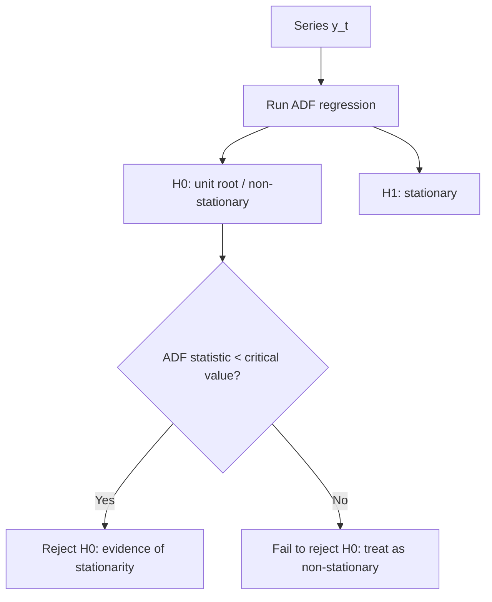

# Week 7: Modelling Predictable Returns

## What This Week Is Really About

Week 7 starts the move from "testing whether returns are predictable" into actually modelling predictable returns.

The key idea is that financial data arrives in time order. Today's return comes after yesterday's return, and today's price comes after yesterday's price. That ordering matters. If the past contains useful information about the present, then we can build a time-series model.

The week is mainly about three questions:

1. Is the series stable enough to model with standard time-series tools?
2. Is the series more like a random walk, where shocks permanently accumulate?
3. If the series is predictable, how do we forecast it using an AR model?

Stationarity, random walks, ADF tests, and AR(1) models are all answers to those questions.

## Jargon Check

- **Time series:** Data observed in time order, such as daily returns or monthly prices.
- **Stationarity:** A stability condition where the mean, variance, and autocovariance structure do not change over time.
- **Random walk:** A process where the current value equals the previous value plus a new shock.
- **Drift:** A constant average movement added to a random walk.
- **Unit root:** A feature of a time-series process that makes shocks permanent and usually makes the series non-stationary.
- **ADF test:** Augmented Dickey-Fuller test; a test for whether a series has a unit root.
- **AR model:** Autoregressive model; a model where a variable depends on its own past values.
- **Conditional mean:** The expected value given current information.
- **Unconditional mean:** The long-run average without conditioning on today's information.
- **Forecast horizon:** How many steps ahead we are trying to predict.

## Plain-English Roadmap

Time-series modelling is about using the order of observations. A return today may depend on yesterday's return, and a price today may depend heavily on yesterday's price. We care about that dependence because it changes how we forecast.

Stationarity means the series has stable behaviour over time. Its average, variance, and autocovariance structure do not drift around. This matters because if a series is not stationary, old data may not describe the future in a stable way.

A random walk is a model for prices where the best guess of tomorrow's price is today's price plus a new unpredictable shock. It is non-stationary because shocks accumulate permanently. If a shock raises the price today, that higher level carries forward.

Returns are often more stable than prices because returns are changes in prices rather than price levels. A stock price can wander upward for years, but its daily return may fluctuate around a roughly stable mean.

The ADF test asks whether a series has a unit root, which is the technical feature that makes a random walk non-stationary. The null is deliberately pessimistic: "this series has a unit root." You only conclude stationarity if the test statistic is sufficiently negative.

An AR(1) model says today's value is partly explained by yesterday's value plus new information. The coefficient $\phi_1$ controls persistence. If $\phi_1$ is close to 1, shocks fade slowly. If it is close to 0, the series forgets its past quickly.

Conditional moments use information you already have. The conditional mean is your forecast given yesterday's information. The conditional variance is your remaining uncertainty after using that information. The unconditional variance is larger because it ignores the current information set.

Think of Week 7 as a filter. Before modelling a series, ask what kind of object it is. If it is a price level that behaves like a random walk, modelling it as stationary can produce misleading results. If it is a return series that behaves more stably, an AR model may be reasonable. The ADF test is one formal way to decide which side of that line the data appears to fall on.

## Visual Guide

This diagram shows the ADF decision logic. The null is that the series has a unit root, so you only conclude stationarity when the statistic is sufficiently negative.

## Formula Symbol Guide

Use this for stationarity, random walks, AR models, and ADF tests.

- $y_t$: time-series variable at time $t$.
- $y_{t-1}$: previous-period value of $y_t$.
- $p_t$: log price at time $t$.
- $r_t$: return at time $t$, often $p_t-p_{t-1}$.
- $c$: intercept in an AR model.
- $\phi$: autoregressive coefficient; measures persistence from the previous period.
- $\epsilon_t$: shock/error term at time $t$.
- $\sigma_\epsilon^2$: variance of the shock.
- $F_t$: information available at time $t$.
- $\mathbb E(y_{T+1}|F_T)$: forecast of $y$ one period ahead using current information.
- $\mu_y$: unconditional/long-run mean of $y_t$.
- $\operatorname{Var}(y_t)$: unconditional variance of $y_t$.
- $\hat\phi_c$: estimated ADF coefficient used in the unit-root test.
- $SE(\hat\phi_c)$: standard error of the ADF coefficient estimate.
- $t$: test statistic, usually estimate divided by standard error.
- $\mu$: drift in a random walk.
- $h$: forecast horizon.

## Stationarity (Exam)

Concept: stationarity means the series behaves consistently over time. Without it, averages and variances from the past may not be reliable guides to the future.

Example: returns fluctuating around a stable mean may be stationary; a price series trending upward usually is not.

Stationarity is the idea that the rules generating the series stay stable. The series can move around, and it can still be noisy, but its basic behaviour does not drift away over time. A stationary return series might have bad days and good days, but it keeps returning to a broadly stable average and volatility level.

This matters because many time-series formulas assume the past is informative about the future. If the mean and variance keep changing, the past becomes a weak guide. A model fitted to old observations may not describe future observations well.

A time series $Y_t$ is covariance stationary if:

$$
\begin{aligned}
\mathbb{E}(Y_t) &= \mu \quad \text{constant mean} \\
\operatorname{Var}(Y_t) &= \sigma^2 \quad \text{constant variance} \\
\operatorname{Cov}(Y_t, Y_{t-j}) &= \gamma_j \quad \text{depends only on lag } j
\end{aligned}
$$

Stationarity matters because many formulas, tests, and forecasts assume stable moments.

Financial pattern:

$$
\begin{aligned}
\log prices       often non-stationary \\
\log returns      often stationary
\end{aligned}
$$

### Section Summary

- Stationarity means stable mean, variance, and autocovariance.
- Many time-series models assume stationarity.
- Prices are often non-stationary because shocks accumulate.
- Returns are often closer to stationary because they measure changes rather than levels.

## Random walk (Exam)

Concept: a random walk is a price process where shocks permanently change the level. This is why its variance grows over time.

Example: if today's log price is 5 and the shock is 0.02, tomorrow's log price becomes 5.02.

A random walk for log price $p_t$ is:

$$
p_t = p_{t-1} + \epsilon_t
$$

where $\epsilon_{t}$ is white noise.

By successive substitution:

$$
p_t = p_0 + \epsilon_1 + \cdots + \epsilon_t
$$

If $p_0 = 0$:

$$
\begin{aligned}
\mathbb{E}(p_t) = 0 \\
\operatorname{Var}(p_t) = \sigma^2 t
\end{aligned}
$$

Because the variance grows with time, a random walk is not stationary.

The important intuition is permanence. In a random walk, a shock today does not fade away. If the price jumps upward today, tomorrow's price starts from that new higher level. Over time, the accumulated shocks make the path wander.

This is why random walks are natural models for price levels but not usually for returns. The return is the change in price, so it removes the accumulated level and focuses on the new shock.

### Section Summary

- A random walk is today's value plus a new shock.
- Shocks have permanent effects on the level.
- The variance grows over time.
- Because the variance is not constant, the process is non-stationary.

## Random walk with drift (Exam)

Concept: drift adds a steady average direction to the random walk. The series still remains non-stationary because shocks accumulate.

A random walk with drift is like a random walk with a constant average push in one direction. The drift might represent average growth in a log price. But adding drift does not fix the stationarity problem. Shocks still accumulate permanently, so the variance still grows over time.

Example: a stock index may have positive drift because it tends to grow over long periods, while still receiving random shocks.

A random walk with drift is:

$$
p_t = \mu + p_{t-1} + \epsilon_t
$$

By successive substitution:

$$
p_t = \mu t + p_0 + \epsilon_1 + \cdots + \epsilon_t
$$

If $p_0 = 0$:

$$
\begin{aligned}
\mathbb{E}(p_t) = \mu t \\
\operatorname{Var}(p_t) = \sigma^2 t
\end{aligned}
$$

Both mean and variance depend on time, so it is non-stationary.

## Unit root testing idea (Exam)

Concept: a unit root is the mathematical feature behind random-walk behaviour. The ADF test checks whether the series has this non-stationary feature.

Example: failing to reject the ADF null means you treat the log price as non-stationary.

The unit-root question is really the stationarity question in a more technical form. If a process has a unit root, shocks do not fade away. They become part of the future level of the series. That is why random walks and unit-root processes are treated as non-stationary.

The ADF test is deliberately conservative. Its null hypothesis is that the series has a unit root. So you do not "prove stationarity" just because a plot looks stable. You only get evidence of stationarity when the test statistic is sufficiently negative to reject the unit-root null.

To test whether a series has a unit root, start from:

$$
y_t = \phi_1 y_{t-1} + error_t
$$

Unit root means:

$$
\phi_1 = 1
$$

The ADF regression is usually written in differences:

$$
\Delta y_t = c_t + \phi_c y_{t-1}
+ \beta_1 \Delta y_{t-1}
+ \cdots
+ \beta_p \Delta y_{t-p}
+ \epsilon_t
$$

where:

$$
\phi_c = \phi_1 - 1
$$

Hypotheses:

$$
\begin{aligned}
H_0: \phi_c = 0      unit root, non-stationary \\
H_1: \phi_c < 0      stationary
\end{aligned}
$$

This is a left-tailed test.

ADF statistic:

$$
\operatorname{ADF} = \frac{\hat{\phi}_c}{\operatorname{se}(\hat{\phi}_c)}
$$

Decision:

$$
\text{Reject }H_0\text{ if the ADF statistic is more negative than the ADF critical value}
$$

Example logic:

$$
\begin{aligned}
\operatorname{ADF} = -2.402, critical value = -3.41 \\
-2.402 > -3.41, so fail to reject H_0 \\
conclude the series appears non-stationary
\end{aligned}
$$

### Section Summary

- A unit root means shocks have permanent effects.
- The ADF null is non-stationarity.
- Rejecting the ADF null supports stationarity.
- Failing to reject means you should treat the series as unit-root/non-stationary.

## Drift versus trend in ADF tests (Exam)

Concept: the ADF regression must match the visual behaviour of the series. Use drift for a nonzero mean level, and trend when the level has a clear time trend.

Example: a price level trending upward usually needs the trend version; returns usually do not.

ADF tests can include different deterministic components. A drift term allows the series to have a nonzero average movement. A trend term allows the series to have a deterministic upward or downward time trend.

The choice matters because the critical values depend on the specification. The exam point is not just to write the formula, but to recognise what background behaviour the test is allowing for.

If the series has no obvious trend:

$$
c_t = c
$$

This is the drift specification.

If the series has a clear linear trend:

$$
c_t = c_0 + c_1 t
$$

This is the trend specification.

Use the critical value matching the chosen specification.

### Section Summary

- Drift allows a nonzero average movement.
- Trend allows a deterministic time trend.
- The ADF critical value must match the version of the test being used.

## Martingale difference sequence (Exam)

Concept: MDS means the next shock has zero expected value after using past information. It formalises the idea of unpredictable news.

Example: earnings news may be positive or negative, but before it arrives its expected surprise is zero.

A process $\epsilon_{t}$ is a martingale difference sequence (MDS) if:

$$
\mathbb{E}(\epsilon_t | F_{t-1}) = 0
$$

$F_{t-1}$ is the information available up to time `t-1`.

Meaning: given all past information, the expected current shock is zero.

This is stronger and more useful for forecasting than simply saying the unconditional mean is zero.

The distinction becomes important later. A series can be unpredictable in mean but still have predictable volatility. In finance, this is common: tomorrow's return direction may be hard to predict, but tomorrow's volatility may be high if today was turbulent.

### Section Summary

- MDS means the next shock has conditional mean zero.
- It formalises the idea that new information is unpredictable.
- It does not necessarily mean volatility is constant.

## AR(1) model (Exam)

Concept: AR(1) says today depends on yesterday plus new information. The coefficient tells you how persistent the series is.

Example: if $\phi_1=0.6$, 60% of yesterday's deviation carries into today.

An AR(1) model is the simplest model of predictable time-series behaviour. It says one lag matters. If yesterday's value was high, today's expected value shifts depending on the sign and size of $\phi_{1}$.

The coefficient $\phi_{1}$ is the persistence parameter. If it is close to zero, the series forgets its past quickly. If it is close to one, shocks fade slowly. If it equals one, the model becomes random-walk-like and stationarity fails.

An AR(1) model is:

$$
y_t = c + \phi_1 y_{t-1} + \epsilon_t
$$

where $\epsilon_{t}$ is an MDS.

Stationarity condition:

$$
|\phi_{1}| < 1
$$

### Section Summary

- AR(1) uses one lag of the series to predict the current value.
- $\phi_{1}$ measures persistence.
- Stationarity requires $|\phi_{1}| < 1$.

## AR(1) conditional mean (Exam)

Concept: the conditional mean is the one-step forecast. Yesterday's value is known, so it enters directly.

Example: if $r_{t-1}$ is known, plug it into the AR equation to forecast $r_t$.

Given information at `t-1`, $y_{t-1}$ is known:

$$
\mathbb{E}(y_t | F_{t-1}) = c + \phi_1 y_{t-1}
$$

This is the forecast of $y_t$ using past information.

The conditional mean is the model's best guess before the new shock is observed. Once the shock arrives, the realised value can be above or below the forecast. The point is that the forecast uses everything known at `t-1`, and in an AR(1), the relevant known value is $y_{t-1}$.

### Section Summary

- Conditional mean means expected value given current information.
- In an AR(1), it is the one-step-ahead forecast.
- The forecast uses yesterday's observed value.

## AR(1) unconditional mean (Exam)

Concept: the unconditional mean is the long-run centre of the AR(1) process. Forecasts drift toward it when the process is stationary.

Example: for $r_t=0.1+0.5r_{t-1}+u_t$, the long-run mean is 0.2.

Use LIE and stationarity:

$$
\begin{aligned}
\mathbb{E}(y_t) = \mathbb{E}(\mathbb{E}(y_t | F_{t-1})) \\
= \mathbb{E}(c + \phi_1 y_{t-1}) \\
= c + \phi_1 \mathbb{E}(y_t)
\end{aligned}
$$

So:

$$
\mathbb{E}(y_t) = c / (1 - \phi_1)
$$

Practice exam example:

$$
\begin{aligned}
r_t = 0.1 + 0.5 r_{t-1} + u_t \\
\mathbb{E}(r_t) = 0.1 / (1 - 0.5) = 0.2
\end{aligned}
$$

The unconditional mean is the long-run centre of the process. For a stationary AR(1), forecasts eventually move back toward this centre. If today's value is unusually high and $0 < \phi_{1} < 1$, the model predicts that the effect gradually fades rather than staying forever.

### Section Summary

- The unconditional mean is the long-run average.
- For AR(1), it is $c / (1 - \phi_{1})$.
- It only makes sense under stationarity.

## AR(1) conditional variance (Exam)

Concept: conditional variance is the uncertainty left after yesterday's value is known. In a simple AR(1), only the new shock remains uncertain.

Example: once $r_{t-1}$ is known, only $u_t$ creates next-period uncertainty.

If:

$$
\operatorname{Var}(\epsilon_t | F_{t-1}) = \sigma_epsilon^2
$$

then:

$$
\operatorname{Var}(y_t | F_{t-1}) = \sigma_epsilon^2
$$

because $c + \phi_{1} y_{t-1}$ is already known at time `t-1`.

Practice exam example:

$$
\begin{aligned}
\operatorname{Var}(u_t | F_{t-1}) = 4 \\
\operatorname{Var}(r_t | F_{t-1}) = 4
\end{aligned}
$$

## AR(1) unconditional variance (Exam)

Concept: unconditional variance is larger because it includes uncertainty about the whole process, not just the next shock.

Example: if shock variance is 4 and $\phi=0.5$, unconditional variance is $4/(1-0.25)$.

Using the Law of Total Variance:

$$
\operatorname{Var}(y_t) = \sigma_epsilon^2 / (1 - \phi_1^2)
$$

Practice exam example:

$$
\begin{aligned}
\operatorname{Var}(r_t) = 4 / (1 - 0.5^2) \\
= 4 / 0.75 \\
= 5.333
\end{aligned}
$$

Conditional variance is smaller than unconditional variance because conditioning uses information.

## AR(1) forecasts (Exam)

Concept: AR forecasts are built recursively. For more than one step ahead, replace unknown future values with their forecasts.

Example: a two-step forecast plugs the one-step forecast into the model again.

One-step ahead:

$$
\mathbb{E}(y_{t+1} | F_t) = c + \phi_1 y_t
$$

Two-step ahead:

$$
\begin{aligned}
\mathbb{E}(y_{t+2} | F_t) = c + \phi_1 \mathbb{E}(y_{t+1} | F_t) \\
= c(1 + \phi_1) + \phi_1^2 y_t
\end{aligned}
$$

As the forecast horizon grows, for stationary AR(1):

$$
\mathbb{E}(y_{t+h} | F_t) \to c / (1 - \phi_1)
$$

The forecast reverts to the unconditional mean.

## Exam-Style Practice Questions

### Question 1: ADF unit-root test

#### Relevant Formulas

ADF test statistic: use this to test whether a series has a unit root.

$$
t=\frac{\hat\phi_c}{SE(\hat\phi_c)}
$$

ADF decision rule: reject the unit-root null only if the statistic is more negative than the ADF critical value.

Suppose the log price $p_t$ of a stock is tested using an ADF regression with trend. The coefficient on $p_{t-1}$ in the differenced regression is $\hat{\phi}_c=-0.018$ with standard error $0.0075$. The 5% ADF critical value is $-3.41$.

1. Write the null and alternative hypotheses.
2. Compute the ADF statistic.
3. Do you reject the null at the 5% level?
4. What conclusion do you draw about $p_t$?

#### Worked Answer

Hypotheses:

$$
H_0:\phi_c=0 \quad \text{unit root / non-stationary}
$$

$$
H_1:\phi_c<0 \quad \text{stationary}.
$$

ADF statistic:

$$
ADF=\frac{-0.018}{0.0075}=-2.40.
$$

Since $-2.40>-3.41$, fail to reject $H_0$. Treat $p_t$ as non-stationary.

### Question 2: AR(1) conditional and unconditional moments

#### Relevant Formulas

AR(1) model: use this when current returns depend on last period's return.

$$
r_t=c+\phi r_{t-1}+\epsilon_t
$$

Conditional mean: use this for the next-period forecast given current information.

$$
\mathbb E(r_t\mid F_{t-1})=c+\phi r_{t-1}
$$

Unconditional mean and variance: use these for the long-run average and long-run volatility.

$$
\mathbb E(r_t)=\frac{c}{1-\phi}, \qquad \operatorname{Var}(r_t)=\frac{\sigma_\epsilon^2}{1-\phi^2}
$$

Suppose stationary returns follow:

$$
r_t=0.20+0.35r_{t-1}+u_t,
$$

where $u_t$ is an MDS and $\operatorname{Var}(u_t\mid F_{t-1})=2.25$.

1. Compute $\mathbb{E}(r_t\mid F_{t-1})$.
2. Compute $\mathbb{E}(r_t)$.
3. Compute $\operatorname{Var}(r_t\mid F_{t-1})$.
4. Compute $\operatorname{Var}(r_t)$.
5. Explain why the conditional variance is smaller than the unconditional variance.

#### Worked Answer

Conditional mean:

$$
\mathbb{E}(r_t\mid F_{t-1})=0.20+0.35r_{t-1}.
$$

Unconditional mean:

$$
\mathbb{E}(r_t)=\frac{0.20}{1-0.35}=0.3077.
$$

Conditional variance:

$$
\operatorname{Var}(r_t\mid F_{t-1})=2.25.
$$

Unconditional variance:

$$
\operatorname{Var}(r_t)=\frac{2.25}{1-0.35^2}=2.564.
$$

The conditional variance is smaller because knowing $r_{t-1}$ removes part of the uncertainty.

### Question 3: Random walk with drift

#### Relevant Formulas

Random walk with drift: use this when price changes are permanent and include an average drift.

$$
p_t=p_{t-1}+\mu+\epsilon_t
$$

Mean and variance over time: use these to show that uncertainty grows with horizon.

$$
\mathbb E(p_t)=p_0+\mu t, \qquad \operatorname{Var}(p_t)=t\sigma^2
$$

Let:

$$
p_t=\mu+p_{t-1}+\epsilon_t,\qquad p_0=0,
$$

where $\epsilon_t$ is white noise with mean zero and variance $\sigma^2$.

1. Use successive substitution to write $p_t$ in terms of $\mu$ and shocks.
2. Derive $\mathbb{E}(p_t)$.
3. Derive $\operatorname{Var}(p_t)$.
4. Explain why $p_t$ is non-stationary.

#### Worked Answer

Successive substitution gives:

$$
p_t=\mu t+\epsilon_1+\epsilon_2+\cdots+\epsilon_t.
$$

Therefore:

$$
\mathbb{E}(p_t)=\mu t,\qquad \operatorname{Var}(p_t)=\sigma^2t.
$$

It is non-stationary because both mean and variance depend on time.

### Question 4: One-step and two-step forecasts

#### Relevant Formulas

One-step AR(1) forecast: use the latest observed value.

$$
\hat y_{T+1}=c+\phi y_T
$$

Two-step AR(1) forecast: feed the one-step forecast back into the model.

$$
\hat y_{T+2}=c+\phi\hat y_{T+1}
$$

Long-run mean: forecasts move toward this when $|\phi|<1$.

$$
\mu_y=\frac{c}{1-\phi}
$$

For:

$$
y_t=0.4+0.6y_{t-1}+\epsilon_t,
$$

and current value $y_T=1.2$:

1. Compute $\mathbb{E}(y_{T+1}\mid F_T)$.
2. Compute $\mathbb{E}(y_{T+2}\mid F_T)$.
3. What value do long-horizon forecasts converge to?

#### Worked Answer

One-step forecast:

$$
\mathbb{E}(y_{T+1}\mid F_T)=0.4+0.6(1.2)=1.12.
$$

Two-step forecast:

$$
\mathbb{E}(y_{T+2}\mid F_T)=0.4+0.6(1.12)=1.072.
$$

Long-horizon forecasts converge to:

$$
\frac{0.4}{1-0.6}=1.
$$

## What to be able to do

1. Define covariance stationarity.
2. Derive random walk with drift by successive substitution.
3. Explain why a random walk is non-stationary.
4. Set up and interpret an ADF test.
5. Define MDS.
6. Compute AR(1) conditional mean, unconditional mean, conditional variance, and unconditional variance.
7. Produce one-step and two-step AR(1) forecasts.
