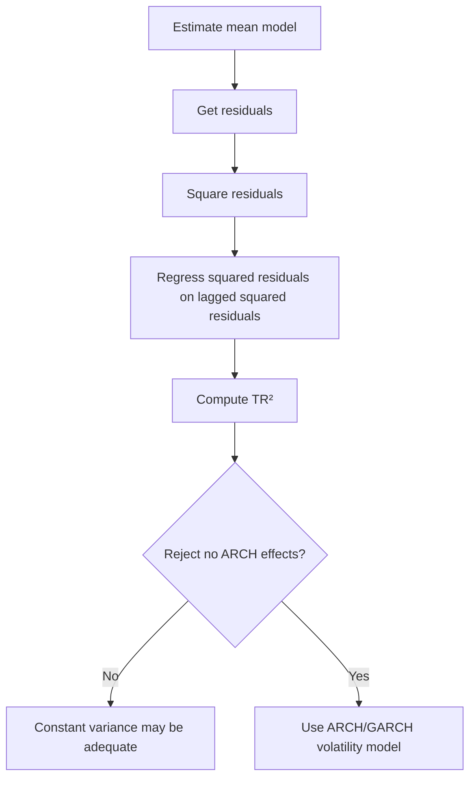

# Week 8: Modelling Volatility, ARCH

## What this week is for

This week moves from modelling average returns to modelling changing volatility. The key idea is that returns themselves may have little autocorrelation, but squared returns or squared residuals often do. That means risk is predictable even when returns are hard to predict.

## Plain-English Roadmap

Up to this point, many models focus on the conditional mean: what return do we expect next? In finance, the expected return over one day is often tiny and hard to predict. But the risk, or volatility, can be much more predictable.

Volatility clustering means calm periods tend to be followed by calm periods, and turbulent periods tend to be followed by turbulent periods. If a huge shock happened yesterday, tomorrow is more likely to be volatile even if you do not know whether the return will be positive or negative.

This is why squared returns matter. A return of $+5$ and a return of $-5$ are opposite directions, but both are large moves. Squaring removes the sign and measures size. Autocorrelation in squared residuals means the size of shocks is predictable.

An ARCH model says today's variance depends on past squared shocks. In plain language: "recent surprises tell us how risky the next period is." A large past residual increases the next conditional variance.

The ARCH LM test is a diagnostic. It asks whether squared residuals still have patterns. If they do, a constant-variance model is missing something important, and an ARCH/GARCH volatility model may be needed.

White noise and MDS are both about unpredictability, but they are not the same emphasis. White noise describes unconditional no-correlation behaviour. MDS says that after using all past information, the expected next shock is zero. MDS is the forecasting idea.

## Visual Guide

The ARCH test is a diagnostic pipeline. You first remove the mean pattern, then test whether the squared residuals still have a pattern.



## Formula Symbol Guide

Use this for white noise, MDS, ARCH tests, and ARCH models.

- $u_t$: error/shock at time $t$.
- $F_{t-1}$: information available before time $t$.
- $\mathbb E(u_t|F_{t-1})$: conditional mean of the shock given past information.
- $\operatorname{Cov}(u_t,u_{t-k})$: covariance between today's shock and a lagged shock.
- $\epsilon_t$: model residual or innovation at time $t$.
- $\sigma_t^2$: conditional variance at time $t$; the volatility forecast squared.
- $\alpha_0$: ARCH constant; baseline variance level.
- $\alpha_i$: coefficient on lagged squared shock $\epsilon_{t-i}^2$.
- $q$: number of ARCH lags.
- $LM$: ARCH LM test statistic.
- $T$: sample size.
- $R^2$: regression fit from the auxiliary regression of squared residuals on lagged squared residuals.
- $\chi_q^2$: chi-square distribution with $q$ degrees of freedom.
- $AIC$, $BIC$: information criteria for comparing models; lower is better.
- $k$: number of estimated parameters.
- $\ell$: log-likelihood.


## White noise versus MDS (Exam)

Concept: white noise describes lack of unconditional serial correlation; MDS describes lack of conditional predictability. MDS is often the more useful forecasting assumption.

Example: an MDS shock can have changing variance and still have conditional mean zero.

White noise:

$$
\begin{aligned}
\mathbb{E}(u_t) = 0 \\
\operatorname{Var}(u_t) = \sigma^2 \\
\operatorname{Corr}(u_t, u_{t-k}) = 0 \text{ for } k \ge 1
\end{aligned}
$$

MDS:

$$
\mathbb{E}(u_t | F_{t-1}) = 0
$$

Difference:

```text
white noise   unconditional mean, variance, and autocorrelation properties
MDS           conditional mean restriction using past information
```

An MDS has unconditional mean zero by LIE:

$$
\mathbb{E}(u_t) = \mathbb{E}(\mathbb{E}(u_t | F_{t-1})) = 0
$$

An MDS also has no autocorrelation with its past:

$$
\operatorname{Cov}(u_t, u_{t-k}) = 0 \text{ for } k \ge 1
$$

because `u_{t-k}` is known at time `t-1`.

## AR(p) model (Exam)

Concept: AR(p) lets several past values help forecast the current value. AIC helps choose how many lags are worth keeping.

Example: AR(3) uses the last three observations to forecast the next one.

An AR(p) model is:

$$
y_t = c + \phi_1 y_{t-1} + \cdots + \phi_p y_{t-p} + \epsilon_t
$$

Unconditional mean:

$$
\mathbb{E}(y_t) = c / (1 - \phi_1 - \cdots - \phi_p)
$$

One-step forecast:

$$
\begin{aligned}
\mathbb{E}(y_{t+1} | F_t) \\
= c + \phi_1 y_t + \phi_2 y_{t-1} + \cdots + \phi_p y_{t-p+1}
\end{aligned}
$$

Use AIC to choose `p`:

$$
lowest \operatorname{AIC} = preferred model
$$

After choosing the model, check whether residuals look like white noise using the residual correlogram. If residual autocorrelations remain, the mean model may be inadequate.

## Why volatility models are needed (Exam)

Concept: returns can be hard to predict in direction but easier to predict in size. Volatility models focus on the size of uncertainty.

Example: after a market crash day, tomorrow's direction may be unclear, but risk is likely elevated.

A standard return model is:

$$
r_t = \mathbb{E}(r_t | F_{t-1}) + \epsilon_t
$$

Earlier models often assumed:

$$
\operatorname{Var}(\epsilon_t | F_{t-1}) = \sigma_\epsilon^2
$$

But financial returns often show:

```text
large shocks followed by large shocks
small shocks followed by small shocks
```

This is volatility clustering.

Even if `r_t` has little autocorrelation, `r_t^2` or `\hat{\epsilon}_t^2` can be autocorrelated.

## Testing for ARCH effects (Exam)

Concept: the ARCH test asks whether squared residuals have serial dependence. If they do, volatility is changing over time in a predictable way.

Example: significant lagged squared residuals mean large residuals tend to follow large residuals.

Suppose the mean model is:

$$
y_t = x_t' \beta + \epsilon_t
$$

To test for ARCH(q) effects:

1. Estimate the mean equation and obtain residuals `\hat{\epsilon}_t`.
2. Square the residuals.
3. Run the auxiliary regression:

$$
\begin{aligned}
\hat{\epsilon}_t^2 = \rho_0 \\
+ \rho_1 \hat{\epsilon}_{t-1}^2 \\
+ \cdots \\
+ \rho_q \hat{\epsilon}_{t-q}^2 \\
+ v_t
\end{aligned}
$$

Hypotheses:

$$
\begin{aligned}
H_0 &: \rho_1 = \cdots = \rho_q = 0 \quad \text{no ARCH effects} \\
H_1 &: \text{at least one } \rho_j \ne 0 \quad \text{ARCH effects exist}
\end{aligned}
$$

Test statistic:

$$
TR^2 \sim \chi^2_q \quad \text{under } H_0
$$

Decision:

$$
TR^2 > \chi^2_q \text{ critical value} \Rightarrow \text{reject } H_0
$$

Rejecting means volatility is time-varying and predictable.

## ARCH model structure (Exam)

Concept: ARCH writes the shock as a standard shock times a time-varying scale. That scale is the conditional volatility.

Example: if $\sigma_t$ doubles, the same standardised shock creates twice the return shock size.

Write:

$$
\begin{aligned}
\epsilon_t = \sigma_t u_t \\
u_t \sim \mathrm{iid}(0,1)
\end{aligned}
$$

Then:

$$
\begin{aligned}
\mathbb{E}(\epsilon_t | F_{t-1}) = 0 \\
\operatorname{Var}(\epsilon_t | F_{t-1}) = \sigma_t^2
\end{aligned}
$$

because `sigma_t` is known given past information.

## ARCH(1) (Exam)

Concept: ARCH(1) says the latest squared shock is enough to update today's variance forecast. Big surprise yesterday means high risk today.

Example: if yesterday's residual was 3, its square 9 can strongly raise today's variance forecast.

ARCH(1) specifies:

$$
\sigma_t^2 = \alpha_0 + \alpha_1 \epsilon_{t-1}^2
$$

Conditions:

$$
\begin{aligned}
\alpha_0 > 0 \\
\alpha_1 \ge 0 \\
\alpha_1 < 1
\end{aligned}
$$

Interpretation:

```text
alpha_0   baseline variance
alpha_1   sensitivity of current variance to yesterday's squared shock
```

If yesterday's shock was large in absolute value, `epsilon_{t-1}^2` is large, so today's conditional variance is high.

## ARCH(q) (Exam)

Concept: ARCH(q) lets several past shocks affect current volatility. The sum of alpha coefficients measures how persistent those shock effects are.

Example: ARCH(5) lets shocks from the last five days affect today's variance.

ARCH(q):

$$
\begin{aligned}
\sigma_t^2 = \alpha_0 \\
+ \alpha_1 \epsilon_{t-1}^2 \\
+ \cdots \\
+ \alpha_q \epsilon_{t-q}^2
\end{aligned}
$$

Conditions:

$$
\begin{aligned}
\alpha_0 > 0 \\
\alpha_i \ge 0 \\
\sum \alpha_i < 1
\end{aligned}
$$

Persistence is often measured by:

$$
\sum \alpha_i
$$

Higher persistence means shocks affect volatility for longer.

## Unconditional moments of ARCH(1) errors (Exam)

Concept: ARCH errors can have zero autocorrelation but still have changing variance. This is why looking only at return autocorrelation can miss volatility dependence.

Example: returns may have zero autocorrelation while squared returns have strong autocorrelation.

For ARCH(1):

$$
\begin{aligned}
\epsilon_t = \sigma_t u_t \\
\sigma_t^2 = \alpha_0 + \alpha_1 \epsilon_{t-1}^2
\end{aligned}
$$

Main results:

$$
\begin{aligned}
\mathbb{E}(\epsilon_t) = 0 \\
\operatorname{Cov}(\epsilon_t, \epsilon_{t-k}) = 0 \text{ for } k \ge 1 \\
\operatorname{Var}(\epsilon_t) = \alpha_0 / (1 - \alpha_1)
\end{aligned}
$$

Important interpretation:

$$
\begin{aligned}
\epsilon_t is uncorrelated over time \\
but \epsilon_t^2 can be autocorrelated
\end{aligned}
$$

So returns can look unpredictable in levels but predictable in volatility.

## Exam-Style Practice Questions

### Question 1: White noise versus MDS

#### Relevant Formulas

Martingale difference sequence: use this to show the shock has zero conditional mean.

$$
\mathbb E(u_t\mid F_{t-1})=0
$$

White noise covariance condition: use this to show shocks are uncorrelated over time.

$$
\operatorname{Cov}(u_t,u_{t-k})=0
$$


Let $u_t$ be an MDS with respect to $F_{t-1}$.

1. State the MDS condition.
2. Use the Law of Iterated Expectations to show that $\mathbb{E}(u_t)=0$.
3. Show that $\operatorname{Cov}(u_t,u_{t-k})=0$ for $k\ge 1$.
4. Briefly explain why MDS is a conditional mean restriction, while white noise is an unconditional description.

#### Worked Answer

MDS condition:

$$
\mathbb{E}(u_t\mid F_{t-1})=0.
$$

Using LIE:

$$
\mathbb{E}(u_t)=\mathbb{E}[\mathbb{E}(u_t\mid F_{t-1})]=0.
$$

For $k\ge1$, $u_{t-k}$ is known at time $t-1$, so:

$$
\operatorname{Cov}(u_t,u_{t-k})=\mathbb{E}(u_tu_{t-k})=\mathbb{E}[u_{t-k}\mathbb{E}(u_t\mid F_{t-1})]=0.
$$

MDS is about conditional unpredictability; white noise is about unconditional mean, variance, and autocorrelation.

### Question 2: ARCH LM test

#### Relevant Formulas

ARCH LM test: use this to test whether squared residuals are predictable from their own lags.

$$
LM=TR^2
$$

Null hypothesis: no ARCH effects up to lag $q$.

$$
H_0:\rho_1=\rho_2=\cdots=\rho_q=0
$$

Decision rule: compare $LM$ with a $\chi_q^2$ critical value.


An analyst estimates a constant mean model for returns and obtains residuals $\hat{\epsilon}_t$. She then estimates:

$$
\hat{\epsilon}_t^2
=0.12+0.18\hat{\epsilon}_{t-1}^2+0.09\hat{\epsilon}_{t-2}^2+\hat{v}_t.
$$

The auxiliary regression has $R^2=0.031$ and $T=850$.

1. State the null and alternative hypotheses for an ARCH(2) test.
2. Compute the LM statistic.
3. Compare it to $\chi^2_2=5.991$.
4. What conclusion do you draw about time-varying volatility?

#### Worked Answer

Hypotheses:

$$
H_0:\rho_1=\rho_2=0,\qquad H_1:\text{at least one is non-zero.}
$$

LM statistic:

$$
TR^2=850(0.031)=26.35.
$$

Since $26.35>5.991$, reject $H_0$. There are ARCH effects, so volatility is time-varying and predictable.

### Question 3: ARCH(1) unconditional variance

#### Relevant Formulas

ARCH(1) variance model: use this when volatility depends on the previous squared shock.

$$
\sigma_t^2=\alpha_0+\alpha_1\epsilon_{t-1}^2
$$

Stationarity condition: use this before computing long-run variance.

$$
\alpha_1<1
$$

Unconditional variance: use this to find the long-run average variance.

$$
\operatorname{Var}(\epsilon_t)=\frac{\alpha_0}{1-\alpha_1}
$$


Suppose:

$$
\epsilon_t=\sigma_t u_t,\qquad
\sigma_t^2=0.20+0.65\epsilon_{t-1}^2,
$$

where $u_t\sim iid(0,1)$.

1. Verify that the ARCH(1) stationarity condition holds.
2. Compute $\operatorname{Var}(\epsilon_t)$.
3. Explain why $\epsilon_t$ can be uncorrelated but still have predictable volatility.

#### Worked Answer

Stationarity condition:

$$
\alpha_1=0.65<1.
$$

Unconditional variance:

$$
\operatorname{Var}(\epsilon_t)=\frac{0.20}{1-0.65}=0.5714.
$$

The errors can be uncorrelated because their signs are not predictable, while their squared sizes can still be predictable.

### Question 4: Choosing an AR model

#### Relevant Formulas

AR model choice: use information criteria to balance fit against complexity.

$$
AIC=-2\ell+2k, \qquad BIC=-2\ell+k\log(T)
$$

Decision rule: choose the model with the lower information criterion.


The following AIC values are obtained for AR models fitted to returns:

| Model | AIC |
|---|---:|
| AR(1) | 1842.6 |
| AR(2) | 1837.9 |
| AR(3) | 1838.4 |
| AR(4) | 1840.2 |

1. Which model is selected by AIC?
2. After selecting the model, what residual diagnostic should you check?
3. What would it mean if the residual correlogram still showed significant autocorrelation?

#### Worked Answer

Choose AR(2), because it has the lowest AIC, 1837.9.

After selecting it, check the residual correlogram. If residual autocorrelation remains, the AR(2) has not fully captured the mean dependence.

## What to be able to do

1. Distinguish white noise and MDS.
2. Show an MDS has mean zero and no autocorrelation.
3. Select AR(p) using AIC and check residual ACF.
4. Explain volatility clustering.
5. Set up an ARCH LM test.
6. Write ARCH(1) and ARCH(q) models.
7. Interpret ARCH parameters and conditions.
8. Derive `var(epsilon_t) = alpha_0 / (1 - alpha_1)` for ARCH(1).
