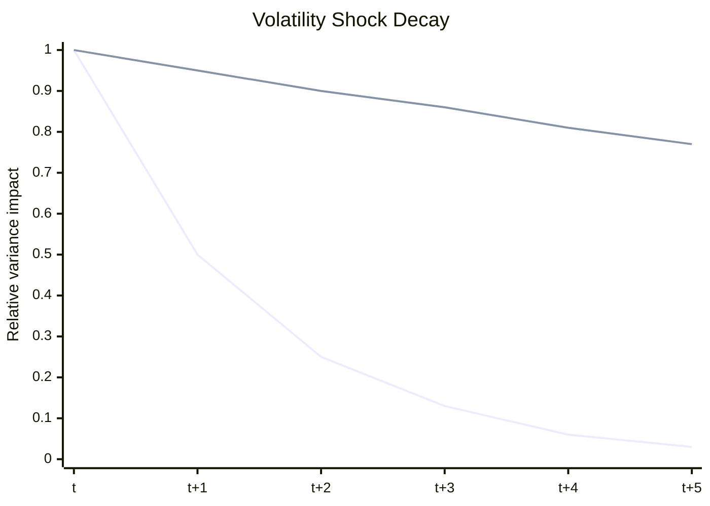

# Week 9: Modelling Volatility, ARCH and GARCH

## What this week is for

This week extends ARCH to GARCH. The exam uses this in fitted-model writing, prediction intervals, ARCH versus GARCH comparisons, and interpreting volatility persistence.

## Plain-English Roadmap

ARCH models use past squared shocks to forecast today's volatility. GARCH adds another ingredient: yesterday's own variance forecast. That makes GARCH more flexible and usually more realistic.

Think of GARCH as a volatility updating rule. Today's variance forecast starts with a baseline level, then increases if yesterday's shock was large, and also carries over part of yesterday's volatility. This carry-over is why GARCH captures long clusters of high or low volatility.

The $\alpha_1$ term measures the immediate reaction to new information. If yesterday's shock was large, $\alpha_1\epsilon_{t-1}^2$ pushes today's variance up. The $\beta_1$ term measures persistence from previous volatility. If yesterday was already a high-volatility day, $\beta_1\sigma_{t-1}^2$ keeps today's forecast high.

The sum $\alpha_1+\beta_1$ is the key persistence number. If it is close to 1, volatility shocks die out slowly. This does not necessarily mean the average level of volatility is high; it means volatility is sticky.

The long-run variance is the level volatility is pulled toward over time. In a stationary GARCH model, forecasts eventually drift back toward this long-run level. That is what "mean reversion in volatility" means.

Prediction intervals combine a mean forecast and a volatility forecast. The mean says where the next return is centred. The variance says how wide the plausible range should be. High forecast variance means a wider prediction interval.

Comparing ARCH and GARCH is about whether adding lagged variance improves the model enough. If GARCH has a much better likelihood or lower information criterion, it is usually preferred because it captures persistence more compactly.

## Visual Guide

This chart shows volatility persistence. A low-persistence model forgets a shock quickly; a high-persistence model stays elevated for longer.



## Formula Symbol Guide

Use this for ARCH/GARCH model formulas and forecasts.

- $r_t$: return at time $t$.
- $\mu$: unconditional mean return.
- $c$: intercept in the mean equation.
- $\phi$: AR coefficient in the mean equation.
- $\epsilon_t$: residual/shock at time $t$.
- $\sigma_t^2$: conditional variance at time $t$.
- $\alpha_0$: variance intercept or baseline variance term.
- $\alpha_1$: ARCH coefficient on the previous squared shock.
- $\beta_1$: GARCH coefficient on the previous variance forecast.
- $\alpha_1+\beta_1$: volatility persistence; must be less than 1 for stationary GARCH(1,1).
- $\hat\sigma_{T+1}^2$: one-step-ahead forecast variance.
- $\hat r_{T+1}$: one-step-ahead forecast return.
- $\ell_0$, $\ell_1$: log-likelihoods for restricted and unrestricted models.
- $LR$: likelihood ratio statistic, often $2(\ell_1-\ell_0)$.
- $\mathcal N(0,\sigma_t^2)$: normal distribution with mean 0 and variance $\sigma_t^2$.


## Why ARCH is not always enough (Exam)

Concept: ARCH may need many lagged shocks to capture long volatility clusters. GARCH captures the same idea more compactly using lagged variance.

Example: if volatility clusters for weeks, ARCH(1) is probably too short-memory.

ARCH(q) models use many lags of squared shocks:

$$
\sigma_t^2 = \alpha_0 + \alpha_1 \epsilon_{t-1}^2 + \cdots + \alpha_q \epsilon_{t-q}^2
$$

In high-frequency financial data, a large `q` may be needed to capture persistent volatility clustering. GARCH solves this more compactly by adding lagged conditional variance.

## GARCH(p,q) (Exam)

Concept: GARCH combines two memory channels: recent shocks and previous variance forecasts. This makes volatility smoother and more persistent.

Example: GARCH(1,1) uses yesterday's shock and yesterday's variance forecast.

A GARCH(p,q) model is:

$$
\begin{aligned}
\epsilon_t = \sigma_t u_t \\
u_t \sim \mathrm{iid}(0,1) \\
 \\
\sigma_t^2 = \alpha_0 \\
+ \alpha_1 \epsilon_{t-1}^2 + \cdots + \alpha_q \epsilon_{t-q}^2 \\
+ \beta_1 \sigma_{t-1}^2 + \cdots + \beta_p \sigma_{t-p}^2
\end{aligned}
$$

GARCH includes:

$$
\begin{aligned}
past squared shocks       \epsilon^2 terms \\
past conditional variance \sigma^2 terms
\end{aligned}
$$

## GARCH(1,1) (Exam)

Concept: GARCH(1,1) is popular because one shock lag and one variance lag often capture financial volatility well.

Example: a large $\beta_1$ means high volatility yesterday keeps today's volatility forecast high.

The most common model is:

$$
\sigma_t^2 = \alpha_0 + \alpha_1 \epsilon_{t-1}^2 + \beta_1 \sigma_{t-1}^2
$$

Conditions:

$$
\begin{aligned}
\alpha_0 > 0 \\
\alpha_1 \ge 0 \\
\beta_1 \ge 0 \\
\alpha_1 + \beta_1 < 1
\end{aligned}
$$

Why conditions matter:

$$
\begin{aligned}
\text{non-negative parameters} & \text{keep variance positive} \\
\alpha_{1} + \beta_{1} < 1 & \text{finite unconditional variance and mean reversion}
\end{aligned}
$$

## Persistence (Exam)

Concept: persistence tells you how slowly volatility shocks fade. A value near 1 means volatility is very sticky.

Example: $\alpha_1+\beta_1=0.98$ means volatility shocks fade very slowly.

For GARCH(1,1), volatility persistence is:

$$
\alpha_{1} + \beta_{1}
$$

Interpretation:

```text
close to 0      volatility shocks die out quickly
close to 1      volatility shocks die out slowly
```

High persistence means high-volatility periods tend to last.

## Long-run variance (Exam)

Concept: long-run variance is the average level that volatility forecasts revert toward when the model is stationary.

Example: if current variance is above the long-run variance, future forecasts gradually move downward.

For GARCH(1,1):

$$
\operatorname{Var}(\epsilon_t) = \alpha_0 / (1 - \alpha_1 - \beta_1)
$$

This is the unconditional variance, also called the long-run variance.

Long-run volatility is:

$$
\sqrt{\frac{\alpha_0}{1-\alpha_1-\beta_1}}
$$

Do not confuse:

$$
\begin{aligned}
\alpha_{0} & \text{affects volatility level} \\
\alpha_{1} + \beta_{1} & \text{affects persistence}
\end{aligned}
$$

Two models can have the same persistence but different long-run variance. Two models can have the same long-run variance but different persistence.

## Conditional moments of GARCH errors (Exam)

Concept: conditionally, the error has mean zero and variance sigma squared. Unconditionally, the variance changes over time, creating fat tails.

Example: given yesterday's information, the error has variance $\sigma_t^2$; before conditioning, variance changes over time.

Given past information:

$$
\begin{aligned}
\mathbb{E}(\epsilon_t | F_{t-1}) = 0 \\
\operatorname{Var}(\epsilon_t | F_{t-1}) = \sigma_t^2 \\
\operatorname{Cov}(\epsilon_t, \epsilon_{t-k} | F_{t-1}) = 0
\end{aligned}
$$

Unconditionally:

$$
\begin{aligned}
\mathbb{E}(\epsilon_t) = 0 \\
\operatorname{Cov}(\epsilon_t, \epsilon_{t-k}) = 0 \\
\operatorname{Var}(\epsilon_t) = \alpha_0 / (1 - \alpha_1 - \beta_1)
\end{aligned}
$$

So GARCH errors are uncorrelated, but their squares are dependent.

## Skewness of standard GARCH errors (Exam)

Concept: standard GARCH with normal shocks is symmetric, so it cannot explain negative skewness by itself.

Example: normal GARCH can produce fat tails but still has zero skewness.

If the GARCH model uses symmetric innovations such as:

$$
u_t \sim \mathrm{iid} \mathcal{N}(0,1)
$$

then the conditional distribution is symmetric:

$$
\epsilon_t | F_{t-1} \sim \mathcal{N}(0, \sigma_t^2)
$$

So:

$$
\mathbb{E}(\epsilon_t^3 | F_{t-1}) = 0
$$

Using LIE:

$$
\mathbb{E}(\epsilon_t^3) = \mathbb{E}[ \mathbb{E}(\epsilon_t^3 | F_{t-1}) ] = 0
$$

Therefore the unconditional skewness is:

$$
skewness = \mathbb{E}(\epsilon_t^3) / [\operatorname{Var}(\epsilon_t)]^{3/2} = 0
$$

Exam conclusion:

```text
standard GARCH with normal innovations can capture volatility clustering
and fat tails, but not unconditional skewness/asymmetry
```

To model asymmetric volatility, use GJR-GARCH or EGARCH.

## Mean equation plus volatility equation (Exam)

Concept: the mean equation forecasts direction/level; the variance equation forecasts risk. Both are needed for prediction intervals and VaR.

Example: AR predicts tomorrow's centre; GARCH predicts tomorrow's spread.

A complete return model has both:

$$
\begin{aligned}
\operatorname{mean} equation: \\
r_t = c + \phi_1 r_{t-1} + \epsilon_t \\
 \\
variance equation: \\
\sigma_t^2 = \alpha_0 + \alpha_1 \epsilon_{t-1}^2 + \beta_1 \sigma_{t-1}^2
\end{aligned}
$$

This is an AR(1)-GARCH(1,1).

If the mean is constant:

$$
r_t = \mu + \epsilon_t
$$

then the variance model still describes changing risk.

## Mean-adjusted AR form (Exam)

Concept: some software reports AR models around their mean rather than with an intercept. Expanding the equation converts between the two forms.

Example: $r_t-\mu=\phi(r_{t-1}-\mu)+u_t$ says deviations from the mean are persistent.

Some R output writes the AR(1) as:

$$
r_t - \mu = \phi (r_{t-1} - \mu) + \epsilon_t
$$

To convert to intercept form:

$$
\begin{aligned}
r_t = c + \phi r_{t-1} + \epsilon_t \\
c = \mu(1 - \phi)
\end{aligned}
$$

This appears in the practice exam. If the fitted mean form is:

$$
r_t = \mu + \phi(r_{t-1} - \mu) + \epsilon_t
$$

expand carefully:

$$
r_t = \mu(1 - \phi) + \phi r_{t-1} + \epsilon_t
$$

## One-step-ahead forecast, AR(1)-GARCH(1,1) (Exam)

Concept: the one-step forecast uses today's observed return, residual, and variance estimate. Nothing future needs to be guessed yet.

Example: plug in today's return for the mean forecast and today's residual/variance for the variance forecast.

Given:

$$
\begin{aligned}
r_t = c + \phi r_{t-1} + \epsilon_t \\
\sigma_t^2 = \alpha_0 + \alpha_1 \epsilon_{t-1}^2 + \beta_1 \sigma_{t-1}^2
\end{aligned}
$$

At time `T`, the one-step conditional mean forecast is:

$$
\mathbb{E}(r_{T+1} | F_T) = c + \phi r_T
$$

The one-step conditional variance forecast is:

$$
\begin{aligned}
\mathbb{E}(\sigma_{T+1}^2 | F_T) \\
= \alpha_0 + \alpha_1 \epsilon_T^2 + \beta_1 \sigma_T^2
\end{aligned}
$$

## Prediction interval (Exam)

Concept: a prediction interval widens when forecast volatility rises. It combines the expected return with the uncertainty around it.

Example: if the forecast standard deviation is 2, a 95% interval is roughly mean plus/minus 3.92.

If:

$$
r_{T+1} | F_T \sim \mathcal{N}(mean_forecast, variance_forecast)
$$

then a 95 percent prediction interval is:

$$
mean_forecast \pm 1.96 \sqrt{variance_forecast}
$$

This is directly used in the practice exam.

## Comparing ARCH and GARCH (Exam)

Concept: model comparison asks whether extra GARCH persistence improves fit enough to justify the more flexible model.

Example: a much larger log likelihood for GARCH suggests lagged variance matters.

ARCH(q) is nested inside GARCH(p,q) when all $\beta$ terms are zero.

Likelihood ratio test:

$$
\operatorname{LR} = 2 [ LL_GARCH - LL_ARCH ]
$$

Under the null that the added GARCH terms are unnecessary:

$$
\operatorname{LR}\sim \chi^2_p
$$

If `LR` is large, reject ARCH in favour of GARCH.

Other practical comparison tools:

$$
\begin{aligned}
higher \log likelihood      better \\
lower \operatorname{AIC}/\operatorname{BIC}              better \\
residual diagnostics       squared standardized residuals should not show autocorrelation
\end{aligned}
$$

## Student-t innovations

Concept: Student-t shocks allow more extreme observations than normal shocks. This is useful because financial returns often have fat tails.

Example: a t distribution with 5 degrees of freedom allows more extreme shocks than a normal distribution.

Sometimes normal shocks are not heavy-tailed enough.

Using Student-t innovations allows:

```text
more probability of large shocks
fatter tails than normal
```

In `rugarch`, `shape` is the degrees of freedom. Smaller values mean heavier tails.

## Exam-Style Practice Questions

### Question 1: Write a fitted AR-GARCH model

#### Relevant Formulas

Mean-adjusted AR(1): use this when the model is written around the unconditional mean.

$$
r_t-\mu=\phi(r_{t-1}-\mu)+\epsilon_t
$$

Intercept conversion: use this to rewrite the model in intercept form.

$$
c=\mu(1-\phi)
$$

GARCH(1,1): use this to write the conditional variance equation.

$$
\sigma_t^2=\alpha_0+\alpha_1\epsilon_{t-1}^2+\beta_1\sigma_{t-1}^2
$$


R output for an AR(1)-GARCH(1,1) model reports:

| Parameter | Estimate |
|---|---:|
| $\mu$ | 0.084 |
| ar1 | -0.12 |
| omega | 0.145 |
| alpha1 | 0.11 |
| beta1 | 0.82 |

The AR equation is reported in mean-adjusted form.

1. Write the fitted mean equation in mean-adjusted form.
2. Convert the mean equation into intercept form.
3. Write the fitted conditional variance equation.
4. Check whether the GARCH parameters satisfy the finite-variance condition.

#### Worked Answer

Mean-adjusted form:

$$
r_t-0.084=-0.12(r_{t-1}-0.084)+\hat{\epsilon}_t.
$$

Intercept form uses $c=\mu(1-\phi)$:

$$
c=0.084[1-(-0.12)]=0.0941.
$$

So:

$$
r_t=0.0941-0.12r_{t-1}+\hat{\epsilon}_t.
$$

Variance equation:

$$
\hat{\sigma}_t^2=0.145+0.11\hat{\epsilon}_{t-1}^2+0.82\hat{\sigma}_{t-1}^2.
$$

Finite variance condition:

$$
0.11+0.82=0.93<1.
$$

### Question 2: One-step forecast and prediction interval

#### Relevant Formulas

One-step mean forecast: use the fitted mean equation with the latest return.

$$
\hat r_{T+1}=c+\phi r_T
$$

One-step GARCH variance forecast: use the latest squared shock and latest variance.

$$
\hat\sigma_{T+1}^2=\alpha_0+\alpha_1\epsilon_T^2+\beta_1\sigma_T^2
$$

Normal prediction interval: use this to give a likely range for the next return.

$$
\hat r_{T+1}\pm1.96\hat\sigma_{T+1}
$$


Using the model:

$$
r_t=0.094-0.12r_{t-1}+\hat{\epsilon}_t,
$$

$$
\hat{\sigma}_t^2=0.145+0.11\hat{\epsilon}_{t-1}^2+0.82\hat{\sigma}_{t-1}^2,
$$

suppose at time $T$:

$$
r_T=0.50,\qquad \hat{\epsilon}_T=0.42,\qquad \hat{\sigma}_T^2=3.20.
$$

1. Compute $\mathbb{E}(r_{T+1}\mid F_T)$.
2. Compute $\hat{\sigma}_{T+1}^2$.
3. Assuming conditional normality, compute a 95% prediction interval.

#### Worked Answer

Mean forecast:

$$
\mathbb{E}(r_{T+1}\mid F_T)=0.094-0.12(0.50)=0.034.
$$

Variance forecast:

$$
\hat{\sigma}_{T+1}^2=0.145+0.11(0.42^2)+0.82(3.20)=2.7884.
$$

Standard deviation:

$$
\hat{\sigma}_{T+1}=\sqrt{2.7884}=1.670.
$$

95% prediction interval:

$$
0.034\pm1.96(1.670)=[-3.239,3.307].
$$

### Question 3: ARCH versus GARCH

#### Relevant Formulas

Likelihood ratio statistic: use this to compare nested volatility models such as ARCH and GARCH.

$$
LR=2(\ell_1-\ell_0)
$$

Decision rule: reject the smaller model if $LR$ is larger than the chi-square critical value.


An ARCH(5) model has log likelihood $LL_A=-4120.5$. A GARCH(1,1) model has log likelihood $LL_G=-4058.7$.

1. State the likelihood ratio statistic for comparing the models.
2. Compute the statistic.
3. If the comparison has one added GARCH parameter and $\chi^2_1=3.841$, which model do you prefer?
4. Explain your conclusion in words.

#### Worked Answer

Likelihood ratio statistic:

$$
LR=2(LL_G-LL_A)=2[-4058.7-(-4120.5)]=123.6.
$$

Since $123.6>3.841$, prefer GARCH(1,1). The lagged variance term improves the model.

### Question 4: GARCH skewness

#### Relevant Formulas

Conditional normal GARCH shock: use this to reason about skewness.

$$
\epsilon_t\mid F_{t-1}\sim\mathcal N(0,\sigma_t^2)
$$

Normal third moment: a conditionally normal shock has zero skewness.

$$
\mathbb E(\epsilon_t^3\mid F_{t-1})=0
$$


Consider a GARCH(1,1) model with normal innovations.

1. Write the conditional distribution of $\epsilon_t\mid F_{t-1}$.
2. Derive $\mathbb{E}(\epsilon_t^3)$ using LIE.
3. What is the unconditional skewness?
4. What stylised fact does this standard GARCH model fail to capture?

#### Worked Answer

Under normal GARCH:

$$
\epsilon_t\mid F_{t-1}\sim \mathcal{N}(0,\sigma_t^2).
$$

The conditional distribution is symmetric, so:

$$
\mathbb{E}(\epsilon_t^3\mid F_{t-1})=0.
$$

Using LIE:

$$
\mathbb{E}(\epsilon_t^3)=\mathbb{E}[0]=0.
$$

So unconditional skewness is zero. Standard GARCH with normal innovations does not capture asymmetry/leverage.

## What to be able to do

1. Write ARCH(q), GARCH(p,q), and GARCH(1,1).
2. Check positivity and stationarity conditions.
3. Interpret $\alpha_{1}$, $\beta_{1}$, and $\alpha_{1} + \beta_{1}$.
4. Compute long-run variance.
5. Write a fitted AR-GARCH model from R output.
6. Compute one-step mean and variance forecasts.
7. Build a 95 percent prediction interval.
8. Compare ARCH and GARCH using likelihood ratio logic.
