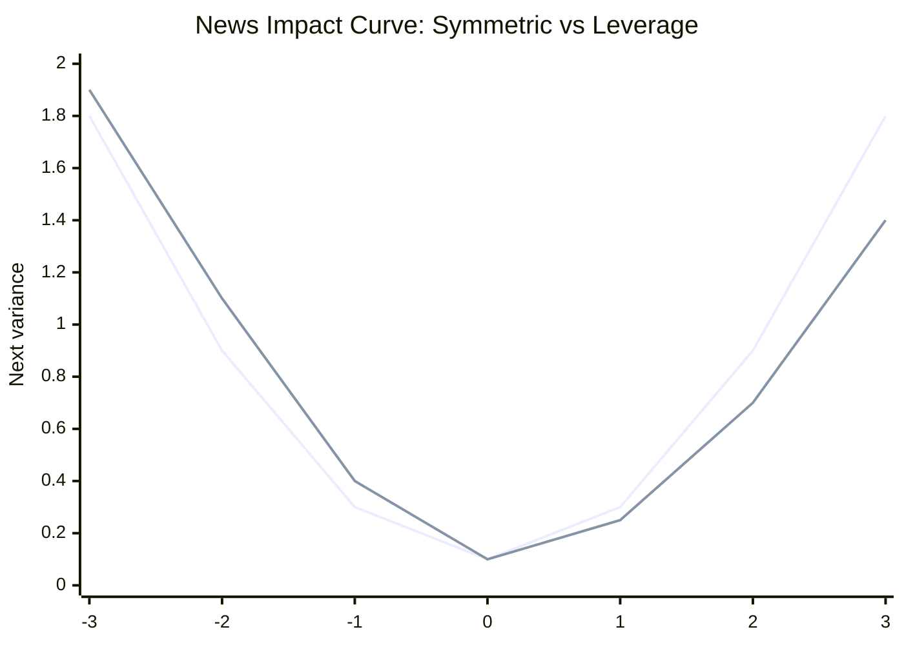

# Week 10: Modelling Asymmetry in Volatility

## What this week is for

Standard ARCH and GARCH treat positive and negative shocks of the same size symmetrically. This week introduces models that allow bad news to raise volatility more than good news. The exam uses GJR-GARCH, leverage effects, and news impact curves.

## Plain-English Roadmap

Standard GARCH only sees the size of yesterday's shock because it uses $\epsilon_{t-1}^2$. Squaring removes the sign. A positive shock and a negative shock of the same size therefore have the same effect on volatility.

Financial markets often do not behave symmetrically. Bad news can make investors more nervous than equally large good news makes them confident. This is the leverage effect or asymmetric volatility.

GJR-GARCH fixes this by adding an indicator variable that switches on when the previous shock is negative. If the shock is good news, only the usual ARCH effect applies. If the shock is bad news, the extra leverage term is added too.

The leverage parameter $\lambda$ tells you how much extra impact bad news has. If $\lambda>0$, negative shocks increase future volatility more than positive shocks of the same size. If it is statistically significant, the asymmetry is not just random noise in the sample.

EGARCH handles asymmetry differently by modelling log variance. The advantage is that variance is automatically positive, because exponentiating log variance gives a positive number. EGARCH can capture leverage through the sign of the standardised shock.

A news impact curve is a picture of how yesterday's shock changes today's variance. Symmetric models have symmetric curves. GJR-GARCH has a steeper curve on the negative-shock side when there is leverage.

## Visual Guide

This chart shows the news impact idea. A symmetric model gives the same volatility response to equal positive and negative shocks. A leverage model makes the negative side steeper.



## Formula Symbol Guide

Use this for leverage, GJR-GARCH, EGARCH, and news impact curves.

- $\epsilon_t$: shock or residual at time $t$.
- $\sigma_t^2$: conditional variance at time $t$.
- $\alpha_0$: baseline variance term.
- $\alpha_1$: symmetric ARCH effect from the previous squared shock.
- $\beta_1$: GARCH persistence effect from previous variance.
- $\lambda$: leverage/asymmetry coefficient; measures the extra effect of bad news.
- $I_{t-1}$: indicator variable; equals 1 when the previous shock is negative and 0 otherwise.
- $\epsilon_{t-1}^2$: squared previous shock; size of yesterday's news, ignoring sign.
- $\alpha_1$: good-news curvature/effect in GJR-GARCH.
- $\alpha_1+\lambda$: bad-news curvature/effect in GJR-GARCH.
- $SE(\hat\lambda)$: standard error of the estimated leverage coefficient.
- $t$: t-statistic for testing whether leverage is statistically significant.
- $NIC$: news impact curve; shows how shocks of different signs/sizes affect variance.


## Leverage effect (Exam)

Concept: leverage effect means bad news increases future volatility more than equally sized good news. The sign of the shock matters.

Example: a -5% return may raise tomorrow's volatility more than a +5% return.

The leverage effect is the tendency for negative return shocks to increase future volatility more than positive shocks of the same magnitude.

Plain English:

```text
bad news moves risk more than equally sized good news
```

In firm-level finance, a fall in equity value can increase debt-to-equity leverage, making the firm riskier. More generally, markets often react more strongly to negative news.

## Why standard GARCH is symmetric (Exam)

Concept: standard GARCH squares shocks, and squaring removes the sign. That is why it treats good and bad news equally.

Example: both +3 and -3 become 9 when squared, so standard GARCH treats them equally.

GARCH(1,1):

$$
\sigma_t^2 = \alpha_0 + \alpha_1 \epsilon_{t-1}^2 + \beta_1 \sigma_{t-1}^2
$$

Because the shock enters as $epsilon_{t-1}^2$, a shock of $+2$ and `-2` has the same effect:

$$
(+2)^2 = (-2)^2 = 4
$$

So standard GARCH cannot capture leverage.

## GJR-GARCH model (Exam)

Concept: GJR-GARCH adds a switch that turns on for negative shocks. This lets bad news have an extra volatility effect.

Example: if yesterday's residual is negative, the indicator equals 1 and the leverage term is added.

GJR-GARCH adds an indicator for bad news:

$$
\begin{aligned}
r_t = \mu + \epsilon_t \\
\epsilon_t = \sigma_t u_t \\
 \\
\sigma_t^2 = \alpha_0 \\
+ \alpha_1 \epsilon_{t-1}^2 \\
+ \lambda I_{t-1} \epsilon_{t-1}^2 \\
+ \beta_1 \sigma_{t-1}^2
\end{aligned}
$$

where:

$$
\begin{aligned}
I_{t-1} = 1 \text{ if } \epsilon_{t-1} \le 0 \\
= 0 otherwise
\end{aligned}
$$

Effects:

$$
\begin{aligned}
good news, \epsilon_{t-1} > 0: \\
effect = \alpha_1 \epsilon_{t-1}^2 \\
 \\
bad news, \epsilon_{t-1} \le 0: \\
effect = (\alpha_1 + \lambda) \epsilon_{t-1}^2
\end{aligned}
$$

Leverage effect:

$$
\lambda > 0
$$

If $\lambda$ is positive and significant, bad news has a larger effect on volatility.

In `rugarch` output, `gamma1` often corresponds to the GJR leverage parameter $\lambda$.

## Testing leverage in GJR-GARCH (Exam)

Concept: the leverage test asks whether the extra bad-news coefficient is statistically different from zero.

Example: if the leverage t-statistic is 4, the bad-news effect is statistically significant.

Hypotheses:

$$
\begin{aligned}
H_0: \lambda = 0 \\
H_1: \lambda \ne 0
\end{aligned}
$$

Test statistic:

$$
t = \lambda_hat / \operatorname{se}(\lambda_hat)
$$

Decision at 5 percent:

$$
\text{if } |t| > 1.96, \text{ reject } H_0
$$

Interpretation:

$$
\begin{aligned}
\text{reject and } \hat{\lambda} > 0 & \text{significant leverage effect} \\
\text{do not reject} & \text{no strong evidence of asymmetry}
\end{aligned}
$$

## GJR-GARCH conditions (Exam)

Concept: the conditions keep variance positive and finite. The lambda term enters stationarity at half weight under symmetric shocks because bad news occurs about half the time.

Example: $\alpha_1+\lambda$ must not make the variance response to bad news negative.

For variance positivity, a simple set of restrictions is:

$$
\begin{aligned}
\alpha_0 > 0 \\
\alpha_1 \ge 0 \\
\beta_1 \ge 0 \\
\alpha_1 + \lambda \ge 0
\end{aligned}
$$

For finite unconditional variance under symmetric shocks:

$$
\alpha_{1} + \beta_{1} + \lambda/2 < 1
$$

The `lambda/2` appears because under a symmetric distribution, negative shocks occur about half the time.

Unconditional variance:

$$
\operatorname{Var}(\epsilon_t) = \alpha_0 / (1 - \alpha_1 - \beta_1 - \lambda/2)
$$

## EGARCH model (Exam)

Concept: EGARCH models log variance, so variance is automatically positive. It can also make negative standardised shocks affect volatility differently.

Example: a negative EGARCH asymmetry coefficient means negative standardised shocks raise log variance more.

EGARCH models log variance:

$$
\begin{aligned}
\log(\sigma_t^2) = \omega \\
+ \alpha_1 u_{t-1} \\
+ \gamma_1 (|u_{t-1}| - E|u_{t-1}|) \\
+ \beta_1 \log(\sigma_{t-1}^2)
\end{aligned}
$$

where:

$$
u_{t-1} = \epsilon_{t-1} / \sigma_{t-1}
$$

If $u_t$ is standard normal:

$$
E|u_t| = \sqrt{2/pi} \approx 0.7979
$$

Leverage in this notation:

$$
\alpha_{1} < 0
$$

A negative shock then has a larger effect on log variance than a positive shock of the same size.

Advantage:

$$
because \log(\sigma_t^2) is modelled, \sigma_t^2 is automatically positive
$$

## News Impact Curve, NIC (Exam)

Concept: the NIC visualises how yesterday's shock changes today's variance. It turns the variance equation into a picture.

Example: plot shocks on the x-axis and next variance on the y-axis to see the volatility response.

The News Impact Curve plots next-period conditional variance against yesterday's shock.

It answers:

$$
\text{if yesterday's news was } \epsilon_{t-1}\text{, what happens to today's variance?}
$$

## NIC for ARCH(1) (Exam)

Concept: ARCH has a symmetric U-shaped NIC because only squared shock size matters.

Example: shocks of +2 and -2 land at the same height on the ARCH NIC.

ARCH(1):

$$
\sigma_t^2 = \alpha_0 + \alpha_1 \epsilon_{t-1}^2
$$

NIC:

$$
\sigma_t^2 = \alpha_0 + \alpha_1 \epsilon_{t-1}^2
$$

Interpretation:

$$
\begin{aligned}
\alpha_{0} & \text{vertical position / baseline variance} \\
\alpha_{1} & \text{curvature / sensitivity to shocks}
\end{aligned}
$$

It is symmetric because positive and negative shocks have the same squared value.

## NIC for GARCH(1,1) (Exam)

Concept: GARCH has a similar symmetric curve, but shifted by the lagged variance evaluated at its long-run level.

Example: the GARCH NIC is still symmetric, but its vertical position includes the long-run variance term.

For NIC, set lagged variance to the unconditional variance:

$$
\bar{\sigma}^2 = \alpha_0 / (1 - \alpha_1 - \beta_1)
$$

Then:

$$
NIC = \alpha_0 + \alpha_1 \epsilon_{t-1}^2 + \beta_1 \bar{\sigma}^2
$$

or:

$$
\begin{aligned}
NIC = \alpha_0 + \beta_1 [\alpha_0 / (1 - \alpha_1 - \beta_1)] \\
+ \alpha_1 \epsilon_{t-1}^2
\end{aligned}
$$

It is still symmetric. Curvature is governed by $\alpha_{1}$.

## NIC for GJR-GARCH (Exam)

Concept: GJR-GARCH has different curvature on the negative side because bad news adds the leverage coefficient.

Example: if $\alpha_1=0.05$ and $\lambda=0.10$, negative-shock curvature is 0.15.

GJR-GARCH:

$$
\begin{aligned}
\sigma_t^2 = \alpha_0 \\
+ \alpha_1 \epsilon_{t-1}^2 \\
+ \lambda I_{t-1} \epsilon_{t-1}^2 \\
+ \beta_1 \sigma_{t-1}^2
\end{aligned}
$$

Set:

$$
A = \alpha_0 + \beta_1 \alpha_0 / (1 - \alpha_1 - \lambda/2 - \beta_1)
$$

NIC:

$$
\begin{aligned}
\text{ if } \epsilon_{t-1} > 0: \\
\sigma_t^2 = A + \alpha_1 \epsilon_{t-1}^2 \\
 \\
\text{ if } \epsilon_{t-1} \le 0: \\
\sigma_t^2 = A + (\alpha_1 + \lambda) \epsilon_{t-1}^2
\end{aligned}
$$

Curvature:

$$
\begin{aligned}
\text{positive shocks} & \alpha_1 \\
\text{negative shocks} & \alpha_1 + \lambda
\end{aligned}
$$

This is exactly the practice exam idea. If asked which parameters determine curvature, say $\alpha_{1}$ and $\lambda$; the negative side has curvature $\alpha_{1} + \lambda$.

## Exam-Style Practice Questions

### Question 1: GJR-GARCH model and leverage

#### Relevant Formulas

GJR-GARCH model: use this when bad news may affect volatility differently from good news.

$$
\sigma_t^2=\alpha_0+\alpha_1\epsilon_{t-1}^2+\lambda I_{t-1}\epsilon_{t-1}^2+\beta_1\sigma_{t-1}^2
$$

Indicator variable: use this to switch on the extra bad-news effect.

$$
I_{t-1}=1\text{ if }\epsilon_{t-1}<0, \qquad I_{t-1}=0\text{ if }\epsilon_{t-1}\ge0
$$


An estimated GJR-GARCH model is:

$$
r_t=0.032+\hat{\epsilon}_t,
$$

$$
\hat{\sigma}_t^2
=0.018+0.046\hat{\epsilon}_{t-1}^2
+0.092I_{t-1}\hat{\epsilon}_{t-1}^2
+0.881\hat{\sigma}_{t-1}^2.
$$

1. Define $I_{t-1}$.
2. What is the effect of good news on next period's variance?
3. What is the effect of bad news on next period's variance?
4. Is there evidence of a leverage effect from the sign of the coefficient? Explain.

#### Worked Answer

$I_{t-1}=1$ when $\hat{\epsilon}_{t-1}\le0$ and $0$ otherwise.

Good news effect:

$$
\alpha_1=0.046.
$$

Bad news effect:

$$
\alpha_1+\lambda=0.046+0.092=0.138.
$$

Because the leverage coefficient is positive, bad news has a larger effect on volatility than good news.

### Question 2: Testing leverage

#### Relevant Formulas

Leverage coefficient t-test: use this to test whether bad news has an extra volatility effect.

$$
t=\frac{\hat\lambda}{SE(\hat\lambda)}
$$

Hypotheses:

$$
H_0:\lambda=0, \qquad H_1:\lambda\ne0
$$


For the GJR-GARCH model above, suppose the standard error of the leverage coefficient is $0.021$.

1. State the null and alternative hypotheses for testing leverage.
2. Compute the t-statistic.
3. Using 1.96 as the 5% two-sided critical value, state your conclusion.
4. Explain the conclusion in plain English.

#### Worked Answer

Hypotheses:

$$
H_0:\lambda=0,\qquad H_1:\lambda\ne0.
$$

Statistic:

$$
t=0.092/0.021=4.38.
$$

Since $4.38>1.96$, reject $H_0$. The leverage effect is statistically significant.

### Question 3: News impact curve curvature

#### Relevant Formulas

Good-news curvature: use this for positive shocks where the indicator is off.

$$
\text{good-news effect}=\alpha_1
$$

Bad-news curvature: use this for negative shocks where the leverage term is active.

$$
\text{bad-news effect}=\alpha_1+\lambda
$$


For a GJR-GARCH model:

$$
\sigma_t^2=\alpha_0+\alpha_1\epsilon_{t-1}^2+\lambda I_{t-1}\epsilon_{t-1}^2+\beta_1\sigma_{t-1}^2,
$$

with:

$$
\alpha_1=0.04,\qquad \lambda=0.13.
$$

1. Which parameters determine the curvature of the NIC?
2. What is the curvature for positive shocks?
3. What is the curvature for negative shocks?
4. Explain why the NIC is asymmetric.

#### Worked Answer

The NIC curvature is determined by $\alpha_1$ and $\lambda$.

Positive-shock curvature:

$$
\alpha_1=0.04.
$$

Negative-shock curvature:

$$
\alpha_1+\lambda=0.04+0.13=0.17.
$$

The NIC is asymmetric because negative shocks have a larger curvature.

### Question 4: EGARCH interpretation

#### Relevant Formulas

EGARCH leverage sign: use this to interpret asymmetry in log variance models.

$$
\lambda<0 \Rightarrow \text{negative shocks raise volatility more than positive shocks}
$$

P-value rule: a very small p-value means the asymmetry coefficient is statistically significant.


An EGARCH output gives an asymmetric coefficient estimate of $-0.08$ with p-value $0.000$.

1. Write the sign condition for leverage in the EGARCH notation used in these notes.
2. Is the leverage effect statistically significant?
3. Explain why EGARCH does not need the same non-negativity restrictions as GARCH.

#### Worked Answer

In this EGARCH notation, leverage is captured by a negative asymmetric coefficient. Since the estimate is $-0.08$ and the p-value is 0.000, the leverage effect is statistically significant.

EGARCH models log variance, so variance is automatically positive after exponentiating. That is why it does not need the same non-negativity restrictions as standard GARCH.

## What to be able to do

1. Explain leverage effect in plain language.
2. Explain why standard GARCH is symmetric.
3. Write GJR-GARCH and identify the bad-news indicator.
4. Interpret and test $\lambda$.
5. Write EGARCH and explain why log variance guarantees positivity.
6. Draw or explain NICs for ARCH, GARCH, and GJR-GARCH.
7. Compute NIC curvature for positive and negative shocks.
