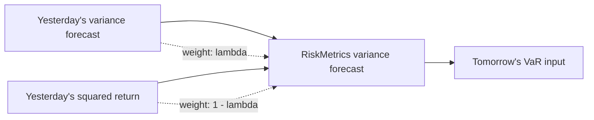

# Week 11: IGARCH, RiskMetrics, and ARMA Models

## What this week is for

This week has three assessed ideas: IGARCH/RiskMetrics, VaR calculation using conditional normal returns, and ARMA models. The workshop focuses strongly on GARCH persistence and long-run variance.

## Plain-English Roadmap

IGARCH is what happens when volatility persistence is pushed all the way to 1. In an ordinary stationary GARCH model, volatility shocks eventually fade. In IGARCH, shocks never fully disappear in the same way, so the model has no finite unconditional variance.

RiskMetrics is a practical IGARCH-style rule for updating risk. It says tomorrow's variance forecast is a weighted average of yesterday's variance forecast and yesterday's squared return. The decay parameter $\lambda$ controls how slowly the forecast updates.

If $\lambda$ is high, the model is slow-moving: yesterday's variance forecast receives a lot of weight. If $1-\lambda$ is high, the latest squared return has more influence and the forecast reacts faster to new shocks.

VaR turns a volatility forecast into a dollar risk number. Once you have a conditional mean and variance, you assume a conditional distribution, usually normal in this unit, find a bad return quantile, and multiply by the position size.

ARMA models are for modelling the conditional mean, not volatility. AR terms use past values of the series. MA terms use past shocks. An MA(1) forecast only uses the most recent shock for the one-step forecast; after that, the forecast returns to the mean because future shocks have expected value zero.

The big distinction in this week is level versus persistence. A model can have a high average variance but low persistence, or the same average variance but much stronger persistence. GARCH models let you separate those ideas.

## Visual Guide

RiskMetrics is a weighted updating rule. A high decay parameter means yesterday's variance forecast dominates; a lower decay parameter means the newest squared return matters more.



## Formula Symbol Guide

Use this for IGARCH, RiskMetrics, and ARMA formulas.

- $\sigma_t^2$: conditional variance at time $t$.
- $\alpha_0$: variance intercept; equals 0 in RiskMetrics/EWMA.
- $\alpha_1$: weight on the latest squared return or shock.
- $\beta_1$: weight on the previous variance forecast.
- $\alpha_1+\beta_1$: volatility persistence; equals 1 in IGARCH.
- $\lambda$: RiskMetrics decay factor; commonly 0.94 for daily data.
- $1-\lambda$: weight placed on the latest squared return.
- $r_T$: latest observed return.
- $\hat\sigma_{T+1}^2$: one-step-ahead variance forecast.
- $q_{0.05}$: 5% return quantile.
- $\hat\mu_{T+1}$: forecast mean return for next period.
- $W_0$: dollar value invested.
- $\operatorname{VaR}_{0.05}$: 5% Value at Risk.
- $y_t$: time-series variable in an ARMA/MA model.
- $\mu$: mean of the ARMA/MA process.
- $\theta$: MA coefficient on the lagged shock.
- $\epsilon_t$: current shock.
- $\epsilon_{t-1}$: previous shock.


## IGARCH motivation (Exam)

Concept: IGARCH is used when estimated GARCH persistence is basically 1. It treats volatility shocks as extremely persistent.

Example: an estimated $\alpha_1+\beta_1=0.995$ suggests volatility is almost integrated.

In many estimated GARCH(1,1) models:

```text
alpha_1 + beta_1 approx 1
```

This means volatility is highly persistent. IGARCH imposes:

$$
\alpha_1 + \beta_1 = 1
$$

## IGARCH(1,1) (Exam)

Concept: IGARCH forces alpha plus beta to equal 1. This removes mean reversion in the usual stationary GARCH sense.

Example: if $\beta=0.94$, the squared-return weight is $1-0.94=0.06$.

Start from GARCH(1,1):

$$
\sigma_t^2 = \alpha_0 + \alpha_1 \epsilon_{t-1}^2 + \beta_1 \sigma_{t-1}^2
$$

If:

$$
\alpha_1 + \beta_1 = 1
$$

then:

$$
\alpha_1 = 1 - \beta_1
$$

IGARCH:

$$
\sigma_t^2 = \alpha_0 + (1 - \beta_1) \epsilon_{t-1}^2 + \beta_1 \sigma_{t-1}^2
$$

Special RiskMetrics-style IGARCH sets:

$$
\alpha_0 = 0
$$

so:

$$
\sigma_t^2 = (1 - \beta_1) \epsilon_{t-1}^2 + \beta_1 \sigma_{t-1}^2
$$

If the mean is zero, `epsilon_t = r_t`, so:

$$
\sigma_t^2 = (1 - \beta_1) r_{t-1}^2 + \beta_1 \sigma_{t-1}^2
$$

## IGARCH and unconditional variance (Exam)

Concept: because persistence equals 1, the usual long-run variance formula breaks down. That is why IGARCH has no finite unconditional variance.

Example: the denominator $1-\alpha-\beta$ becomes zero when $\alpha+\beta=1$.

For GARCH(1,1):

$$
\operatorname{Var}(\epsilon_t) = \alpha_0 / (1 - \alpha_1 - \beta_1)
$$

For IGARCH:

$$
\alpha_1 + \beta_1 = 1
$$

so the denominator is zero. Therefore:

```text
unconditional variance does not exist
```

This is why IGARCH is not covariance stationary, even though it is widely used for risk forecasting.

## RiskMetrics model (Exam)

Concept: RiskMetrics is a simple volatility updating rule. It blends yesterday's variance forecast with yesterday's squared return.

Example: with $\lambda=0.94$, yesterday's variance gets 94% weight and yesterday's squared return gets 6%.

RiskMetrics assumes:

$$
r_t | F_{t-1} \sim \mathcal{N}(0, \sigma_t^2)
$$

and:

$$
\sigma_t^2 = \beta \sigma_{t-1}^2 + (1 - \beta) r_{t-1}^2
$$

The one-step-ahead forecast is:

$$
\sigma_{T+1}^2 = \beta \sigma_T^2 + (1 - \beta) r_T^2
$$

Common interpretation:

```text
beta close to 1   slow updating, persistent volatility
1 - beta          weight on latest squared return
```

## VaR under conditional normality (Exam)

Concept: conditional normal VaR uses tomorrow's forecast mean and variance to find a bad return threshold.

Example: with zero mean and forecast standard deviation 2%, the 5% quantile is about -3.29%.

If:

$$
r_{T+1} | F_T \sim \mathcal{N}(\mu_{T+1|T}, \sigma_{T+1}^2)
$$

then the alpha quantile is:

$$
q_\alpha = \mu_{T+1|T} + \sigma_{T+1} z_\alpha
$$

VaR for investment `W_0`:

$$
\operatorname{VaR}_\alpha = | W_0 \times q_\alpha |
$$

For 5 percent VaR:

$$
z_{0.05} = -1.645
$$

RiskMetrics uses `mu = 0`, so:

$$
\begin{aligned}
q_{0.05} = -1.645 \sigma_{T+1} \\
\operatorname{VaR}_{0.05} = | W_0 \times (-1.645 \sigma_{T+1}) |
\end{aligned}
$$

## AR-GARCH VaR (Exam)

Concept: AR-GARCH VaR uses an AR model for the mean and GARCH for the variance before calculating the return quantile.

Example: if the AR mean forecast is positive, it partly offsets the negative VaR quantile.

For an AR(p)-GARCH(1,1):

$$
\begin{aligned}
r_t = \mu_t + \epsilon_t \\
\mu_t = c + \phi_1 r_{t-1} + \cdots + \phi_p r_{t-p} \\
 \\
\sigma_t^2 = \alpha_0 + \alpha_1 \epsilon_{t-1}^2 + \beta_1 \sigma_{t-1}^2
\end{aligned}
$$

One-step conditional mean:

$$
\mu_{T+1|T} = c + \phi_1 r_T + \cdots + \phi_p r_{T-p+1}
$$

One-step conditional variance:

$$
\sigma_{T+1}^2 = \alpha_0 + \alpha_1 \epsilon_T^2 + \beta_1 \sigma_T^2
$$

Then:

$$
\begin{aligned}
q_{0.05} = \mu_{T+1|T} - 1.645 \sigma_{T+1} \\
\operatorname{VaR}_{0.05} = | W_0 q_{0.05} |
\end{aligned}
$$

## GARCH persistence versus volatility level (Exam)

Concept: persistence is about how long shocks last; level is about how large variance is on average. They are related but not the same.

Example: two models can both have variance 0.2, but the one with persistence 0.95 stays volatile longer.

For GARCH(1,1):

$$
\begin{aligned}
persistence = \alpha_1 + \beta_1 \\
long-run variance = \alpha_0 / (1 - \alpha_1 - \beta_1)
\end{aligned}
$$

Key distinction:

```text
alpha_0 changes the overall volatility level
alpha_1 + beta_1 changes persistence
```

Workshop logic:

If models A, B, and C all have:

$$
\alpha_1 + \beta_1 = 0.95
$$

then they have the same persistence. If their `alpha_0` values differ, their unconditional variances differ.

If two models have the same long-run variance but different `alpha_1 + beta_1`, the one with larger `alpha_1 + beta_1` has stronger volatility clustering.

## MA(1) model (Exam)

Concept: MA(1) says today's value depends on today's shock and yesterday's shock. It models short-lived shock effects.

Example: a positive shock yesterday raises today's forecast if the MA coefficient is positive.

An MA(1) model is:

$$
y_t = \phi_0 + u_t + \theta_1 u_{t-1}
$$

where:

$$
u_t \sim \mathrm{iid}(0, \sigma_u^2)
$$

Unconditional mean:

$$
\mathbb{E}(y_t) = \phi_0
$$

Unconditional variance:

$$
\operatorname{Var}(y_t) = (1 + \theta_1^2) \sigma_u^2
$$

Autocorrelation:

$$
\begin{aligned}
\rho_1 = \theta_1 / (1 + \theta_1^2) \\
\rho_k = 0 \text{ for } k > 1
\end{aligned}
$$

## Forecasting MA(1) (Exam)

Concept: the one-step MA forecast uses the last observed residual. Beyond that, future residuals have expected value zero.

Example: after one step, the unknown future shock is set to zero in expectation.

At time `T`:

$$
y_{T+1} = \phi_0 + u_{T+1} + \theta_1 u_T
$$

Since the future shock has forecast zero:

$$
forecast y_{T+1} = \phi_0_hat + \theta_1_hat u_T_hat
$$

For two or more steps ahead:

$$
forecast y_{T+h} = \phi_0_hat, h \ge 2
$$

MA(1) forecasts revert to the mean after one period.

## ARMA(p,q) (Exam)

Concept: ARMA combines memory from past values and past shocks. It is mainly a conditional-mean model.

Example: ARMA(1,1) uses yesterday's value and yesterday's shock.

ARMA combines autoregressive and moving-average dynamics:

$$
\begin{aligned}
y_t = \phi_0 \\
+ \phi_1 y_{t-1} + \cdots + \phi_p y_{t-p} \\
+ u_t + \theta_1 u_{t-1} + \cdots + \theta_q u_{t-q}
\end{aligned}
$$

Use AIC to choose among candidate ARMA models:

$$
lowest \operatorname{AIC} = preferred
$$

## Exam-Style Practice Questions

### Question 1: GARCH persistence and long-run variance

#### Relevant Formulas

GARCH persistence: use this to measure how slowly volatility shocks fade.

$$
\rho=\alpha_1+\beta_1
$$

Long-run variance: use this only when $\alpha_1+\beta_1<1$.

$$
\bar\sigma^2=\frac{\alpha_0}{1-\alpha_1-\beta_1}
$$


Consider three GARCH(1,1) models:

| Model | $\alpha_0$ | $\alpha_1$ | $\beta_1$ |
|---|---:|---:|---:|
| A | 0.002 | 0.08 | 0.87 |
| B | 0.020 | 0.08 | 0.87 |
| C | 0.050 | 0.08 | 0.87 |

1. Compute the persistence for each model.
2. Do the models have the same volatility persistence?
3. Compute the long-run variance for each model.
4. Explain why higher unconditional variance does not necessarily mean higher persistence.

#### Worked Answer

Persistence for all three models:

$$
\alpha_1+\beta_1=0.08+0.87=0.95.
$$

So they have the same volatility persistence.

Long-run variances:

$$
A:\frac{0.002}{1-0.95}=0.04.
$$

$$
B:\frac{0.020}{1-0.95}=0.40.
$$

$$
C:\frac{0.050}{1-0.95}=1.00.
$$

Higher unconditional variance means a higher average volatility level, not necessarily stronger persistence.

### Question 2: IGARCH and RiskMetrics

#### Relevant Formulas

RiskMetrics / EWMA forecast: use this when the variance update has no intercept and weights sum to 1.

$$
\sigma_{T+1}^2=(1-\lambda)r_T^2+\lambda\sigma_T^2
$$

IGARCH persistence condition: shocks to variance do not die out in the usual mean-reverting way.

$$
\alpha_1+\beta_1=1
$$


RiskMetrics uses:

$$
\sigma_{t+1}^2=(1-\lambda)r_t^2+\lambda\sigma_t^2.
$$

Suppose $\lambda=0.94$, $r_T=-0.018$, and $\sigma_T^2=0.000225$.

1. Compute $\sigma_{T+1}^2$.
2. Explain why this is an IGARCH-style model.
3. Does this model have a finite unconditional variance? Explain.

#### Worked Answer

RiskMetrics forecast:

$$
\sigma_{T+1}^2=(1-0.94)(-0.018)^2+0.94(0.000225)=0.00023094.
$$

It is IGARCH-style because the weights on squared return and lagged variance sum to 1. It has no finite unconditional variance in the usual GARCH sense.

### Question 3: VaR under RiskMetrics

#### Relevant Formulas

RiskMetrics variance forecast: first update volatility using the latest return.

$$
\sigma_{T+1}^2=(1-\lambda)r_T^2+\lambda\sigma_T^2
$$

Normal 5% quantile: use this to get the bad return cutoff.

$$
q_{0.05}=\hat\mu_{T+1}-1.645\hat\sigma_{T+1}
$$

VaR: use this to convert the return cutoff into a dollar loss.

$$
\operatorname{VaR}_{0.05}=|W_0q_{0.05}|
$$


Using the variance forecast from Question 2, suppose an investor holds \$5 million in the asset and assumes zero conditional mean.

1. Compute the 5% return quantile using $z_{0.05}=-1.645$.
2. Compute the 1-day 5% VaR.
3. Explain what the VaR means.

#### Worked Answer

Standard deviation:

$$
\sigma_{T+1}=\sqrt{0.00023094}=0.01520.
$$

5% quantile:

$$
q_{0.05}=-1.645(0.01520)=-0.0250.
$$

VaR:

$$
\operatorname{VaR}_{0.05}=|5{,}000{,}000(-0.0250)|\approx125{,}000.
$$

So the 1-day 5% VaR is about 125,000 dollars.

### Question 4: MA(1) forecasting

#### Relevant Formulas

MA(1) model: use this when the current value depends on the current and previous shock.

$$
y_t=\mu+\epsilon_t+\theta\epsilon_{t-1}
$$

MA(1) forecasts: only the one-step forecast uses the latest shock; later forecasts return to the mean.

$$
\hat y_{T+1}=\mu+\theta\epsilon_T, \qquad \hat y_{T+h}=\mu\text{ for }h\ge2
$$


Suppose:

$$
y_t=0.006+u_t+0.30u_{t-1},
$$

and the last estimated residual is $\hat{u}_T=0.012$.

1. Compute the one-step-ahead forecast $\hat{y}_{T+1}$.
2. Compute the two-step-ahead forecast $\hat{y}_{T+2}$.
3. Explain why the forecasts become constant after the first step.

#### Worked Answer

One-step forecast:

$$
\hat{y}_{T+1}=0.006+0.30(0.012)=0.0096.
$$

Two-step forecast:

$$
\hat{y}_{T+2}=0.006.
$$

After the first step, future shocks have expected value zero, so the MA(1) forecast returns to the mean.

## What to be able to do

1. Explain IGARCH as GARCH with `alpha_1 + beta_1 = 1`.
2. Explain why IGARCH has no finite unconditional variance.
3. Write the RiskMetrics variance recursion.
4. Compute one-step RiskMetrics variance forecast.
5. Compute 5 percent VaR using `z = -1.645`.
6. Distinguish persistence from volatility level.
7. Write MA(1), compute its mean/variance/autocorrelation.
8. Forecast an MA(1).
9. Recognise ARMA(p,q) and select by AIC.
