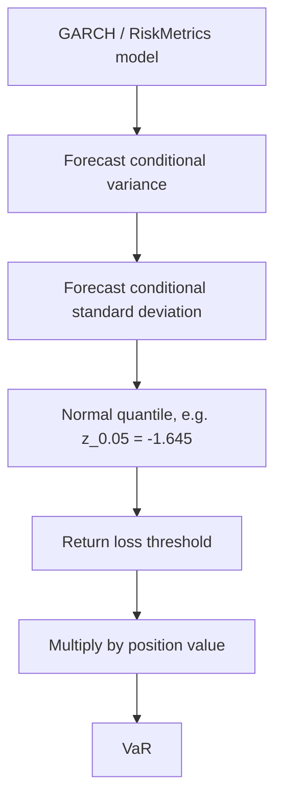

# Week 12: Forecasting Volatility

## What this week is for

This week is forecasting conditional variance and using it for VaR. The workshop uses RiskMetrics portfolio VaR and GJR-GARCH leverage interpretation. The exam uses one-step forecasts, prediction intervals, and VaR.

## Plain-English Roadmap

This week asks: once you have a volatility model, how do you use it to forecast risk? The one-step forecast is easiest because today's shock and today's variance estimate are already known.

For more than one step ahead, future shocks are not known. The trick is to replace the unknown future squared shock with its expected value, which equals the future conditional variance. That is why multi-step GARCH forecasts become recursive.

The persistence number $\alpha_1+\beta_1$ controls how fast forecasts move back toward the long-run variance. If persistence is high, a high-volatility day affects forecasts for many future days. If persistence is low, forecasts return to normal quickly.

Prediction intervals use both the expected return and the forecast variance. A volatility forecast is not just a side calculation; it directly determines how wide the interval is.

VaR is the same idea translated into money. First find a bad return quantile, then multiply by the value of the position. Always check whether returns are written as decimals or percentages. A return of $2$ can mean 2% in some outputs, not 200%.

Portfolio VaR adds one more idea: correlation. Two risky assets do not simply add their risks unless they are perfectly correlated. If correlation is less than 1, diversification reduces portfolio VaR relative to the sum of individual stand-alone risks.

The individual-VaR formula and the direct portfolio-variance formula are two ways of doing the same normal portfolio VaR calculation. They match because VaR is proportional to standard deviation under the normal model.

## Visual Guide

This diagram shows the forecast-to-VaR workflow. The volatility model produces a variance forecast, the distribution turns that into a bad return quantile, and the position size turns it into dollars.



## Formula Symbol Guide

Use this for volatility forecasts, prediction intervals, and VaR.

- $\hat\sigma_{T+1}^2$: one-step-ahead variance forecast.
- $\hat\sigma_{T+h}^2$: variance forecast $h$ periods ahead.
- $\sigma_T^2$: latest fitted/known conditional variance.
- $\epsilon_T^2$: latest squared shock.
- $\alpha_0$: GARCH variance intercept.
- $\alpha_1$: ARCH coefficient on latest squared shock.
- $\beta_1$: GARCH coefficient on latest variance.
- $\rho$: persistence, usually $\alpha_1+\beta_1$.
- $\bar\sigma^2$: long-run variance that forecasts move toward when $\rho<1$.
- $\hat r_{T+1}$: one-step-ahead forecast return.
- $1.96$: approximate standard normal cutoff for a 95% prediction interval.
- $1.645$: approximate standard normal cutoff for a one-sided 5% VaR.
- $q_{0.05}$: 5% bad-return quantile.
- $W_0$: dollar value invested.
- $\operatorname{VaR}_p$: portfolio Value at Risk.
- $w_A$, $w_B$: portfolio weights in assets A and B.
- $\sigma_A$, $\sigma_B$: standard deviations of assets A and B.
- $\rho_{AB}$: correlation between assets A and B.
- $\sigma_p^2$: portfolio variance.
- $\lambda$: leverage coefficient in a GJR-GARCH test.


## GARCH(1,1) variance forecasts (Exam)

Concept: this section turns the fitted GARCH equation into a forecasting tool. The variance equation updates risk from past shocks and past risk.

Example: if today's residual is large, the one-step variance forecast rises immediately.

Model:

$$
\begin{aligned}
r_t = \mu + \epsilon_t \\
\epsilon_t = \sigma_t u_t \\
\sigma_t^2 = \alpha_0 + \alpha_1 \epsilon_{t-1}^2 + \beta_1 \sigma_{t-1}^2
\end{aligned}
$$

Assume:

$$
\begin{aligned}
\mathbb{E}(u_t | F_{t-1}) = 0 \\
\mathbb{E}(u_t^2 | F_{t-1}) = 1 \\
\alpha_0 > 0 \\
\alpha_1 \ge 0 \\
\beta_1 \ge 0 \\
\alpha_1 + \beta_1 < 1
\end{aligned}
$$

## One-step-ahead variance forecast (Exam)

Concept: the one-step forecast is direct because the latest residual and variance are already known at time t.

Example: at time T, plug $\epsilon_T^2$ and $\sigma_T^2$ directly into the GARCH equation.

At time `t`, both $\epsilon_{t}^2$ and $\sigma_{t}^2$ are known.

$$
\begin{aligned}
\mathbb{E}(\sigma_{t+1}^2 | F_t) \\
= \alpha_0 + \alpha_1 \epsilon_t^2 + \beta_1 \sigma_t^2
\end{aligned}
$$

This is the formula used most often in VaR questions.

## Why future squared shocks are replaced by future variance (Exam)

Concept: for future steps, the actual future shock is unknown. Its expected square equals the future conditional variance, which makes recursion possible.

Example: for a two-step forecast, $\epsilon_{T+1}^2$ is unknown, so use its conditional expectation.

For $h \ge 2$:

$$
\begin{aligned}
\mathbb{E}(\epsilon_{t+h-1}^2 | F_t) \\
= \mathbb{E}(\sigma_{t+h-1}^2 | F_t)
\end{aligned}
$$

Reason:

$$
\begin{aligned}
\epsilon_{t+h-1} = \sigma_{t+h-1} u_{t+h-1} \\
\mathbb{E}(u_{t+h-1}^2 | F_{t+h-2}) = 1
\end{aligned}
$$

So the expected future squared shock equals the expected future conditional variance.

## Recursive h-step variance forecast (Exam)

Concept: multi-step forecasts repeatedly feed the previous variance forecast into the next one.

Example: compute the two-step forecast from the one-step forecast, then the three-step from the two-step.

Let:

$$
\rho = \alpha_1 + \beta_1
$$

For $h \ge 2$:

$$
\begin{aligned}
\mathbb{E}(\sigma_{t+h}^2 | F_t) \\
= \alpha_0 + \rho \mathbb{E}(\sigma_{t+h-1}^2 | F_t)
\end{aligned}
$$

Two-step:

$$
\begin{aligned}
\mathbb{E}(\sigma_{t+2}^2 | F_t) \\
= \alpha_0 + \rho \mathbb{E}(\sigma_{t+1}^2 | F_t)
\end{aligned}
$$

Three-step:

$$
\begin{aligned}
\mathbb{E}(\sigma_{t+3}^2 | F_t) \\
= \alpha_0 + \rho \mathbb{E}(\sigma_{t+2}^2 | F_t)
\end{aligned}
$$

## Closed-form h-step forecast (Exam)

Concept: the closed form is just the recursive forecast written in one line. It makes mean reversion toward long-run variance clear.

Example: when h is large, the persistence term shrinks and the forecast approaches long-run variance.

Starting from the one-step forecast:

$$
\mathbb{E}(\sigma_{t+1}^2 | F_t)
$$

the h-step forecast is:

$$
\begin{aligned}
\mathbb{E}(\sigma_{t+h}^2 | F_t) \\
= \alpha_0 [1 - \rho^{h-1}] / [1 - \rho] \\
+ \rho^{h-1} \mathbb{E}(\sigma_{t+1}^2 | F_t)
\end{aligned}
$$

Equivalently, using the long-run variance:

$$
\bar{\sigma}^2 = \alpha_0 / (1 - \alpha_1 - \beta_1)
$$

$$
\begin{aligned}
\mathbb{E}(\sigma_{t+h}^2 | F_t) \\
= \bar{\sigma}^2 \\
+ \rho^{h-1} [\mathbb{E}(\sigma_{t+1}^2 | F_t) - \bar{\sigma}^2]
\end{aligned}
$$

As `h` becomes large:

$$
\mathbb{E}(\sigma_{t+h}^2 | F_t) \to \bar{\sigma}^2
$$

So GARCH variance forecasts mean-revert to the unconditional variance.

## Prediction interval for returns (Exam)

Concept: prediction intervals use volatility forecasts to describe a plausible range for the next return.

Example: if the mean forecast is 0 and variance forecast is 4, the 95% interval is about -3.92 to 3.92.

If:

$$
r_{T+1} | F_T \sim \mathcal{N}(\mu_{T+1|T}, \sigma_{T+1}^2)
$$

then a 95 percent prediction interval is:

$$
\mu_{T+1|T} \pm 1.96 \sqrt{\sigma_{T+1}^2}
$$

In the practice exam:

1. Write the fitted mean equation.
2. Compute $mu_{T+1|T}$.
3. Compute $sigma_{T+1}^2$.
4. Use `mean \pm 1.96 sd`.

## One-asset VaR (Exam)

Concept: one-asset VaR converts a bad return quantile into a dollar loss for a single position.

Example: a -2% quantile on a \$1 million position gives VaR of \$20,000.

If:

$$
r_{T+1} | F_T \sim \mathcal{N}(\mu_{T+1|T}, \sigma_{T+1}^2)
$$

then:

$$
q_{0.05} = \mu_{T+1|T} - 1.645 \sqrt{\sigma_{T+1}^2}
$$

For position value $W_0$:

$$
\operatorname{VaR}_{0.05} = | W_0 q_{0.05} |
$$

If the conditional mean is assumed zero:

$$
\operatorname{VaR}_{0.05} = | W_0 (-1.645 \sqrt{\sigma_{T+1}^2}) |
$$

## RiskMetrics one-step variance forecast (Exam)

Concept: RiskMetrics forecasts tomorrow's risk as a weighted average of old risk and the newest squared return.

Example: a large squared return today raises tomorrow's RiskMetrics variance forecast.

RiskMetrics:

$$
\sigma_{i,t+1}^2 = (1 - \lambda_i) r_{i,t}^2 + \lambda_i \sigma_{i,t}^2
$$

Use the asset's own decay factor. In the Week 12 workshop:

$$
\begin{aligned}
Motorola:  \lambda = 0.96 \\
Citigroup: \lambda = 0.94
\end{aligned}
$$

Example structure:

$$
\begin{aligned}
\sigma_{m,t+1}^2 = (1 - 0.96) r_{m,t}^2 + 0.96 \sigma_{m,t}^2 \\
\sigma_{c,t+1}^2 = (1 - 0.94) r_{c,t}^2 + 0.94 \sigma_{c,t}^2
\end{aligned}
$$

Then:

$$
\operatorname{VaR}_i = \left| W_i(-1.645)\sqrt{\sigma_{i,t+1}^2}\right|
$$

## Portfolio VaR with two assets (Exam)

Concept: portfolio VaR must account for correlation. If assets are imperfectly correlated, total portfolio risk is less than adding stand-alone risks.

Example: if correlation is 0, the covariance term drops out; if correlation is 1, diversification disappears.

Suppose portfolio return is:

$$
r_{p,t} = w r_{m,t} + (1 - w) r_{c,t}
$$

where:

$$
\begin{aligned}
w &= \frac{\text{amount in Motorola}}{\text{total portfolio value}} \\
1-w &= \frac{\text{amount in Citigroup}}{\text{total portfolio value}}
\end{aligned}
$$

Portfolio variance:

$$
\begin{aligned}
\sigma_p^2 = w^2 \sigma_m^2 \\
+ (1 - w)^2 \sigma_c^2 \\
+ 2w(1 - w) \rho \sigma_m \sigma_c
\end{aligned}
$$

Then:

$$
\operatorname{VaR}_p =
\left| \text{total value} \times (-1.645) \times \sigma_p \right|
$$

where $\sigma_p = \sqrt{\sigma_p^2}$.

## Portfolio VaR from individual VaRs (Exam)

Concept: this formula is the VaR version of the two-asset variance formula. It works because normal VaR is proportional to standard deviation.

Example: with positive correlation, portfolio VaR is larger than with zero correlation but smaller than perfect-correlation addition.

If both individual VaRs use the same confidence level and normal framework:

$$
\operatorname{VaR}_p =
\sqrt{\operatorname{VaR}_m^2 + \operatorname{VaR}_c^2 + 2\rho\operatorname{VaR}_m\operatorname{VaR}_c}
$$

This matches the direct portfolio variance method because VaR is proportional to position size and standard deviation.

## GJR-GARCH revision for leverage (Exam)

Concept: this revisits asymmetry because leverage affects volatility forecasts and therefore VaR.

Example: if yesterday's shock was negative, the GJR variance forecast includes the extra leverage term.

GJR-GARCH:

$$
\begin{aligned}
\sigma_t^2 = \alpha_0 \\
+ \alpha_1 \epsilon_{t-1}^2 \\
+ \lambda I_{t-1} \epsilon_{t-1}^2 \\
+ \beta_1 \sigma_{t-1}^2
\end{aligned}
$$

where:

$$
\begin{aligned}
I_{t-1} = 1 \text{ if } \epsilon_{t-1} \le 0 \\
= 0 otherwise
\end{aligned}
$$

If $\lambda > 0$, bad news has a bigger volatility impact:

$$
\begin{aligned}
good news effect = \alpha_1 \\
bad news effect  = \alpha_1 + \lambda
\end{aligned}
$$

Test leverage:

$$
\begin{aligned}
H_0: \lambda = 0 \\
H_1: \lambda \ne 0 \\
t = \frac{\hat{\lambda}}{\operatorname{se}(\hat{\lambda})}
\end{aligned}
$$

At 5 percent, reject if:

$$
|t| > 1.96
$$

## Stylised facts captured and missed (Exam)

Concept: every volatility model captures some market facts and misses others. Knowing the limitation tells you when a richer model is needed.

Example: standard GARCH captures volatility clustering but misses the stronger effect of bad news.

ARCH and GARCH capture:

```text
volatility clustering
time-varying volatility
fat-tailed unconditional returns
```

Standard ARCH and GARCH do not capture:

```text
leverage effect / asymmetric volatility
```

For leverage, use:

```text
GJR-GARCH
EGARCH
```

## Exam-Style Practice Questions

### Question 1: h-step GARCH variance forecasts

#### Relevant Formulas

One-step GARCH variance forecast: use this to forecast next period's variance.

$$
\hat\sigma_{T+1}^2=\alpha_0+\alpha_1\epsilon_T^2+\beta_1\sigma_T^2
$$

Persistence: use this to simplify multi-step forecasts.

$$
\rho=\alpha_1+\beta_1
$$

Recursive h-step forecast: use this to move forecasts forward one horizon at a time.

$$
\hat\sigma_{T+h}^2=\alpha_0+\rho\hat\sigma_{T+h-1}^2
$$

Long-run variance: forecasts mean-revert toward this value when $\rho<1$.

$$
\bar\sigma^2=\frac{\alpha_0}{1-\rho}
$$


Suppose:

$$
\sigma_t^2=0.10+0.12\epsilon_{t-1}^2+0.80\sigma_{t-1}^2.
$$

At time $T$, $\epsilon_T^2=1.44$ and $\sigma_T^2=1.10$.

1. Compute the one-step-ahead variance forecast.
2. Compute $\rho=\alpha_1+\beta_1$.
3. Compute the two-step-ahead variance forecast.
4. Compute the long-run variance.
5. Explain why longer-horizon forecasts move toward the long-run variance.

#### Worked Answer

One-step variance forecast:

$$
\hat{\sigma}_{T+1}^2=0.10+0.12(1.44)+0.80(1.10)=1.1528.
$$

Persistence:

$$
\rho=\alpha_1+\beta_1=0.12+0.80=0.92.
$$

Two-step forecast:

$$
\hat{\sigma}_{T+2}^2=0.10+0.92(1.1528)=1.1606.
$$

Long-run variance:

$$
\bar{\sigma}^2=\frac{0.10}{1-0.92}=1.25.
$$

Longer-horizon forecasts move toward 1.25 because stationary GARCH variance forecasts mean-revert.

### Question 2: Prediction interval and VaR

#### Relevant Formulas

Forecast standard deviation: use this by taking the square root of forecast variance.

$$
\hat\sigma_{T+1}=\sqrt{\hat\sigma_{T+1}^2}
$$

Normal prediction interval: use this for a 95% return range.

$$
\hat r_{T+1}\pm1.96\hat\sigma_{T+1}
$$

Normal VaR quantile: use this for the 5% bad return cutoff.

$$
q_{0.05}=\hat\mu_{T+1}-1.645\hat\sigma_{T+1}
$$


An AR(1)-GARCH(1,1) model gives:

$$
\mathbb{E}(r_{T+1}\mid F_T)=0.08,
\qquad
\hat{\sigma}_{T+1}^2=4.00.
$$

Returns are measured in percent.

1. Compute the 95% prediction interval for $r_{T+1}$.
2. Compute the 1-day-ahead 5% VaR for a \$1 million investment.
3. Be careful about whether the return is in percent or decimal form.

#### Worked Answer

Forecast standard deviation is:

$$
\sqrt{4.00}=2.
$$

95% prediction interval:

$$
0.08\pm1.96(2)=[-3.84,4.00].
$$

Because returns are in percent, the 5% quantile is:

$$
q_{0.05}=0.08-1.645(2)=-3.21\%.
$$

VaR on a 1 million dollar position:

$$
1{,}000{,}000(0.0321)=32{,}100.
$$

### Question 3: Two-asset RiskMetrics portfolio VaR

#### Relevant Formulas

Two-asset portfolio variance: use this to combine individual risks and correlation.

$$
\sigma_p^2=w_A^2\sigma_A^2+w_B^2\sigma_B^2+2w_Aw_B\rho_{AB}\sigma_A\sigma_B
$$

Portfolio VaR approximation: use this to convert portfolio volatility into 5% normal VaR.

$$
\operatorname{VaR}_p=W_0(1.645)\sigma_p
$$

Individual VaR aggregation: use this when the question gives individual VaRs and correlation.

$$
\operatorname{VaR}_p=\sqrt{\operatorname{VaR}_A^2+\operatorname{VaR}_B^2+2\rho_{AB}\operatorname{VaR}_A\operatorname{VaR}_B}
$$


A manager holds \$1 million in stock A and \$1 million in stock B. One-step RiskMetrics variance forecasts are:

$$
\hat{\sigma}_{A,T+1}^2=0.0025,\qquad
\hat{\sigma}_{B,T+1}^2=0.0064.
$$

The return correlation is $\rho=0.35$.

1. Compute the 5% VaR for stock A.
2. Compute the 5% VaR for stock B.
3. Compute the portfolio variance using weights $w_A=w_B=0.5$.
4. Compute the 5% VaR for the \$2 million portfolio.
5. Verify the portfolio VaR using the individual-VaR formula.

#### Worked Answer

Stock A VaR:

$$
1{,}000{,}000(1.645)\sqrt{0.0025}=82{,}250.
$$

Stock B VaR:

$$
1{,}000{,}000(1.645)\sqrt{0.0064}=131{,}600.
$$

Portfolio variance with $w_A=w_B=0.5$:

$$
\sigma_p^2=0.5^2(0.0025)+0.5^2(0.0064)+2(0.5)(0.5)(0.35)(0.05)(0.08)=0.002925.
$$

Portfolio standard deviation:

$$
\sigma_p=\sqrt{0.002925}=0.0541.
$$

Portfolio VaR:

$$
2{,}000{,}000(1.645)(0.0541)\approx177{,}900.
$$

Individual-VaR formula gives the same result:

$$
\sqrt{82250^2+131600^2+2(0.35)(82250)(131600)}\approx177{,}900.
$$

### Question 4: GJR-GARCH leverage test

#### Relevant Formulas

Leverage t-test: use this to test whether asymmetric volatility is statistically significant.

$$
t=\frac{\hat\lambda}{SE(\hat\lambda)}
$$

Hypotheses:

$$
H_0:\lambda=0, \qquad H_1:\lambda\ne0
$$

Decision rule: reject $H_0$ if $|t|$ is larger than the chosen critical value, often 1.96 for a 5% two-sided test.


A fitted GJR-GARCH model reports:

$$
\hat{\lambda}=0.064,\qquad \operatorname{se}(\hat{\lambda})=0.018.
$$

1. Set up the test for leverage.
2. Compute the t-statistic.
3. State your conclusion at the 5% level.
4. Explain how bad news affects volatility relative to good news.

#### Worked Answer

Hypotheses:

$$
H_0:\lambda=0,\qquad H_1:\lambda\ne0.
$$

Statistic:

$$
t=0.064/0.018=3.56.
$$

Since $3.56>1.96$, reject $H_0$. Bad news has a statistically larger effect on volatility than good news.

## What to be able to do

1. Compute one-step GARCH variance forecasts.
2. Use recursive and closed-form h-step GARCH forecasts.
3. Explain mean reversion to long-run variance.
4. Compute 95 percent prediction intervals.
5. Compute one-asset 5 percent VaR.
6. Compute RiskMetrics variance forecasts.
7. Compute two-asset portfolio VaR using correlation.
8. Test and interpret GJR-GARCH leverage.
